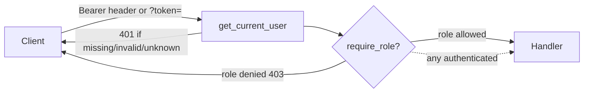
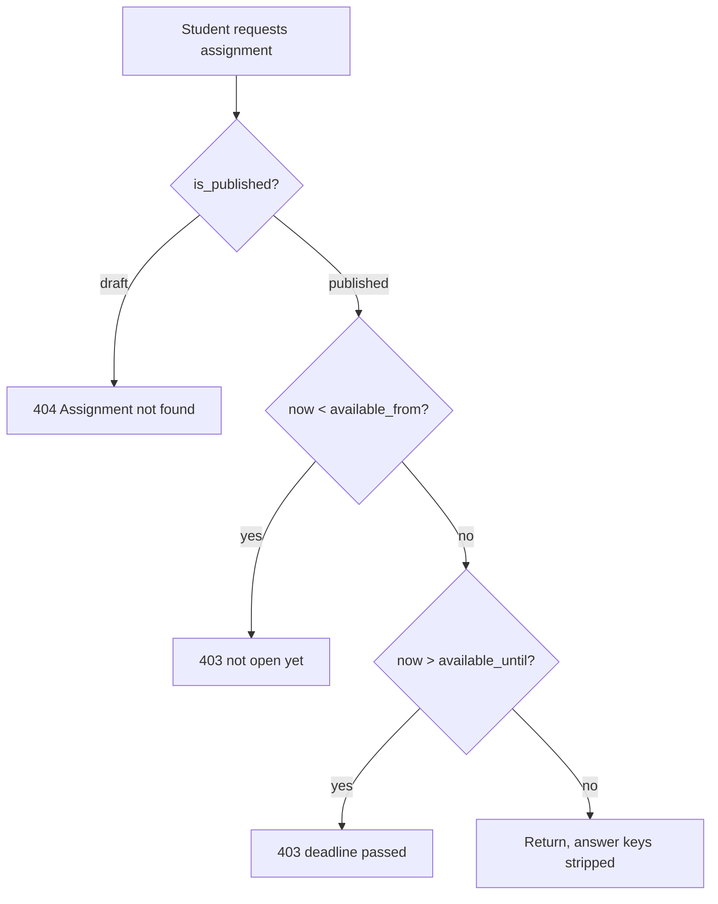

# API Reference

Complete reference for the PaperLock REST API. Every endpoint, its required
role, parameters, request/response shape, and the security- and
integrity-critical behaviors baked into each router.

For the database schema behind these payloads, see [`./data-model.md`](./data-model.md).

---

## Conventions

- **Base path.** Every route is mounted under `/api`. Routers add their own
  prefix on top (`/api/auth`, `/api/pdf`, `/api/assignments`,
  `/api/submissions`, `/api/grading`). Wiring lives in
  [`backend/app/main.py`](../backend/app/main.py).
- **Content type.** Request and response bodies are JSON unless noted
  (`POST /api/pdf/upload` is `multipart/form-data`; `GET /api/pdf/{id}/serve`
  returns `application/pdf`; `GET /api/grading/export/{id}` returns
  `text/csv`).
- **Datetimes.** ISO-8601. SQLite stores naive datetimes; the server coerces
  them to UTC before any availability/deadline comparison
  (`_as_aware`, and inline `replace(tzinfo=timezone.utc)`).
- **Roles.** `instructor`, `student`, `ta` (enum `UserRole` in
  [`backend/app/models.py`](../backend/app/models.py)).

### Authentication

Auth is a signed JWT (see [`backend/app/routers/auth.py`](../backend/app/routers/auth.py)).

| Property | Value |
|---|---|
| Algorithm | `HS256` |
| Signing key | `SECRET_KEY` env var (default `dev-secret-change-in-production`) |
| Expiry | 24 hours (`TOKEN_EXPIRE_HOURS = 24`) |
| Payload | `sub` = `str(user_id)`, `role` = role value, `exp` |
| Transport | `Authorization: Bearer <token>` header **or** `?token=<token>` query param |

The `?token=` query form exists so an inline `<embed>`/`<iframe>` PDF request
(`GET /api/pdf/{id}/serve`) can carry credentials without a custom header.

**`get_current_user`** decodes the token and loads the user. Failure modes:

| Condition | Status | Detail |
|---|---|---|
| No header and no `token` param | 401 | `No token provided` |
| Token fails to decode / bad `sub` | 401 | `Invalid token` |
| Decoded user id not in DB | 401 | `User not found` |

**`require_role(*roles)`** runs after `get_current_user`; if
`current_user.role` is not in the allowed set it returns **403
`Insufficient permissions`**. Per-endpoint "Required role" below names the
exact roles passed to `require_role` (or "any authenticated" when only
`get_current_user` is used).

---

## App-level routes

Defined directly on the app in [`main.py`](../backend/app/main.py).

| Method / Path | Role | Behavior |
|---|---|---|
| `GET /api/health` | none | Returns `{"status": "ok"}`. Used by the container healthcheck. |

**CORS.** `allow_origins` comes from `CORS_ORIGINS` (comma-separated, default
`http://localhost:5173,http://localhost:3000`); `allow_credentials=True`;
methods and headers are `*`. Not exercised in the bundled same-origin deploy.

**Production start-guard.** On startup, when `PAPERLOCK_ENV=production`, the app
raises `RuntimeError` and refuses to boot if `SECRET_KEY` is empty, one of the
insecure placeholders (`dev-secret-change-in-production`,
`change-me-in-production`, `change-me`, `secret`), or shorter than 16
characters. This blocks forged instructor tokens.

---

## Auth router — prefix `/api/auth`

Source: [`backend/app/routers/auth.py`](../backend/app/routers/auth.py).

| Method / Path | Role | Summary |
|---|---|---|
| `POST /api/auth/login` | none | Exchange PID + access code for a JWT |
| `POST /api/auth/users` | instructor | Create one user |
| `POST /api/auth/users/batch` | instructor | Create many users (skips existing PIDs) |
| `GET /api/auth/users` | instructor | List users, optional role filter |
| `PATCH /api/auth/users/{user_id}` | instructor | Update name/email/role |
| `DELETE /api/auth/users/{user_id}` | instructor | Delete a user |
| `POST /api/auth/users/{user_id}/reset-code` | instructor | Regenerate access code |
| `GET /api/auth/me` | any authenticated | Current identity |

### `POST /api/auth/login`

- **Body** (`LoginRequest`): `pid`, `access_code`.
- **Response** (`LoginResponse`): `token`, `user_id`, `name`, `role`.
- **Errors:** 401 `Invalid PID or access code` when no user matches both `pid`
  and `access_code`.
- Access codes are compared as stored plaintext (by design; see the launch
  hardening note in project memory).

### `POST /api/auth/users`

- **Body** (`CreateUserRequest`): `pid`, `name`, `email?`, `role` (`UserRole`).
- **Response** (`CreateUserResponse`): `id`, `pid`, `name`, `role`,
  `access_code`. (Note: no `email` field on this response model.)
- `access_code` is generated with `secrets.token_urlsafe(16)`.
- **Errors:** 409 `User with this PID already exists`.

### `POST /api/auth/users/batch`

- **Body** (`BatchCreateRequest`): `students` — a list of `CreateUserRequest`
  objects (each carries its own `role`, despite the field name `students`).
- **Response:** `list[CreateUserResponse]`.
- **Behavior:** idempotent per PID — any item whose `pid` already exists is
  **silently skipped** (no error), and only newly-created users appear in the
  response. Backs the roster CSV import in the instructor UI.

### `GET /api/auth/users`

- **Query:** `role` (optional string; filters `User.role == role`).
- **Response:** `list[UserResponse]` = `id`, `pid`, `name`, `email`, `role`,
  `access_code`. Ordered by `User.id` ascending.

### `PATCH /api/auth/users/{user_id}`

- **Body** (`UserUpdate`): `name?`, `email?`, `role?`. Each is applied only when
  **not `None`** (you cannot null a field through this endpoint).
- **Response:** `UserResponse`.
- **Errors:** 404 `User not found`.

### `DELETE /api/auth/users/{user_id}`

- Before deleting, detaches any grades the user authored
  (`Grade.graded_by -> None`) so the `grades.graded_by` FK is not violated;
  the user's submissions and annotations cascade-delete via ORM relationships.
- **Response:** `{"ok": true}`.
- **Errors:** 404 `User not found`.

### `POST /api/auth/users/{user_id}/reset-code`

- Regenerates `access_code` (`secrets.token_urlsafe(16)`).
- **Response:** `{"access_code": "<new code>"}`.
- **Errors:** 404 `User not found`.

### `GET /api/auth/me`

- **Response:** `{"id", "pid", "name", "role"}` for the token's user.

---

## PDF router — prefix `/api/pdf`

Source: [`backend/app/routers/pdf.py`](../backend/app/routers/pdf.py).
Handles PDF upload/serve, OCR block retrieval, and instructor block grouping
(merge/split/regroup) used to define region-select answer targets.

| Method / Path | Role | Summary |
|---|---|---|
| `GET /api/pdf/` | instructor | List uploaded PDFs |
| `POST /api/pdf/upload` | instructor | Upload + OCR a PDF |
| `GET /api/pdf/{pdf_id}/serve` | any authenticated | Stream the PDF file inline |
| `GET /api/pdf/{pdf_id}/blocks` | any authenticated | OCR blocks for a PDF |
| `PATCH /api/pdf/blocks/{block_id}/group` | instructor | Set/clear one block's group |
| `POST /api/pdf/blocks/merge` | instructor | Merge blocks into one group |
| `POST /api/pdf/blocks/split` | instructor | Ungroup a group's blocks |
| `DELETE /api/pdf/{pdf_id}` | instructor | Delete a PDF (guarded) |

### `GET /api/pdf/`

- **Response:** `list[PDFListItem]` = `id`, `original_name`, `page_count`,
  `uploaded_at` (ISO string or `null`). Ordered by `uploaded_at` **descending**.

### `POST /api/pdf/upload`

- **Body:** `multipart/form-data` with `file` (`UploadFile`).
- Rejects any filename not ending in `.pdf` (case-insensitive) with **400
  `Only PDF files allowed`**.
- Saved under a random `{uuid4().hex}.pdf` name in the upload dir. Text
  extraction (`extract_text_blocks`, PyMuPDF + spaCy) runs in a threadpool; on
  failure the file is removed and the request fails with **422
  `Failed to process PDF: {e}`**.
- **Response** (`PDFResponse`): `id`, `original_name`, `page_count`,
  `block_count`, `has_text` (`len(blocks) > 0`).

### `GET /api/pdf/{pdf_id}/serve`

- **Response:** `FileResponse`, `application/pdf`, with headers
  `Content-Disposition: inline`, `Cache-Control: no-store`,
  `X-Content-Type-Options: nosniff`.
- **Errors:** 404 `PDF not found`.
- **Note:** gated only by `get_current_user` — **any** logged-in user (incl.
  students) may fetch **any** PDF by id. This is the endpoint the `?token=`
  query form serves.

### `GET /api/pdf/{pdf_id}/blocks`

- **Response:** `list[OCRBlockResponse]` = `id`, `page_number`, `text`, `x`,
  `y`, `width`, `height`, `group_id`, `sentence_group`, `paragraph_group`,
  `block_order`. Ordered by `page_number`, then `block_order`.
- **Note:** also gated only by `get_current_user`. Block `text` is visible to
  students; answer-key stripping (below) applies only to *question* fields, not
  to block text.

### `PATCH /api/pdf/blocks/{block_id}/group`

- **Query:** `group_id` (`int | null`). Sets `block.group_id` to that value.
- **Response:** `{"ok": true}`. **Errors:** 404 `Block not found`.

### `POST /api/pdf/blocks/merge`

- **Body:** a raw JSON array `block_ids: list[int]`.
- Sets every found block's `group_id` to `min(block ids)`.
- **Response:** `{"group_id", "block_count"}`. **Errors:** 404 `No blocks found`.

### `POST /api/pdf/blocks/split`

- **Body** (`SplitBlocksRequest`): `group_id`.
- Clears `group_id = None` on every block matching that group.
- **Response:** `{"ok": true, "block_count"}`. **Errors:** 404
  `No blocks with that group_id`.

### `DELETE /api/pdf/{pdf_id}`

- **Errors:** 404 `PDF not found`; **409 `Cannot delete PDF: assignments
  reference it`** if any `Assignment.pdf_id == pdf_id` exists (PDF→Assignment has
  no cascade).
- On success removes the on-disk file (if present) then the row.
- **Response:** `{"ok": true}`.

---

## Assignments router — prefix `/api/assignments`

Source: [`backend/app/routers/assignments.py`](../backend/app/routers/assignments.py).
Authoring, publishing/scheduling, sections, questions, and portable
export/import bundles.

| Method / Path | Role | Summary |
|---|---|---|
| `POST /api/assignments/` | instructor | Create assignment (as draft) |
| `GET /api/assignments/` | any authenticated | List assignments (student-filtered) |
| `GET /api/assignments/{assignment_id}` | any authenticated | One assignment (student-gated) |
| `POST /api/assignments/{assignment_id}/questions` | instructor | Add a question |
| `PUT /api/assignments/{assignment_id}` | instructor | Edit metadata / dates |
| `POST /api/assignments/{assignment_id}/publish` | instructor | Publish / unpublish |
| `DELETE /api/assignments/{assignment_id}` | instructor | Delete assignment |
| `PUT /api/assignments/{assignment_id}/questions/{question_id}` | instructor | Edit a question |
| `DELETE /api/assignments/{assignment_id}/questions/{question_id}` | instructor | Delete a question |
| `POST /api/assignments/{assignment_id}/sections` | instructor | Create a section |
| `PUT /api/assignments/{assignment_id}/sections/{section_id}` | instructor | Edit a section |
| `DELETE /api/assignments/{assignment_id}/sections/{section_id}` | instructor | Delete a section (ungroups its questions) |
| `GET /api/assignments/{assignment_id}/bundle` | instructor | Export a portable bundle |
| `POST /api/assignments/import` | instructor | Import a bundle |

### Answer-key stripping (students)

`_ANSWER_KEY_FIELDS` = `correct_block_ids`, `correct_options`,
`accepted_answers`, `correct_matches`, `cloze_answers`, `sample_answer`. For
**students only**, these are set to `None` on every question in both the list
and the single-get responses (`_strip_answer_keys`).

Fields that render the question — `options`, `match_left`, `match_right`,
`cloze_text`, `cloze_bank` — are **not** stripped (they are needed to display
the prompt/choices). Instructors and TAs receive everything unstripped.

### Visibility & availability gating (students)

- **List** (`GET /`): for students the query is filtered to
  `is_published == True` AND `available_from <= now (or null)` AND
  `available_until >= now (or null)`. Instructors/TAs see all assignments,
  unstripped.
- **Single get** (`GET /{id}`): a draft returns **404** (indistinguishable from
  nonexistent); before `available_from` → **403 `This assignment is not open
  yet`**; after `available_until` → **403 `The deadline for this assignment has
  passed`**. Naive datetimes are coerced to UTC before comparison.

### Default grading mode

`_default_grading_mode(question_type)` fills `grading_mode` when the author
leaves it null (applied at create and add-question time via `_question_kwargs`):

| Question type | Default `grading_mode` |
|---|---|
| `free_text` | `manual` |
| `scale` | `completion` |
| everything else | `auto` |

### `POST /api/assignments/`

- **Body** (`AssignmentCreate`): `title`, `description?`, `pdf_id`,
  `available_from?`, `available_until?`, `questions: list[QuestionCreate]`
  (default `[]`).
- **`QuestionCreate` fields** (also the shape of a single-question add):

  | Field | Type | Default |
  |---|---|---|
  | `question_type` | `QuestionType` | required |
  | `prompt` | str | required |
  | `order` | int | `0` |
  | `points` | float | `1.0` |
  | `correct_block_ids` | list[int]? | `null` |
  | `allow_multiple` | bool | `false` |
  | `selection_granularity` | `SelectionGranularity` | `sentence` |
  | `options` | list[str]? | `null` |
  | `correct_options` | list[int]? | `null` |
  | `section_id` | int? | `null` |
  | `guidance` | str? | `null` |
  | `target_page` | int? | `null` |
  | `sample_answer` | str? | `null` |
  | `grading_mode` | str? | `null` → type default |
  | `accepted_answers` | list[str]? | `null` |
  | `match_left` | list[str]? | `null` |
  | `match_right` | list[str]? | `null` |
  | `correct_matches` | list[int]? | `null` |
  | `cloze_text` | str? | `null` |
  | `cloze_bank` | list[str]? | `null` |
  | `cloze_answers` | list[int]? | `null` |
  | `scale_min` | int? | `null` |
  | `scale_max` | int? | `null` |

- **Positional-order fallback:** for inline questions the stored order is
  `q.order if q.order else idx`, so several questions all left at `order = 0`
  don't collide (they take their list index instead).
- Created as a **draft** (`is_published = False`, the model default).
- **Response:** `AssignmentResponse`.

### `GET /api/assignments/`

- **Response:** `list[AssignmentResponse]`, ordered by `created_at`
  descending.
- Students: filtered to published + in-window (above); each result annotated
  with per-student `is_submitted` and `has_started`, and answer keys stripped
  per question. Instructors/TAs: all assignments, unstripped, without the
  per-student annotations.

### `GET /api/assignments/{assignment_id}`

- **Errors:** 404 `Assignment not found`; for students also the draft-404 and
  out-of-window-403 gating above.
- **Response** (`AssignmentResponse`):

  | Field | Type | Notes |
  |---|---|---|
  | `id` | int | |
  | `title` | str | |
  | `description` | str? | |
  | `pdf_id` | int | |
  | `available_from` | datetime? | |
  | `available_until` | datetime? | |
  | `is_published` | bool | default `false` |
  | `questions` | list[QuestionResponse] | |
  | `sections` | list[SectionResponse] | default `[]` |
  | `is_submitted` | bool | default `false` (student annotation) |
  | `has_started` | bool | default `false` (student annotation) |

- **`QuestionResponse` fields:** `id`, `question_type`, `prompt`, `order`,
  `points`, `allow_multiple`, `selection_granularity` (default `"sentence"`),
  `correct_block_ids?`, `options?`, `correct_options?`, `section_id?`,
  `guidance?`, `target_page?`, `sample_answer?`, `grading_mode?`,
  `accepted_answers?`, `match_left?`, `match_right?`, `correct_matches?`,
  `cloze_text?`, `cloze_bank?`, `cloze_answers?`, `scale_min?`, `scale_max?`.
  (For students the six answer-key fields are `null`.)
- **`SectionResponse` fields:** `id`, `title`, `description?`, `order`.

### `POST /api/assignments/{assignment_id}/questions`

- **Body:** `QuestionCreate`. **Errors:** 404 `Assignment not found`.
- Uses `req.order` **directly** (no positional fallback here — unlike inline
  create).
- **Response:** `QuestionResponse`.

### `PUT /api/assignments/{assignment_id}`

- **Body** (`AssignmentUpdate`): `title?`, `description?`, `available_from?`,
  `available_until?`.
- **`model_fields_set` semantics:** explicitly sending `null` for
  `description`, `available_from`, or `available_until` **clears** that column
  (e.g. remove a deadline to re-open); omitting the field leaves it unchanged.
  `title` is updated only when present **and** not `None`.
- **Response:** `AssignmentResponse`. **Errors:** 404 `Assignment not found`.

### `POST /api/assignments/{assignment_id}/publish`

- **Body** (`PublishRequest`): `published: bool`. Sets `is_published`.
- **Response:** `AssignmentResponse`. **Errors:** 404 `Assignment not found`.
- A draft (unpublished) assignment is invisible to students regardless of its
  availability dates.

### `DELETE /api/assignments/{assignment_id}`

- Deletes the assignment's submissions first (which cascade answers + grades),
  then the assignment. **Response:** `{"ok": true}`. **Errors:** 404
  `Assignment not found`.
- **Note:** the underlying PDF row/file is *not* removed.

### `PUT /api/assignments/{assignment_id}/questions/{question_id}`

- **Body** (`QuestionUpdate`): all fields optional — same field set as
  `QuestionCreate` (including `question_type`, `order`, `points`, etc.).
- **MC option add/remove guard:** if `options` is provided for a
  `multiple_choice` question with a length **different** from the current
  options **and** any submission already exists for the assignment → **409**
  (`Can't add or remove options after students have started …`). Because stored
  answers are positional option indices, changing the option count would silently
  re-map them. Same-count edits (rewording) are always allowed.
- **Simple fields** applied only when **not `None`**: `prompt`,
  `question_type`, `order`, `points`, `correct_block_ids`, `allow_multiple`,
  `selection_granularity`, `options`, `correct_options`.
- **`model_fields_set` fields** (sending `null` clears them): `section_id`,
  `guidance`, `target_page`, `sample_answer`, `grading_mode`,
  `accepted_answers`, `match_left`, `match_right`, `correct_matches`,
  `cloze_text`, `cloze_bank`, `cloze_answers`, `scale_min`, `scale_max`.
- **Type-change grading reset:** if `question_type` changed but `grading_mode`
  was *not* explicitly set in the request, `grading_mode` is reset to the new
  type's default — prevents a stale mode (e.g. scale's `completion`) from
  mis-grading a switched-to type.
- **Response:** `QuestionResponse`. **Errors:** 404 `Question not found`.

### `DELETE /api/assignments/{assignment_id}/questions/{question_id}`

- **Response:** `{"ok": true}`. **Errors:** 404 `Question not found`.

### `POST /api/assignments/{assignment_id}/sections`

- **Body** (`SectionCreate`): `title`, `description?`, `order` (default `0`).
- **Response** (`SectionResponse`): `id`, `title`, `description?`, `order`.
- **Errors:** 404 `Assignment not found`.

### `PUT /api/assignments/{assignment_id}/sections/{section_id}`

- **Body** (`SectionUpdate`): `title?`, `description?`, `order?`. `description`
  uses `model_fields_set` (null clears); `title` and `order` are applied only
  when not `None`.
- **Response:** `SectionResponse`. **Errors:** 404 `Section not found`.

### `DELETE /api/assignments/{assignment_id}/sections/{section_id}`

- **Ungroups** the section's questions (`Question.section_id -> None`) rather
  than deleting them, then deletes the section.
- **Response:** `{"ok": true}`. **Errors:** 404 `Section not found`.

### `GET /api/assignments/{assignment_id}/bundle`

Exports a self-contained `AssignmentBundle` (PDF bytes + OCR blocks + questions
+ answer keys + sections) so an assignment can be moved between servers.

- **Response** (`AssignmentBundle`): `version` (always `1`), `title`,
  `description?`, `available_from?`, `available_until?`, `pdf_original_name`,
  `pdf_page_count`, `pdf_content_base64`, `blocks: list[BundleBlock]`,
  `questions: list[BundleQuestion]`, `sections: list[BundleSection]`.
  - **`BundleBlock`:** `id` (original block id), `page_number`, `text`, `x`,
    `y`, `width`, `height`, `group_id?`, `sentence_group?`, `paragraph_group?`,
    `block_order`. Blocks are ordered by `block_order`.
  - **`BundleQuestion`:** every question field including all answer keys
    (`correct_block_ids`, `correct_options`, `accepted_answers`,
    `correct_matches`, `cloze_answers`, `sample_answer`) plus `section_id`
    (original). It has **no `id`** field.
  - **`BundleSection`:** `id` (original), `title`, `description?`, `order`.
- **Errors:** 404 `Assignment not found`; 404 `PDF for assignment not found`;
  404 `PDF file is missing on disk`.

### `POST /api/assignments/import`

- **Body:** `AssignmentBundle`.
- **Behavior:**
  1. Decodes `pdf_content_base64` (**400 `Bundle PDF is not valid base64`** on
     failure), writes it to the upload dir under a fresh `{uuid4().hex}.pdf`,
     and creates a new `PDF` row (`uploaded_by` = importer).
  2. Recreates all OCR blocks, building an **old→new `id_map`**. Blocks are
     inserted first without `group_id`, then a second pass remaps each
     `group_id` through `id_map`.
  3. Rebuilds each question's `correct_block_ids` through `id_map`, silently
     dropping any id absent from the map.
  4. Recreates sections, building a `section_map`; each question's `section_id`
     is remapped through it (null-safe).
  5. Recreates questions, converting `question_type` via `QuestionType(...)` and
     `selection_granularity` via `SelectionGranularity(...)`.
- Imported as a **draft** and **unscheduled** (`available_from = None`,
  `available_until = None`) so a freshly-imported assignment is never
  accidentally live or already closed — the instructor sets dates and publishes
  when ready.
- **Response:** `AssignmentResponse`.
- **Known limitation:** deleting an imported assignment does not remove the
  PDF row/file created here; the PDF is orphaned.

---

## Submissions router — prefix `/api/submissions`

Source: [`backend/app/routers/submissions.py`](../backend/app/routers/submissions.py).
The student answering flow (start → save answers → submit), plus PDF
annotations. `MAX_FREE_TEXT_LEN = 20000`. Availability helpers `_as_aware`
(naive→UTC) and `_availability` → `(is_open, reason)` are used to enforce the
deadline server-side.

| Method / Path | Role | Summary |
|---|---|---|
| `POST /api/submissions/start/{assignment_id}` | student only | Start/resume a submission |
| `PUT /api/submissions/{submission_id}/answer` | any authenticated (owner) | Upsert one answer |
| `POST /api/submissions/{submission_id}/submit` | any authenticated (owner) | Finalize (lock) |
| `GET /api/submissions/{submission_id}` | any authenticated | Read a submission |
| `POST /api/submissions/annotations` | any authenticated | Create an annotation |
| `GET /api/submissions/annotations/{pdf_id}` | any authenticated | List own annotations |
| `PATCH /api/submissions/annotations/{annotation_id}` | any authenticated (owner) | Edit an annotation |
| `DELETE /api/submissions/annotations/{annotation_id}` | any authenticated (owner) | Delete an annotation |

### `POST /api/submissions/start/{assignment_id}`

- **Role:** student only — **403 `Only students can submit`** otherwise.
- **Errors:** 404 `Assignment not found`.
- **Behavior:**
  - If a submission already exists for this `(student, assignment)`, it is
    returned as-is — **resuming is always allowed, even past the deadline**.
  - Starting a **new** submission requires an open window; otherwise **403**
    with the availability reason (`This assignment is not open yet` /
    `The deadline for this assignment has passed`).
  - **Race handling:** on an `IntegrityError` from the unique
    `(student_id, assignment_id)` constraint, the transaction rolls back and the
    concurrently-created submission is returned instead (**500 `Could not start
    submission`** only if it then can't be found).
- **Response** (`SubmissionResponse`): `id`, `assignment_id`, `is_submitted`,
  `started_at`, `submitted_at`, `answers: list[dict]`. Each answer dict has
  `question_id`, `selected_block_ids`, `free_text`, `selected_options`.

### `PUT /api/submissions/{submission_id}/answer`

- **Ownership:** filtered by `student_id == current_user.id`; a submission not
  owned by the caller is **404 `Submission not found`** (indistinguishable from
  nonexistent).
- **Body** (`AnswerUpdate`):

  | Field | Type | Notes |
  |---|---|---|
  | `question_id` | int | required |
  | `selected_block_ids` | list[int]? | region-select selection |
  | `free_text` | str? | `max_length = 20000` |
  | `selected_options` | `list[int \| None]?` | MC indices **or** positional matching/cloze/scale answers |

  The **`selected_options` nullable fix**: the element type is `int | None`, so
  positions not yet filled are allowed to be `null` — e.g. filling cloze blank
  `{{1}}` before `{{0}}` stores `[null, 3]`. Without this, a partially-answered
  matching/cloze/scale payload would fail validation.
- **Errors:** 404 (not found / not owned); **400 `Already submitted`** if the
  submission is locked; **403** with reason if the deadline has passed
  (server-side enforcement — the answer freezes once the window closes).
- **Behavior:** upserts the `Answer` (unique on `submission_id`+`question_id`).
  On an `IntegrityError` from a concurrent insert of the same
  `(submission, question)`, it rolls back and updates the existing row instead.
- **Response:** `{"ok": true}`.

### `POST /api/submissions/{submission_id}/submit`

- **Ownership:** same `student_id == current_user.id` filter.
- **Errors:** 404 (not found / not owned); **400 `Already submitted`**.
- Sets `is_submitted = True` and `submitted_at = now`.
- **Response:** `{"ok": true, "submitted_at": <datetime>}`.

### `GET /api/submissions/{submission_id}`

- **Errors:** 404 `Submission not found`. A student may only read **their own**
  submission (else **403 `Not your submission`**); instructors/TAs may read any.
- **Response:** `SubmissionResponse`.

### Annotations

Annotations are per-user PDF highlights/notes, always owned by the caller.

- **`POST /api/submissions/annotations`** — Body (`AnnotationCreate`): `pdf_id`,
  `page_number`, `annotation_type`, `position_data` (dict), `content?`, `color`
  (default `"#FFFF00"`). Response (`AnnotationResponse`): `id`, `page_number`,
  `annotation_type`, `position_data`, `content`, `color`.
- **`GET /api/submissions/annotations/{pdf_id}`** — returns the caller's
  annotations for that PDF as `list[AnnotationResponse]`.
- **`PATCH /api/submissions/annotations/{annotation_id}`** — Body
  (`AnnotationUpdate`): `content?`, `color?`. `content` uses `model_fields_set`
  (null clears); `color` is updated only when present **and** not `None`. 404
  `Annotation not found` if missing or not owned. Response:
  `AnnotationResponse`.
- **`DELETE /api/submissions/annotations/{annotation_id}`** — 404 if missing or
  not owned; else `{"ok": true}`.

---

## Grading router — prefix `/api/grading`

Source: [`backend/app/routers/grading.py`](../backend/app/routers/grading.py)
and [`backend/app/services/export.py`](../backend/app/services/export.py).
**Every route requires `instructor` OR `ta`.** `REGION_PROXIMITY_TOLERANCE = 3`.

| Method / Path | Role | Summary |
|---|---|---|
| `GET /api/grading/assignments/{assignment_id}/submissions` | instructor/ta | Per-student grading summary |
| `GET /api/grading/submissions/{submission_id}/grades` | instructor/ta | Existing per-question grades |
| `POST /api/grading/grade` | instructor/ta | Manually grade one question |
| `POST /api/grading/auto-grade/{assignment_id}` | instructor/ta | Auto-grade submitted work |
| `GET /api/grading/export/{assignment_id}` | instructor/ta | Canvas-friendly CSV export |

### `GET /api/grading/assignments/{assignment_id}/submissions`

- **Response:** `list[SubmissionSummary]` = `id`, `student_name`,
  `student_pid`, `is_submitted`, `submitted_at`, `total_score`, `max_score`,
  `graded_count`, `question_count`.
- `graded_count` counts grades with a non-null `score`. `max_score` =
  `sum(q.points)`.
- **`total_score` is `None`** unless **every** question is graded
  (`graded_count >= question_count and question_count > 0`), so a partially
  graded student is never shown a misleading partial total.
- **Errors:** 404 `Assignment not found`.

### `GET /api/grading/submissions/{submission_id}/grades`

- **Response:** `list[GradeResponse]` = `id`, `submission_id`, `question_id`,
  `score` (nullable float), `comments`, `is_auto_graded`, `graded_at`.
  Used to repopulate the grading UI when a submission is reopened.
- **Errors:** 404 `Submission not found`.

### `POST /api/grading/grade`

- **Body** (`GradeRequest`): `submission_id`, `question_id`, `score`,
  `comments?`.
- **Errors:** 404 `Submission not found`; 404 `Question not found`; **400
  `Score must be between 0 and {points}`** when `score < 0` or
  `score > question.points`.
- Upserts the `Grade` for `(submission, question)`, setting
  `graded_by = current_user.id`, `graded_at = now`, and **`is_auto_graded =
  False`**. Flagging it manual protects it from being overwritten by a later
  auto-grade pass.
- **Response:** `GradeResponse`.

### `POST /api/grading/auto-grade/{assignment_id}`

Auto-scores questions that have an answer key; free-text/keyless/manual
questions are **skipped, never auto-zeroed**.

- Processes only `is_submitted == True` submissions. **Errors:** 404
  `Assignment not found`.
- Builds a `block_sg` map (`block_id -> sentence_group`) for the assignment's
  PDF **only if** at least one question is `region_select`.
- For each `(submission, question)` it computes `_auto_score(...)`. A `None`
  result is skipped. If a `Grade` exists and is **not** auto-graded (i.e. a
  manual grade), it is **left untouched**; otherwise a prior auto-grade is
  updated in place, or a new `Grade` with `is_auto_graded = True`,
  `graded_at = now` is inserted. Each write increments the count.
- **Response:** `{"graded": <count>}`.

**`_auto_score(question, answer, block_sg=None)`** — `mode =
question.grading_mode or "auto"`, then by `question_type`. Returns `None` =
"grade manually / no key" (never zeroed).

| Mode / type | Scoring |
|---|---|
| `mode == "manual"` | `None` |
| `mode == "completion"` | full `points` if answered (`_answered`), else `0.0` |
| `region_select` | needs `correct_block_ids` (else `None`); `points × recall` where `recall = |sel ∩ correct| / |correct|`. If recall is 0 but a selection exists and `block_sg` is available, **proximity credit** via nearest `sentence_group` distance: `frac = max(0, 1 − dist / 3)` (dist 1 → ⅔, dist 2 → ⅓, dist ≥3 → 0). Rounded to 4 dp. |
| `multiple_choice` | needs `correct_options` (else `None`); full `points` iff `set(selected_options) == set(correct_options)` (order-independent, all-or-nothing), else `0.0` |
| `short_answer` | needs `accepted_answers` (else `None`); blank → `0.0`; normalized (`strip → lower → rstrip(".%") → strip`) equality against each accepted answer, plus numeric tolerance `< 1e-6`; else `0.0` |
| `matching` / `cloze` | key = `correct_matches` / `cloze_answers`, else (including an empty key, since `[]` is falsy) `None`; fractional `points × correct/total` comparing positional `selected_options[i] == key[i]` |
| `scale` | full `points` if any `selected_options`, else `0.0` (reached only if mode overridden to `auto`, since `scale` defaults to `completion`) |
| `free_text` / anything else | `None` (manual) |

`_answered(answer)` is truthy when the answer exists and has non-blank
`free_text`, any `selected_options`, or any `selected_block_ids`.

### `GET /api/grading/export/{assignment_id}`

- **Response:** `PlainTextResponse`, `text/csv`, header
  `Content-Disposition: attachment; filename=grades_assignment_{id}.csv`.
  Built by `export_grades_csv`.
- **Rows:** only `is_submitted == True` submissions, sorted by
  `_last_name_key(student.name)` = `(last.lower(), full_name.lower())` — last
  name is the token before the first comma (`"Last, First"`) or the last
  whitespace token (`"First Last"`); an empty name sorts as `("", "")`.
- **Columns:** `Student`, `ID` (= `student.pid`), one per question labeled
  `Q{order + 1} ({points})` (questions ordered by `Question.order`), then a
  final `Total ({sum of points})`.
- **Cells:** a grade's `score` when a `Grade` exists with a non-null score, else
  `""` (blank). The `Total` sums only numeric cells; it is left **blank** when
  `graded_count == 0` (so a Canvas import never overwrites a real grade with 0),
  while partially-graded students show a running partial total.

---

## Cross-cutting security notes

- **PDF / OCR exposure.** `GET /api/pdf/{id}/serve` and
  `GET /api/pdf/{id}/blocks` are gated only by `get_current_user`, so any
  authenticated user (including students) can fetch any PDF file and its OCR
  block text by id. Answer-key protection is enforced only on *question*
  fields, not block text.
- **Query-string tokens.** JWTs may travel in `?token=`, which is how inline
  PDF embeds authenticate without a custom header.
- **Two-layer student protection.** Answer-key stripping happens at both
  `list_assignments` and `get_assignment`, on top of draft-404 and
  out-of-window-403 gating. Instructors/TAs bypass all of it.
- **Positional-index integrity.** MC answers are stored as positional option
  indices; two mechanisms keep them aligned — the **409 guard** on MC option
  add/remove once submissions exist (`update_question`), and the
  `selected_options` `int | None` element type that lets positional
  matching/cloze/scale answers carry not-yet-filled `null` slots.

## Related documentation

- [`./data-model.md`](./data-model.md) — tables, enums, constraints, cascades,
  and the SQLite + WAL engine setup behind these payloads.
</content>
</invoke>
