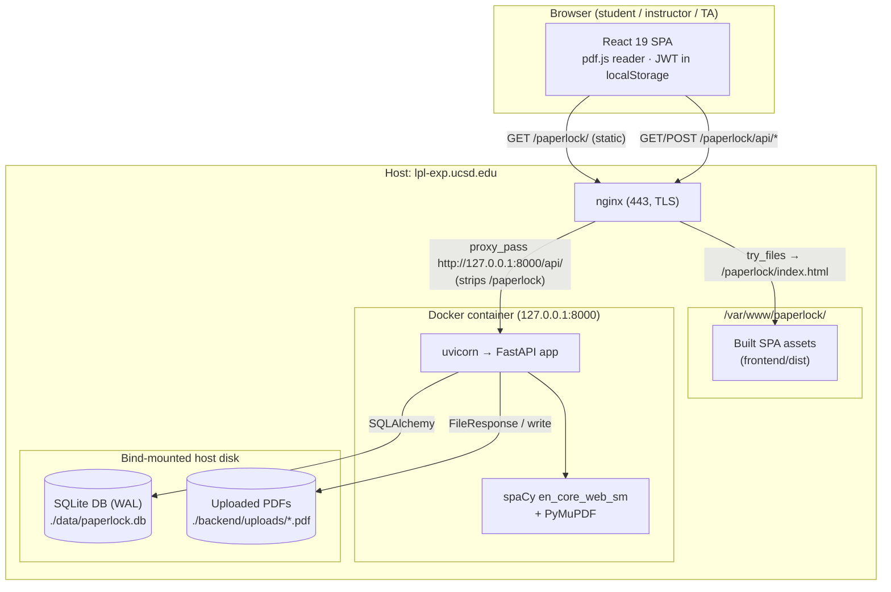

# Architecture

PaperLock is a lockdown reader and assessment tool for PSYC 1 (Intro Psych) at
UCSD. It renders a research-paper PDF alongside instructor-authored questions,
lets students select regions of the page / answer questions, and gives
instructors and TAs authoring, grading, and roster tools. This document
describes the technology stack, the deployed system topology, the request
lifecycle, the repository layout, and where state lives on disk.

See also: [Data model](./data-model.md) · [Backend API reference](./api-reference.md) ·
[Grading & auto-grading](./grading.md) · [Assignment bundles (export/import)](./bundles.md) ·
[Deployment](./deployment.md).

---

## Tech stack

### Backend — Python / FastAPI

| Concern | Choice | Notes |
|---|---|---|
| Web framework | **FastAPI** (`app.main:app`) | ASGI app, title `PaperLock`, version `0.1.0`. All routes mounted under `/api`. |
| ASGI server | **uvicorn** (`uvicorn[standard]`) | `uvicorn app.main:app --host 0.0.0.0 --port 8000`. |
| ORM | **SQLAlchemy 2.x** | `DeclarativeBase` in `database.py`; 10 models in `models.py`. No Alembic migrations at runtime — schema is created with `Base.metadata.create_all` in `init_db()`. |
| Database | **SQLite** (default) with **WAL** | `DATABASE_URL` defaults to `sqlite:///./paperlock.db`. Engine switching supports Postgres, but the launch target runs SQLite. |
| Auth | **JWT**, HS256 (`python-jose`) | `SECRET_KEY` env, 24h expiry. Token via `Authorization: Bearer <token>` **or** `?token=` query param. Roles: `instructor`, `student`, `ta`. |
| PDF text extraction | **PyMuPDF** (`fitz`) | Text-**layer** extraction via `get_text` (**not** image OCR), producing word-level bounding boxes normalized to 0–100 percentage coordinates. A scanned / image-only PDF with no embedded text layer yields no blocks. |
| Sentence grouping | **spaCy** (`en_core_web_sm`) | Each extracted word is tagged with a `sentence_group` and `paragraph_group` so the reader can select at word / sentence / paragraph granularity. |
| Uploads / async I/O | `python-multipart`, `aiofiles` | Multipart is used for PDF upload. Access codes are stored in plaintext by design — `auth.py` compares them directly and never hashes (see the launch-hardening memo), so `passlib` is listed in `requirements.txt` but **unused** (as with `alembic` / `psycopg2-binary` for the unused Postgres path). |

Access codes are stored in **plaintext by design** — they are single-use-ish
class credentials handed out on paper, not passwords, and are printed once by
the seed script.

### SQLite + WAL engine setup (`backend/app/database.py`)

`is_sqlite = DATABASE_URL.startswith("sqlite")` drives all engine branching:

- `connect_args={"check_same_thread": False}` for SQLite (so FastAPI worker
  threads can share connections); `{}` otherwise.
- A `@event.listens_for(engine, "connect")` handler `_set_sqlite_pragma` runs
  on **every** new DBAPI connection (SQLite only) and executes:
  - `PRAGMA journal_mode=WAL` — concurrent reads alongside a single writer.
  - `PRAGMA busy_timeout=5000` — wait up to 5s on lock contention instead of
    immediately raising "database is locked" (sized for ~40+ students
    submitting simultaneously).
  - `PRAGMA foreign_keys=ON` — SQLite does not enforce FKs by default.

See [Data model](./data-model.md) for the full schema, constraints, and cascade
rules.

### Frontend — React SPA

| Concern | Choice | Notes |
|---|---|---|
| Framework | **React 19** (`react` / `react-dom` ^19) | Function components + hooks. |
| Build tool | **Vite 8** (`@vitejs/plugin-react`) | `npm run build` → static bundle in `frontend/dist/`. No Node at runtime. |
| Styling | **Tailwind CSS 4** (`@tailwindcss/vite`) | Utility-first. `tw-animate-css`, `tailwind-merge`, `clsx`, `class-variance-authority`. |
| Components | **shadcn** on **@base-ui/react** | Primitives under `src/components/ui/` (dialog, button, input, textarea, tooltip, scroll-area, badge, separator). |
| Routing | **react-router-dom 7** | `BrowserRouter` with `basename` derived from the Vite base path. |
| PDF rendering | **pdf.js** (`pdfjs-dist` ^5) | Renders the served PDF to a canvas; selection/annotation overlays sit on top. |
| Icons / fonts | `lucide-react`, `@fontsource-variable/geist` | |

The API client (`src/api/client.js`) defaults `API_BASE` to a **relative**
`${BASE_URL}/api`, so the same build works same-origin in dev (Vite proxy) and
production (nginx reverse proxy) with no environment config. It reads the JWT
from `localStorage["paperlock_token"]`, attaches it as a `Bearer` header, and
dispatches a `session-expired` window event on a `401` when a token was present.

---

## System topology

PaperLock is deployed **same-origin**: the static SPA and the API are served
from one host, so no CORS is exercised in production. On the launch host
(`lpl-exp.ucsd.edu`) everything lives under a `/paperlock` sub-path behind the
institution's existing TLS nginx.

- **Static SPA** — built once with `VITE_BASE_PATH=/paperlock/`, rsynced to
  `/var/www/paperlock/`, and served directly by the host nginx. Client-side
  routes fall back to `index.html`.
- **`/paperlock/api/`** — reverse-proxied by nginx to `http://127.0.0.1:8000/api/`,
  **stripping the `/paperlock` prefix** so the backend sees the `/api/*` routes
  it expects. The backend container publishes to `127.0.0.1:8000` only.
- **Backend** — a single Docker container running uvicorn/FastAPI, with
  bind-mounted volumes for uploaded PDFs and the SQLite database.

The `/paperlock` sub-path is optional and entirely a build/proxy concern: set
`VITE_BASE_PATH` (default `/`) to relocate the app. In plain local dev the app
lives at `/` and the Vite dev server on `:5173` proxies `/api` to
`http://localhost:8000` (override with `VITE_DEV_API_TARGET`).



### Deployment variants

| File | Role |
|---|---|
| `docker-compose.prod.yml` | Production: **backend only**, published on `127.0.0.1:8000`, `restart: unless-stopped`, bind-mounts `./backend/uploads` and `./data`, env `PAPERLOCK_ENV=production`, `DATABASE_URL=sqlite:////app/data/paperlock.db`, and a **required** `SECRET_KEY` (`${SECRET_KEY:?...}`). Healthcheck hits `/api/health` with a 45s start period (first boot loads the spaCy model). Frontend is static on the host. |
| `docker-compose.yml` | Bundled dev/all-in-one: runs `backend` (expose 8000) **and** a `frontend` nginx container (publishes `${FRONTEND_PORT:-3000}:80`) with a `db-data` named volume. The frontend container's `nginx.conf` proxies `/api/` → `http://backend:8000/api/`. |

The production start-guard lives in `main.py` `on_startup()`: when
`PAPERLOCK_ENV=production`, the app raises `RuntimeError` and refuses to boot if
`SECRET_KEY` is empty, in the insecure-placeholder set
(`dev-secret-change-in-production`, `change-me-in-production`, `change-me`,
`secret`), or shorter than 16 characters. This prevents forged instructor
tokens. See [Deployment](./deployment.md) for the full runbook.

---

## Request lifecycle

### Client side

1. On login, `POST /api/auth/login` returns a `token`; the SPA stores it in
   `localStorage["paperlock_token"]`.
2. Every API call goes through `request()` in `src/api/client.js`, which
   prefixes `API_BASE` (relative `${BASE_URL}/api`) and adds
   `Authorization: Bearer <token>`. JSON bodies are stringified; `FormData`
   (PDF upload) is passed through untouched.
3. The **PDF itself** is loaded as an inline embed via
   `GET /api/pdf/{id}/serve?token=<token>` — the token travels in the query
   string because the embedding context cannot set an `Authorization` header.
4. A `401` while a token is present dispatches a `session-expired` event, which
   the `SessionExpiredModal` handles.

### Server side

```mermaid
sequenceDiagram
    participant B as Browser (SPA)
    participant N as nginx (same-origin proxy)
    participant U as uvicorn / FastAPI
    participant M as CORS middleware
    participant D as Dependencies<br/>(get_db, get_current_user)
    participant H as Router handler
    participant S as SQLite (WAL) / uploads

    B->>N: HTTPS /paperlock/api/assignments/
    N->>U: /api/assignments/ (prefix stripped)
    U->>M: ASGI request
    M->>D: route matched (prefix /api/assignments)
    D->>D: get_db() opens SessionLocal
    D->>D: get_current_user(): decode JWT (HS256),<br/>load User; 401 if missing/invalid
    D->>D: require_role(...): 403 if role not allowed
    D->>H: inject db + current_user
    H->>S: SQLAlchemy query / FileResponse
    S-->>H: rows / file bytes
    H-->>U: Pydantic response model (answer keys<br/>stripped for students)
    U-->>N: JSON / application/pdf
    N-->>B: response
    Note over D,S: get_db() closes the session in finally
```

Key points in the backend pipeline:

- **Routers** are mounted with prefixes in `main.py`: `/api/auth`, `/api/pdf`,
  `/api/assignments`, `/api/submissions`, `/api/grading`. `GET /api/health`
  is unauthenticated.
- **CORS** middleware is present (`allow_origins` from `CORS_ORIGINS`, default
  `http://localhost:5173,http://localhost:3000`, `allow_credentials=True`) but
  is not exercised in the same-origin deploy.
- **Auth dependencies** (`auth.py`): `get_current_user` decodes the JWT and
  loads the `User` (401 on any failure); `require_role(*roles)` returns 403
  `"Insufficient permissions"` when the role is not allowed.
- **DB session** is provided by the `get_db()` generator dependency, which
  yields a `SessionLocal` and closes it in `finally`.
- **Answer-key protection**: for students, the assignment endpoints null out
  `_ANSWER_KEY_FIELDS` (`correct_block_ids`, `correct_options`,
  `accepted_answers`, `correct_matches`, `cloze_answers`, `sample_answer`) and
  apply draft/availability gating. Instructors/TAs bypass this. Note that
  `/api/pdf/{id}/serve` and `/api/pdf/{id}/blocks` are gated only by
  `get_current_user` (any authenticated role). Full endpoint details are in the
  [Backend API reference](./api-reference.md).

### PDF upload lifecycle (the heavy path)

`POST /api/pdf/upload` (instructor) is the one CPU-heavy request:

1. Reject non-`.pdf` filenames (400).
2. Write the bytes to `UPLOAD_DIR` under a fresh `{uuid4().hex}.pdf` name.
3. Run `extract_text_blocks` — PyMuPDF `get_text` word boxes read off the PDF's
   **text layer** (not image OCR) plus spaCy sentence segmentation — in a
   **threadpool** (`run_in_threadpool`) so it does not block the event loop; on
   failure the file is removed and a 422 is returned.
4. Persist the `PDF` row plus one `OCRBlock` per word (with `sentence_group` /
   `paragraph_group` / normalized `x,y,width,height`). The `OCRBlock` name is
   historical — the rows hold text-layer words, and no image OCR is involved.

The spaCy model (`en_core_web_sm`) is loaded once at module import in
`services/ocr.py` — this is why the production healthcheck allows a 45s start
period. Because extraction reads the PDF's embedded text layer (PyMuPDF
`get_text`) rather than performing image OCR, a scanned or image-only PDF with
no text layer produces zero blocks.

---

## Repository & directory layout

```
paperlock/
├── backend/
│   ├── app/
│   │   ├── main.py              # FastAPI app, router mounts, CORS, startup guard, /api/health
│   │   ├── database.py          # engine, SQLite WAL PRAGMAs, SessionLocal, get_db, init_db
│   │   ├── models.py            # 10 SQLAlchemy models + enums (UserRole, QuestionType, ...)
│   │   ├── routers/
│   │   │   ├── auth.py          # /api/auth   — login, users, roster, me
│   │   │   ├── pdf.py           # /api/pdf    — upload, serve, blocks, merge/split/group
│   │   │   ├── assignments.py   # /api/assignments — CRUD, sections, questions, bundle export/import
│   │   │   ├── submissions.py   # /api/submissions — start, answer upsert, submit, annotations
│   │   │   └── grading.py       # /api/grading — manual grade, auto-grade, summaries, CSV export
│   │   └── services/
│   │       ├── ocr.py           # PyMuPDF get_text (text-layer, not image OCR) + spaCy → ExtractedBlock list (word-level)
│   │       ├── export.py        # export_grades_csv (Canvas-friendly CSV)
│   │       └── pdf_security.py  # UPLOAD_DIR resolution + get_pdf_path
│   ├── seed.py                  # bootstraps the instructor (+ optional demo accounts)
│   ├── requirements.txt
│   ├── Dockerfile               # python:3.11-slim, installs deps + downloads spaCy model
│   ├── uploads/                 # uploaded PDFs on disk (bind-mounted in prod)
│   └── paperlock.db             # dev SQLite file (+ -wal / -shm)
├── frontend/
│   ├── src/
│   │   ├── main.jsx             # React entry
│   │   ├── App.jsx              # routes + role-based guards (BrowserRouter basename)
│   │   ├── views/               # route-level screens (see below)
│   │   ├── components/          # PdfViewer, BlockOverlay, AnnotationOverlay/Tools,
│   │   │   │                    #   QuestionPanel, Markdown, Toast, SaveIndicator, ...
│   │   │   └── ui/              # shadcn/base-ui primitives
│   │   ├── api/client.js        # thin fetch wrapper + typed api.* methods
│   │   ├── hooks/               # useAuth.jsx (AuthProvider), useSaveState.js
│   │   └── lib/utils.js
│   ├── vite.config.js           # base path, @ alias, dev /api proxy
│   ├── nginx.conf               # all-in-one container: SPA + /api proxy
│   ├── Dockerfile
│   └── package.json
├── deploy/
│   ├── nginx-paperlock.conf     # host nginx blocks for the /paperlock sub-path
│   └── update-lpl-exp.sh
├── docker-compose.yml           # dev/all-in-one (backend + frontend nginx)
├── docker-compose.prod.yml      # prod (backend only)
├── DEPLOY.md · ROADMAP.md · .env.example
└── docs/                        # this documentation
```

### Frontend views and role routing (`frontend/src/App.jsx`)

The SPA uses `BrowserRouter` with `basename` from `import.meta.env.BASE_URL`,
`ProtectedRoute` for auth/role gating, and a `RoleRouter` landing page that
redirects by role (instructor → `/instructor`, ta → `/grading`, student →
`/dashboard`).

| Route | View | Allowed roles |
|---|---|---|
| `/login` | `LoginView` | public |
| `/` | `RoleRouter` (redirect) | any authenticated |
| `/dashboard` | `StudentDashboard` | student |
| `/read/:assignmentId` | `ReaderView` (pdf.js reader) | student |
| `/instructor` | `InstructorView` | instructor |
| `/instructor/assignment/:assignmentId/questions` | `QuestionBuilderView` | instructor |
| `/instructor/pdf/:pdfId/blocks` | `BlockEditorView` | instructor |
| `/grading` | `GradingHome` | instructor, ta |
| `/grading/:assignmentId` | `GradingView` | instructor, ta |

---

## Storage

PaperLock keeps all state in two places, both easy to back up:

1. **SQLite database** — relational state (users, PDFs, OCR blocks,
   assignments/sections/questions, submissions/answers, grades, annotations).
   Runs in WAL mode; in production the file lives at `./data/paperlock.db` on
   the host (bind-mounted to `/app/data/paperlock.db` in the container). WAL
   produces sidecar `-wal` / `-shm` files. Schema is created via
   `init_db()` → `Base.metadata.create_all` (no migration tool at runtime). See
   [Data model](./data-model.md).
2. **Uploaded PDFs on disk** — raw PDF bytes under `UPLOAD_DIR`
   (`backend/uploads/`, bind-mounted in production), each stored under a random
   `{uuid4().hex}.pdf` filename while the human-readable `original_name` and the
   on-disk `filename` are recorded on the `PDF` row. Extracted text is **not**
   kept as a blob — it is exploded into `OCRBlock` rows in the database.

The two stores are linked by `PDF.filename`: `get_pdf_path(filename)` resolves
the on-disk path and `GET /api/pdf/{id}/serve` streams it back as
`application/pdf` with `Content-Disposition: inline`, `Cache-Control: no-store`,
and `X-Content-Type-Options: nosniff`.

> Cross-store note: assignment bundles (`GET /api/assignments/{id}/bundle` /
> `POST /api/assignments/import`) fold a PDF's bytes (base64) and its OCR blocks
> into a single portable JSON document, so a whole assignment can move between
> servers. Deleting an imported assignment leaves its PDF row and file behind.
> See [Assignment bundles](./bundles.md).

---

## Related documentation

- [Data model](./data-model.md) — tables, enums, constraints, cascades, WAL setup.
- [Backend API reference](./api-reference.md) — every `/api/*` endpoint, roles, and quirks.
- [Grading & auto-grading](./grading.md) — grading modes, `_auto_score`, CSV export.
- [Assignment bundles](./bundles.md) — export/import JSON shape and id remapping.
- [Deployment](./deployment.md) — nginx, docker-compose, seeding, `SECRET_KEY`.
