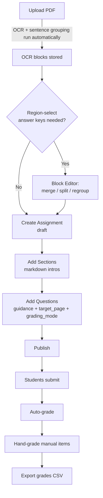
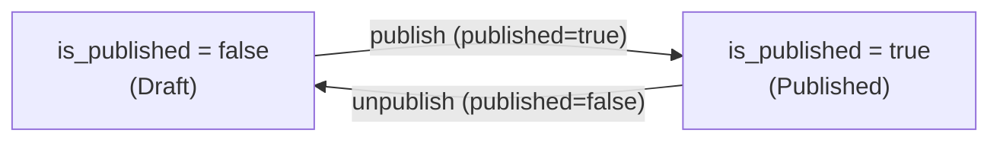

# Authoring Assignments (Instructor)

This guide walks an **instructor** through the full authoring lifecycle in PaperLock:
upload a source PDF, (optionally) hand-tune its text blocks, build an assignment out of
sections and questions, publish it to students, grade it, and export the gradebook.

Every action below maps to a real backend endpoint under the `/api` prefix and a real
screen in the instructor UI. Only the **instructor** role can author; grading is open to
**instructor** and **ta**. See [./api-reference.md](./api-reference.md) for the full route
list and [./data-model.md](./data-model.md) for the underlying tables.

> **Auth reminder.** Every endpoint below (except `/api/health` and `/api/auth/login`)
> requires a JWT sent as `Authorization: Bearer <token>`. Authoring routes additionally
> require `role == instructor`; a `ta` or `student` token receives `403 "Insufficient
> permissions"`.

---

## The workflow at a glance



The instructor home screen (`/instructor`, `InstructorView.jsx`) is the hub: it lists
uploaded PDFs, existing assignments (with a **Draft / Published** badge), and the roster
tools. From there you branch into the Block Editor, the Question Builder, and the Grading
views.

---

## Step 1 — Upload a PDF

Uploading the source article is the first and only mandatory prerequisite for an
assignment (`Assignment.pdf_id` is `NOT NULL`).

**Endpoint:** `POST /api/pdf/upload` — instructor only, `multipart/form-data`, field `file`.

```bash
curl -X POST https://HOST/paperlock/api/pdf/upload \
  -H "Authorization: Bearer $TOKEN" \
  -F "file=@Loftus1975.pdf"
```

What happens on upload:

1. The filename must end in `.pdf` (case-insensitive), else `400 "Only PDF files allowed"`.
2. The file is saved under a random `{uuid}.pdf` name in the server's `UPLOAD_DIR`.
3. **OCR + sentence grouping run automatically.** `extract_text_blocks`
   (`backend/app/services/ocr.py`) runs in a threadpool: PyMuPDF extracts **word-level**
   bounding boxes, then spaCy (`en_core_web_sm`) segments each paragraph into sentences.
   **Despite the name, PaperLock's "OCR" is text-*layer* extraction, not image OCR:** it
   reads the PDF's *embedded* text via PyMuPDF `get_text` and never recognizes characters
   from page images, so a scanned/image-only PDF has no text layer and produces **zero
   blocks** — always author from text-based PDFs.
   Every word becomes one `ocr_blocks` row carrying:
   - `x`, `y`, `width`, `height` — position as a **percentage of the page** (0–100),
   - `sentence_group` — a document-wide sentence index (drives sentence-granularity selection),
   - `paragraph_group` — a document-wide paragraph index,
   - `block_order` — global reading order.
4. If extraction throws, the saved file is removed and the request returns
   `422 "Failed to process PDF: {e}"`.

**Response (`PDFResponse`):**

| Field | Meaning |
|---|---|
| `id` | the `pdf_id` you reference when creating an assignment |
| `original_name` | the uploaded filename |
| `page_count` | number of pages |
| `block_count` | number of OCR word blocks created |
| `has_text` | `true` when `block_count > 0` |

> **Use text-based PDFs, not scans.** If `has_text` is `false`, the PDF is an
> image/scanned document: no selectable text was found, so **region-select questions
> won't work**. The instructor UI surfaces this as a warning on upload. Re-export the
> article as a text PDF before authoring region questions.

Related PDF routes (all instructor unless noted):

| Method & path | Purpose |
|---|---|
| `GET /api/pdf/` | list uploaded PDFs (id, name, page_count, uploaded_at) |
| `GET /api/pdf/{pdf_id}/serve` | stream the PDF inline (any authenticated user) |
| `GET /api/pdf/{pdf_id}/blocks` | list OCR blocks ordered by page then `block_order` (any authenticated user) |
| `DELETE /api/pdf/{pdf_id}` | delete a PDF — **`409`** if any assignment references it |

---

## Step 2 (optional) — Block Editor: merge / split / regroup

The Block Editor exists for one reason: **hand-aligning region-select ("find the line")
answer keys.** Auto-OCR splits text into words and machine-detected sentences, which don't
always match the span you want a student to select. Merging blocks into a single
`group_id` lets you define exactly the region that counts as "the correct line," and that
grouped region is what `correct_block_ids` should point at.

**Open it:** from the instructor PDF list, choose a PDF → route
`/instructor/pdf/:pdfId/blocks` (`BlockEditorView.jsx`).

### How grouping is represented

There are two independent grouping concepts on an `ocr_blocks` row:

- `sentence_group` / `paragraph_group` — **automatic**, produced by OCR; never edited here.
- `group_id` — an **optional manual override** you create by merging. `null` by default.

```mermaid
flowchart LR
    subgraph "OCR output (automatic)"
      w1[word: The] --- w2[word: barn] --- w3[word: was]
    end
    w1 -. "merge selected words" .-> G["group_id = min(block ids)"]
    w2 -. .-> G
    w3 -. .-> G
    G -->|"split"| N["group_id = null (ungrouped)"]
```

### Endpoints

| Method & path | Body / query | Effect |
|---|---|---|
| `POST /api/pdf/blocks/merge` | raw JSON array `block_ids: [int]` | Sets `group_id = min(block_ids)` on all of them. Returns `{group_id, block_count}`. `404` if none found. |
| `POST /api/pdf/blocks/split` | `{ "group_id": int }` | Clears `group_id = null` on every block in that group. Returns `{ok, block_count}`. `404` if none match. |
| `PATCH /api/pdf/blocks/{block_id}/group` | query `?group_id=` (int or omitted for null) | Sets one block's `group_id` directly. Returns `{ok}`. `404` if not found. |

> **Split only undoes a manual merge.** It operates on `group_id`; it cannot re-split an
> automatic `sentence_group`/`paragraph_group`. The UI disables the Split button unless the
> selected block belongs to a manual group.

You do not have to use the Block Editor for free-text, multiple-choice, short-answer,
matching, cloze, or scale questions — it only matters when a `region_select` answer key
must cover a span that OCR grouped differently than you want.

---

## Step 3 — Create an assignment

**Endpoint:** `POST /api/assignments/` — instructor. Body is `AssignmentCreate`.

```json
{
  "title": "Q1 — Loftus (1975): Guided Reading",
  "description": "Optional summary shown on the dashboard.",
  "pdf_id": 42,
  "available_from": "2026-07-07T16:00:00Z",
  "available_until": "2026-07-14T06:59:00Z",
  "questions": []
}
```

| Field | Notes |
|---|---|
| `title` | required |
| `description` | optional |
| `pdf_id` | **required** — the PDF from Step 1 |
| `available_from` / `available_until` | optional ISO datetimes; a `null` end date means "no deadline" (naive datetimes are coerced to UTC before comparison) |
| `questions` | optional inline list of `QuestionCreate`; you can also add them later (Step 5) |

Key behaviors:

- The assignment is created as a **draft** — `is_published = false` by default. It is
  invisible to students until you publish it (Step 7), *regardless of the dates above*.
- If you pass inline `questions`, each one's `order` falls back to its positional index
  (`q.order if q.order else idx`) so several `order = 0` questions don't collide.

The response is an `AssignmentResponse` including `id`, `is_published`, and the nested
`questions` and `sections` arrays.

Editing the shell later:

- `PUT /api/assignments/{id}` — update `title`, `description`, `available_from`,
  `available_until`. This uses `model_fields_set`, so **explicitly sending `null` clears**
  `description`/`available_from`/`available_until` (e.g. remove a deadline to re-open),
  while **omitting** a field leaves it unchanged.
- `DELETE /api/assignments/{id}` — deletes the assignment and its submissions
  (answers/grades cascade). The referenced PDF is **not** deleted.

---

## Step 4 — Add Sections (with markdown intros)

Sections group questions into instructional passes (for PSYC 1 these mirror the QALMRI
reading passes). A section's `description` is a **markdown intro** rendered above its
questions in the reader.

**Endpoint:** `POST /api/assignments/{assignment_id}/sections` — instructor. Body
`SectionCreate`:

```json
{
  "title": "Pass 1 — Survey",
  "description": "Skim the **abstract, figures, and headings**. Do not read line-by-line yet.\n\n- What is the study *about*?\n- What kind of study is it?",
  "order": 0
}
```

| Field | Notes |
|---|---|
| `title` | required |
| `description` | markdown intro (optional) |
| `order` | display order within the assignment (default `0`) |

Response `SectionResponse` = `id`, `title`, `description`, `order`. You attach a question to
a section by setting the question's `section_id` (Step 5).

Managing sections:

- `PUT /api/assignments/{id}/sections/{section_id}` — `title` / `order` update when
  provided; `description` uses `model_fields_set` (send `null` to clear it).
- `DELETE /api/assignments/{id}/sections/{section_id}` — **ungroups** its questions
  (sets their `section_id = null`) rather than deleting them, then removes the section.

---

## Step 5 — Add Questions

Build questions in the Question Builder (`/instructor/assignment/:assignmentId/questions`,
`QuestionBuilderView.jsx`) or via the API.

**Endpoint:** `POST /api/assignments/{assignment_id}/questions` — instructor. Body is
`QuestionCreate`; `404` if the assignment doesn't exist. (Unlike inline creation, this
route uses `req.order` verbatim — set it yourself.)

### Question types

`question_type` is a `QuestionType` enum. See [./question-types.md](./question-types.md)
for the full authoring recipe of each type; in brief:

| `question_type` | Student answers by… | Answer-key field(s) | Default `grading_mode` |
|---|---|---|---|
| `region_select` | selecting a span on the PDF | `correct_block_ids` (+ `selection_granularity`) | `auto` |
| `multiple_choice` | picking option index(es) | `options`, `correct_options`, `allow_multiple` | `auto` |
| `short_answer` | typing a short string/number | `accepted_answers` | `auto` |
| `matching` | pairing left→right | `match_left`, `match_right`, `correct_matches` | `auto` |
| `cloze` | filling blanks from a bank | `cloze_text` (`{{0}}`, `{{1}}` …), `cloze_bank`, `cloze_answers` | `auto` |
| `scale` | choosing a Likert point | `scale_min`, `scale_max` | `completion` |
| `free_text` | writing prose | `sample_answer` (rubric reference only) | `manual` |

### Common fields on every question

| Field | Purpose |
|---|---|
| `prompt` | the question text (required) |
| `points` | max score (default `1.0`) |
| `order` | display order |
| `section_id` | the owning section from Step 4 (optional) |
| `guidance` | scaffolding hint shown to the student in the reader |
| `target_page` | 1-based page number; renders a **"Go to p. N"** jump button in the reader that scrolls the PDF to that page |
| `grading_mode` | `auto`, `manual`, or `completion` (Step 6) |
| `sample_answer` | an instructor-only model answer / rubric reference for hand-grading |

> **Answer keys are hidden from students.** When a student lists or opens an assignment,
> `correct_block_ids`, `correct_options`, `accepted_answers`, `correct_matches`,
> `cloze_answers`, and `sample_answer` are stripped to `null`. Fields needed to *render*
> the question (`options`, `match_left`, `match_right`, `cloze_text`, `cloze_bank`) are
> **not** stripped.

### Editing questions

`PUT /api/assignments/{id}/questions/{question_id}` updates a question. Two safeguards to
know about:

- **MC option count is locked after submissions exist.** If you change the *number* of
  `options` on a `multiple_choice` question once any submission exists for the assignment,
  the request returns **`409`** — students' answers are stored as positional indices and
  adding/removing options would misalign them. Editing option *wording* (same count) is
  allowed.
- **Type change resets grading mode.** If you change `question_type` without explicitly
  setting `grading_mode`, the mode resets to the new type's default so a stale mode can't
  mis-grade.

`DELETE /api/assignments/{id}/questions/{question_id}` removes a question (`404` if not
found).

---

## Step 6 — Set the grading mode

`grading_mode` is a plain string column (not an enum) with three meaningful values. It is
checked **first** by the auto-grader, before question-type logic. If you leave it unset at
create/add time, `_default_grading_mode()` fills in the per-type default from the table
above.

| `grading_mode` | Auto-grade behavior |
|---|---|
| `auto` | Score by the question type's answer-key logic (region overlap, MC set match, short-answer normalize, matching/cloze positional credit). Returns "no key → skip" if the key is missing. |
| `completion` | Full points if the student answered at all, else `0`. Ignores correctness. |
| `manual` | Never auto-scored — always left for hand-grading (never auto-zeroed). |

Defaults: `free_text → manual`, `scale → completion`, everything else → `auto`. Full
scoring math (recall-based region credit, the `REGION_PROXIMITY_TOLERANCE = 3` proximity
rule, numeric tolerance, fractional matching/cloze credit) is documented in
[./grading.md](./grading.md).

---

## Step 7 — Publish / unpublish

**Endpoint:** `POST /api/assignments/{assignment_id}/publish` — instructor.
Body `PublishRequest`: `{ "published": true }` (or `false`). In the UI this is the
**Publish / Unpublish** toggle on the assignment card; the badge flips between **Draft**
and **Published**.



Visibility rules for students (instructors and TAs bypass all of this and always see
everything, unstripped):

- **A draft is invisible regardless of dates.** While `is_published = false`, a student's
  assignment list omits it and `GET /api/assignments/{id}` returns **`404`** (it "looks
  like it doesn't exist").
- Once published, the **availability window** applies:
  - before `available_from` → `403 "This assignment is not open yet"`,
  - after `available_until` → `403 "The deadline for this assignment has passed"`,
  - `null` on either bound means open-ended on that side.

So publishing and scheduling are independent: publish makes it *eligible* to appear;
the dates decide *when* within that. A student who has already started may resume even
after the deadline, but cannot start fresh once closed.

---

## Step 8 — Grade

Grading lives under `/grading` (`GradingHome.jsx` → `GradingView.jsx`) and is open to
**instructor** and **ta**. The recommended order is **auto-grade first, then hand-grade the
manual items.**

### 8a. Auto-grade

**Endpoint:** `POST /api/grading/auto-grade/{assignment_id}` — instructor/ta. In the UI
this is the **"Auto-Grade Region Questions"** button (it actually scores every
auto-scorable question, not just region ones).

- Processes only **submitted** submissions (`is_submitted = true`).
- Skips any question whose score comes back `None` (manual mode, or `auto` with a missing
  key) — these are **never auto-zeroed**.
- **Never overwrites a manual grade:** if a grade exists and `is_auto_graded = false`, it
  is left untouched. Prior auto-grades are updated in place.
- Returns `{ "graded": <count> }`.

### 8b. Hand-grade the rest

For `free_text` (and any `manual` item, or any answer the auto-grader skipped), score by
hand.

**Endpoint:** `POST /api/grading/grade` — instructor/ta. Body `GradeRequest`:

```json
{ "submission_id": 12, "question_id": 88, "score": 4.0, "comments": "Good QALMRI logic." }
```

- Validates `0 <= score <= question.points`, else `400 "Score must be between 0 and
  {points}"`.
- Sets `graded_by`, `graded_at`, and `is_auto_graded = false` — so this manual grade is now
  **protected** from any future auto-grade run.

Supporting reads:

| Method & path | Purpose |
|---|---|
| `GET /api/grading/assignments/{id}/submissions` | roster of submissions with `graded_count`, `question_count`, `total_score` (populated **only** when every question is graded), `max_score` |
| `GET /api/grading/submissions/{id}/grades` | existing per-question grades (to reopen the grading UI) |

See [./grading.md](./grading.md) for the scoring details behind each grade.

### Grading flow

```mermaid
sequenceDiagram
    participant I as Instructor/TA
    participant G as Grading API
    I->>G: POST /auto-grade/{assignment_id}
    G-->>I: {"graded": N} (submitted only; manual grades untouched)
    loop each free_text / manual answer
        I->>G: POST /grade {submission_id, question_id, score, comments}
        G-->>I: GradeResponse (is_auto_graded=false)
    end
    I->>G: GET /export/{assignment_id}
    G-->>I: grades CSV
```

---

## Step 9 — Export grades CSV

**Endpoint:** `GET /api/grading/export/{assignment_id}` — instructor/ta. In the UI this is
the **"Export CSV for Canvas"** button. Returns `text/csv` with
`Content-Disposition: attachment; filename=grades_assignment_{id}.csv`.

Format (`backend/app/services/export.py`):

- Rows are **only** submitted students, sorted by **last name** (handles both
  `"Last, First"` and `"First Last"`).
- Columns: `Student`, `ID` (the student PID), one column per question labeled
  `Q{order+1} ({points})`, then a final `Total ({sum of points})`.
- A cell is the grade score if one exists, else blank (`""`).
- The **Total is left blank when nothing has been graded yet** for that student, so
  importing the CSV into Canvas never overwrites a real grade with a `0`. Partially graded
  students show a running partial total — export once grading is complete.

```
Student,ID,Q1 (2.0),Q2 (4.0),Total (6.0)
"Loftus, Beth",A00000002,2.0,3.5,5.5
"Zed, Alan",A00000009,,,
```

---

## Manage the roster & distribute access codes

PaperLock has no self-service signup and no passwords: a student logs in with their
**PID + access code**, and only an instructor can create accounts. So before students can
open anything, the instructor must build the roster and hand each student their code. This
all lives in the **Students** tab of the instructor home (`InstructorView.jsx` → `UsersTab`;
the tab is labeled *Students* and also holds Teaching Assistants).

> **Why access codes are plaintext.** Codes are stored and shown in the clear **by design**
> — the instructor has to display, copy, and export them to distribute them, so
> hashing-at-rest was deliberately rejected. Treat the roster views and the exported CSV as
> sensitive (the DB is gitignored). To rotate a leaked code, use **Reset** (below).

### Import a roster from a Canvas CSV

The fastest way to populate the roster is the **Import from Canvas CSV** panel at the top of
the Students tab. Export your gradebook from Canvas and upload the file with **Choose CSV
File**; `CsvImportSection.parseCsv` parses it entirely in the browser, shows a preview table
(first 20 rows), and **Import N Students** posts them.

What the parser expects and does:

- **Required headers** (case-insensitive, matched by regex): a `Student` column (the
  student's **name**) **and** a PID column — it prefers **`SIS User ID`** and falls back to
  **`ID`** only if `SIS User ID` is absent. A Canvas gradebook export already carries all
  three. If either the `Student` or the PID column is missing, the parse yields nothing and
  you get *"Could not parse students from CSV. Check that headers include 'Student' and 'SIS
  User ID' or 'ID'."*
- **Quoted commas are handled** — a value like `"Loftus, Beth"` is read as one field, so
  Canvas's `Last, First` names survive intact.
- **Rows missing a name or a PID are skipped** (both must be present to import). This quietly
  drops the junk rows a Canvas export includes, e.g. the `Points Possible` line.
- Every imported user is **forced to `role: "student"`** regardless of the file's contents.
- Import maps to `POST /api/auth/users/batch` (`api.batchCreateUsers`). The server **skips
  any PID that already exists** (duplicates are ignored, not updated), so re-importing an
  updated roster only adds the new students — the result banner reports e.g. *"Imported 22
  students, 3 skipped (duplicates)."*

### Add or manage individual students

Below the import panel the **Students** table lists everyone with their **Name**, **PID**,
and **Access Code**, plus per-row actions:

- **Copy** (copy icon) — copies that one student's access code to the clipboard
  (`copyToClipboard`); the icon briefly turns to a check. Use it to hand a single code to one
  student.
- **Reset** (title *Reset access code*) — regenerates the access code via
  `POST /api/auth/users/{id}/reset-code`; the old code stops working immediately (confirm
  dialog: *"Their old code will stop working."*). Use it when a code leaks or a student
  can't be reached with the old one.
- **Delete** (trash icon) — removes the student (`DELETE /api/auth/users/{id}`, with a
  confirm dialog). Deleting a user detaches any grades they authored (sets `graded_by =
  null`) and cascade-deletes their own submissions.

To add one student by hand, use the **PID / Name** fields under the table and **Add**
(`api.createUser` → `POST /api/auth/users`, forced `role: "student"`); a duplicate PID
returns **`409 "User with this PID already exists"`**.

### Export codes for distribution

Once the roster looks right, the **Export Codes CSV** button (`ExportCodesButton`) downloads
**`paperlock_access_codes.csv`** — one row per student with columns **`Name, PID, Access
Code, Login URL`** (the login URL is built from the current origin plus the app's base path).
This is the file you mail-merge or otherwise use to hand each student their personal code and
where to sign in. The button is disabled while the roster is empty.

Don't confuse the three CSVs in the app: this **access-code sheet** is what you *distribute*;
the Canvas import CSV is your *input* roster; and `grades_assignment_{id}.csv` (Step 9) is the
*graded* output.

### Create & manage TA accounts

The same tab has a **Teaching Assistants** section (`TaSection`, below the divider). Adding a
TA uses the same PID/Name form but forces **`role: "ta"`** (`api.createUser`), and TAs get
their own copy-code and delete actions. A TA account can reach the **grading** views (`role
in {instructor, ta}`) but **cannot author** — authoring routes require `role == instructor`
and return `403 "Insufficient permissions"` for a TA (see the Auth reminder at the top).
Distribute a TA's login the same way: PID + access code.

Roster endpoints (all instructor-only):

| Method & path | Purpose |
|---|---|
| `GET /api/auth/users?role=student\|ta` | list the roster for a role |
| `POST /api/auth/users` | create one user (`409` on duplicate PID) |
| `POST /api/auth/users/batch` | bulk-create from the parsed CSV (skips existing PIDs) |
| `POST /api/auth/users/{id}/reset-code` | regenerate one user's access code |
| `DELETE /api/auth/users/{id}` | delete a user (detaches authored grades) |

---

## Reusing assignments across servers (bundles)

To move a finished assignment to another PaperLock instance (e.g. dev → production),
export it as a self-contained bundle (PDF bytes + OCR blocks + sections + questions +
answer keys) and import it elsewhere.

| Method & path | Purpose |
|---|---|
| `GET /api/assignments/{id}/bundle` | download the `AssignmentBundle` JSON (UI: **Export** on the card) |
| `POST /api/assignments/import` | recreate it here — imported as an **unscheduled draft** |

An imported assignment always arrives as a **draft** with `available_from`/`available_until`
cleared, so it can't accidentally go live or appear already-closed; block IDs and
`section_id`s are remapped so region answer keys stay valid. Full field-by-field shape and
the remapping rules are in [./bundles.md](./bundles.md).

---

## Endpoint quick reference

All paths are under the `/api` prefix. "I" = instructor only; "I/TA" = instructor or TA.

| Step | Method & path | Role |
|---|---|---|
| Upload PDF | `POST /api/pdf/upload` | I |
| List PDFs | `GET /api/pdf/` | I |
| View blocks | `GET /api/pdf/{pdf_id}/blocks` | any |
| Merge blocks | `POST /api/pdf/blocks/merge` | I |
| Split group | `POST /api/pdf/blocks/split` | I |
| Set one block's group | `PATCH /api/pdf/blocks/{block_id}/group` | I |
| Create assignment | `POST /api/assignments/` | I |
| Update assignment | `PUT /api/assignments/{id}` | I |
| Add section | `POST /api/assignments/{id}/sections` | I |
| Add question | `POST /api/assignments/{id}/questions` | I |
| Update question | `PUT /api/assignments/{id}/questions/{qid}` | I |
| Publish / unpublish | `POST /api/assignments/{id}/publish` | I |
| List submissions | `GET /api/grading/assignments/{id}/submissions` | I/TA |
| Auto-grade | `POST /api/grading/auto-grade/{id}` | I/TA |
| Manual grade | `POST /api/grading/grade` | I/TA |
| Export CSV | `GET /api/grading/export/{id}` | I/TA |
| Export bundle | `GET /api/assignments/{id}/bundle` | I |
| Import bundle | `POST /api/assignments/import` | I |
| List roster | `GET /api/auth/users?role=…` | I |
| Create user | `POST /api/auth/users` | I |
| Bulk-import roster | `POST /api/auth/users/batch` | I |
| Reset access code | `POST /api/auth/users/{id}/reset-code` | I |
| Delete user | `DELETE /api/auth/users/{id}` | I |

---

## See also

- [./question-types.md](./question-types.md) — authoring recipe for each question type
- [./grading.md](./grading.md) — auto-scoring math and grading modes
- [./bundles.md](./bundles.md) — assignment bundle export/import format
- [./data-model.md](./data-model.md) — database tables, enums, and constraints
