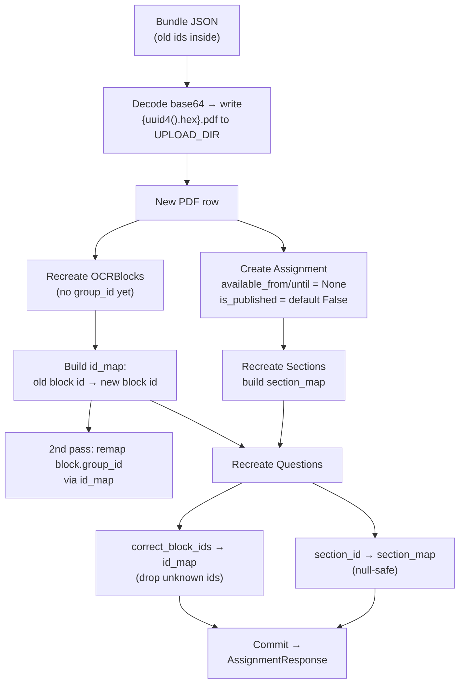
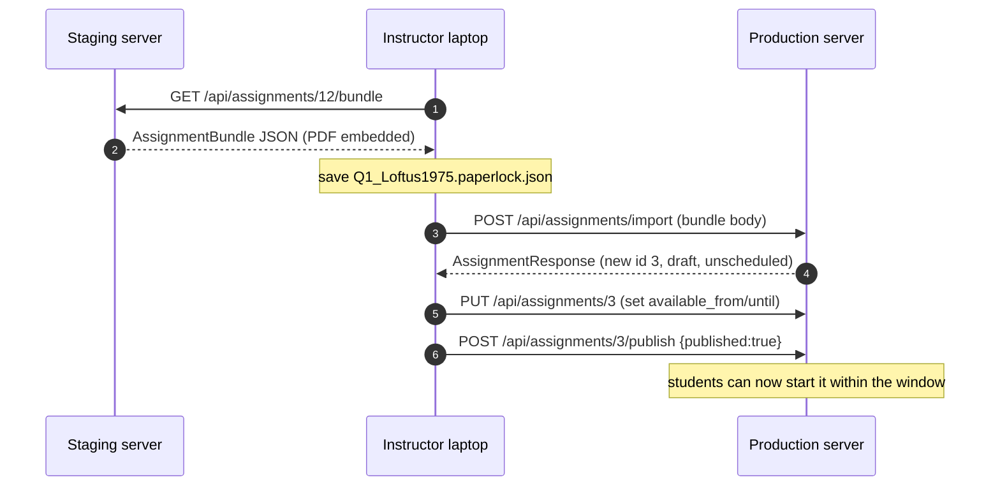

# Assignment Bundles (Export / Import)

A **bundle** is a single self-contained JSON document that carries one complete
assignment — its metadata, the source PDF (embedded, base64-encoded), every OCR
text block, all questions *with their answer keys*, and all sections — so an
instructor can move an assignment from one PaperLock server to another without
sharing a database or copying files by hand.

The primary use case is **deploy-to-remote**: author and test an assignment on a
laptop or staging box, export it to a `*.paperlock.json` file, then import that
file into the production server (`lpl-exp.ucsd.edu` under `/paperlock`). This is
"Option B" of the content-seeding paths in `DEPLOY.md` §7 — a fresh production DB
seeded per-assignment from bundles, as opposed to copying the whole
`paperlock.db` + `uploads/` directory.

All of the code lives in
[`backend/app/routers/assignments.py`](../backend/app/routers/assignments.py)
(the `Bundle*` / `AssignmentBundle` Pydantic models and the `export_bundle` /
`import_bundle` endpoints).

Related docs:

- Column definitions for every table a bundle touches (`PDF`, `OCRBlock`,
  `Assignment`, `Section`, `Question`) → [`./data-model.md`](./data-model.md)
- The full `/api` endpoint surface, roles, and gating →
  [`./api-reference.md`](./api-reference.md)
- How the imported answer keys are scored → [`./grading.md`](./grading.md)
- Environment, seeding, and the production deploy runbook →
  [`./deployment.md`](./deployment.md)
- High-level system tour → [`./overview.md`](./overview.md)

---

## At a glance

| | Export | Import |
|---|---|---|
| **Method / path** | `GET /api/assignments/{assignment_id}/bundle` | `POST /api/assignments/import` |
| **Role** | `instructor` | `instructor` |
| **Request** | path id only | `AssignmentBundle` JSON body |
| **Response** | `AssignmentBundle` JSON | `AssignmentResponse` (the newly created assignment) |
| **Answer keys** | **included** (unstripped — instructor-only route) | recreated and remapped |
| **Availability window** | exported as-is | **ignored** — imported unscheduled |
| **Publish state** | exported title/desc only | imported as a **draft** (unpublished) |

Both routes require `require_role(UserRole.instructor)`; TAs and students cannot
export or import. The JWT may be supplied via the `Authorization: Bearer <token>`
header or a `?token=` query parameter (see [`./api-reference.md`](./api-reference.md)).

---

## The bundle JSON shape

The top-level object is `AssignmentBundle`. A pretty-printed example (PDF payload
truncated) looks like this:

```json
{
  "version": 1,
  "title": "QALMRI 1 — Loftus (1975), Experiment 3",
  "description": "Guided reading & recognition. Three-pass method.",
  "available_from": "2026-07-07T16:00:00+00:00",
  "available_until": "2026-07-14T06:59:00+00:00",
  "pdf_original_name": "Loftus_1975.pdf",
  "pdf_page_count": 8,
  "pdf_content_base64": "JVBERi0xLjQKJ...<base64 of the raw PDF bytes>...",
  "blocks": [
    {
      "id": 4021,
      "page_number": 1,
      "text": "Leading questions and the eyewitness report",
      "x": 11.7647, "y": 11.4268, "width": 70.4575, "height": 1.7677,
      "group_id": null,
      "sentence_group": 0,
      "paragraph_group": 0,
      "block_order": 0
    }
  ],
  "questions": [
    {
      "question_type": "region_select",
      "prompt": "Highlight the sentence stating the research question.",
      "order": 0,
      "points": 2.0,
      "correct_block_ids": [4055, 4056],
      "allow_multiple": true,
      "selection_granularity": "sentence",
      "options": null,
      "correct_options": null,
      "section_id": 88,
      "guidance": "Look in the Introduction.",
      "target_page": 2,
      "sample_answer": null,
      "grading_mode": "auto",
      "accepted_answers": null,
      "match_left": null,
      "match_right": null,
      "correct_matches": null,
      "cloze_text": null,
      "cloze_bank": null,
      "cloze_answers": null,
      "scale_min": null,
      "scale_max": null
    }
  ],
  "sections": [
    {
      "id": 88,
      "title": "Pass 2 — Targeted dig",
      "description": "Introduction → Question & Alternatives.",
      "order": 0
    }
  ]
}
```

### Top-level `AssignmentBundle`

| Field | Type | Notes |
|---|---|---|
| `version` | `int` | Bundle schema version. Defaults to `1`; export always writes `1`. |
| `title` | `str` | Assignment title. |
| `description` | `str \| null` | Markdown description (may be `null`). |
| `available_from` | `datetime \| null` | Source window start. **Recorded but ignored on import.** |
| `available_until` | `datetime \| null` | Source window end. **Recorded but ignored on import.** |
| `pdf_original_name` | `str` | Human-facing filename (e.g. `Loftus_1975.pdf`). |
| `pdf_page_count` | `int` | Page count copied to the new `PDF` row. |
| `pdf_content_base64` | `str` | Base64 (ASCII) of the **raw PDF bytes**. This is the bulk of the file. |
| `blocks` | `list[BundleBlock]` | Every OCR block for the PDF, ordered by `block_order`. |
| `questions` | `list[BundleQuestion]` | All questions, answer keys included. |
| `sections` | `list[BundleSection]` | All sections. Defaults to `[]`. |

> The bundle embeds the **entire PDF** as base64, so a bundle for a multi-page
> article is typically a few hundred KB to a few MB. It is a complete, standalone
> artifact — nothing else needs to travel with it.

### `BundleBlock` — one OCR text block

Each entry is a rectangle of extracted text on a page. The `id` is the block's
id **on the source server**; it exists only so the importer can rewrite answer
keys and manual-merge groups to the new ids (see [Import behavior](#import-behavior)).

| Field | Type | Notes |
|---|---|---|
| `id` | `int` | Original block id (source server). Used only for remapping on import. |
| `page_number` | `int` | 0-based page index. |
| `text` | `str` | Extracted text of the block. |
| `x`, `y`, `width`, `height` | `float` | Bounding box as **percentages of the page dimensions** (0–100), not raw PDF points — `x`/`width` are relative to page width, `y`/`height` to page height. |
| `group_id` | `int \| null` | Manual-merge group. **References another block's `id`** — remapped on import. |
| `sentence_group` | `int \| null` | Sentence index (drives region-select proximity scoring — see [`./grading.md`](./grading.md)). |
| `paragraph_group` | `int \| null` | Paragraph index. |
| `block_order` | `int` | Reading order; export sorts blocks by this. |

### `BundleQuestion` — one question (no `id`)

`BundleQuestion` has **no `id` field**: questions are recreated fresh on import,
so their ids are never referenced by anything else in the bundle. It carries the
full answer key (unlike the student-facing API, which strips keys — see the
answer-key stripping note in [`./api-reference.md`](./api-reference.md)).

| Field | Type | Notes |
|---|---|---|
| `question_type` | `str` | One of the `QuestionType` values: `region_select`, `free_text`, `multiple_choice`, `short_answer`, `matching`, `cloze`, `scale`. Converted via `QuestionType(...)` on import. |
| `prompt` | `str` | Question text. |
| `order` | `int` | Sort order within the assignment. |
| `points` | `float` | Max points. |
| `correct_block_ids` | `list[int] \| null` | **References original block ids** — remapped on import (region_select key). |
| `allow_multiple` | `bool` | Defaults `false`. |
| `selection_granularity` | `str` | `word` \| `sentence` \| `paragraph`. Defaults `"sentence"`. Converted via `SelectionGranularity(...)`. |
| `options` | `list[str] \| null` | Multiple-choice option strings. |
| `correct_options` | `list[int] \| null` | Correct MC option indices. |
| `section_id` | `int \| null` | **Original section id** — remapped via `section_map` on import. |
| `guidance` | `str \| null` | Optional hint text. |
| `target_page` | `int \| null` | 1-based page the question points at. |
| `sample_answer` | `str \| null` | Model answer (free_text). |
| `grading_mode` | `str \| null` | `auto` \| `manual` \| `completion` (plain string, not an enum). |
| `accepted_answers` | `list[str] \| null` | short_answer key. |
| `match_left` / `match_right` | `list[str] \| null` | matching columns. |
| `correct_matches` | `list[int] \| null` | matching key (positional). |
| `cloze_text` | `str \| null` | Text with `{{0}}`, `{{1}}` blanks. |
| `cloze_bank` | `list[str] \| null` | Cloze word bank. |
| `cloze_answers` | `list[int] \| null` | Correct bank-index per blank. |
| `scale_min` / `scale_max` | `int \| null` | Scale / Likert bounds. |

### `BundleSection`

| Field | Type | Notes |
|---|---|---|
| `id` | `int` | Original section id (source server). Used to remap each question's `section_id`. |
| `title` | `str` | Section heading. |
| `description` | `str \| null` | Markdown intro (may be `null`). |
| `order` | `int` | Sort order. |

---

## Export: `GET /api/assignments/{assignment_id}/bundle`

Instructor-only. Given an assignment id, it:

1. Loads the assignment — **404 `"Assignment not found"`** if missing.
2. Loads its `PDF` row — **404 `"PDF for assignment not found"`** if missing.
3. Reads the PDF file from disk (`UPLOAD_DIR`, i.e. `backend/uploads/`) and
   base64-encodes it — **404 `"PDF file is missing on disk"`** if the file is
   gone.
4. Loads every `OCRBlock` for that PDF **ordered by `block_order`**.
5. Serializes questions (with `question_type`/`selection_granularity` as enum
   `.value` strings and **all answer keys included**) and sections.
6. Returns the `AssignmentBundle` with `version=1`.

Note that the source assignment's `available_from` / `available_until` **are**
included in the exported JSON, even though the importer deliberately ignores
them. The response is ordinary JSON; save it to a file to create a portable
bundle:

```bash
# Export assignment 12 to a bundle file (instructor token).
curl -sS \
  -H "Authorization: Bearer $INSTRUCTOR_TOKEN" \
  "https://staging.example.edu/paperlock/api/assignments/12/bundle" \
  -o Q1_Loftus1975.paperlock.json
```

The `.paperlock.json` suffix is the project convention for these files (see
`DEPLOY.md` §7); the API itself does not require any particular filename.

---

## Import: `POST /api/assignments/import`

Instructor-only. The request body **is** an `AssignmentBundle` (the exact JSON
produced by export). It returns the newly created `AssignmentResponse`.

```bash
# Import a bundle onto the production server (instructor token).
curl -sS -X POST \
  -H "Authorization: Bearer $INSTRUCTOR_TOKEN" \
  -H "Content-Type: application/json" \
  --data-binary @Q1_Loftus1975.paperlock.json \
  "https://lpl-exp.ucsd.edu/paperlock/api/assignments/import"
```

### Import behavior

The importer never trusts the source ids. It recreates every row fresh and
threads two remap tables through the process:

1. **Write the PDF.** `pdf_content_base64` is base64-decoded — **400
   `"Bundle PDF is not valid base64"`** if decoding fails. The bytes are written
   to `UPLOAD_DIR` (`backend/uploads/`) under a brand-new random filename,
   `{uuid4().hex}.pdf`. A new `PDF` row is created with `original_name` /
   `page_count` from the bundle and `uploaded_by = current_user`.

2. **Recreate OCR blocks and build `id_map`.** Every `BundleBlock` becomes a new
   `OCRBlock` under the new PDF — **created without `group_id` first**. After the
   flush assigns new ids, `id_map = {old_block_id → new_block_id}` is built.

3. **Remap manual-merge groups.** In a second pass, each block whose source
   `group_id` was set gets `ob.group_id = id_map.get(b.group_id)` — so
   instructor-merged block groups keep pointing at the right (new) blocks.

4. **Create the assignment — unscheduled and draft.** `available_from` and
   `available_until` are forced to `None` regardless of what the bundle carried,
   so a freshly imported assignment can never be accidentally live or already
   closed. `is_published` is **not** set in the constructor, so it falls back to
   the model default (`False`) — the assignment lands as an **unpublished
   draft**. (Because students get a 404 for drafts and a 403 outside the window,
   nothing is visible to students until the instructor sets dates and publishes.)

5. **Recreate sections and build `section_map`.** Each `BundleSection` becomes a
   new `Section` under the new assignment, recording
   `section_map = {old_section_id → new_section_id}`.

6. **Recreate questions with remapped references.** For each `BundleQuestion`:
   - `correct_block_ids` is rebuilt through `id_map`, **silently dropping any id
     not present** (`[id_map[i] for i in q.correct_block_ids if i in id_map]`).
   - `section_id` is remapped via `section_map` (null-safe:
     `section_map.get(q.section_id) if q.section_id else None`).
   - `question_type` is converted with `QuestionType(...)` and
     `selection_granularity` with `SelectionGranularity(...)`.
   - All other fields (points, options/correct_options, matching, cloze, scale,
     guidance, grading_mode, etc.) are copied straight across.

7. **Commit** and return the new assignment via `AssignmentResponse`.

Everything ends up under new, internally consistent ids, so region answer keys,
manual block merges, and section groupings all still line up on the destination
server.



### What import does *not* do

- It does **not** honor the bundle's availability window (dates are dropped).
- It does **not** publish the assignment (you must publish it explicitly).
- It does **not** carry over submissions, answers, grades, students, or
  annotations — a bundle is authoring content only, never student data.
- It does **not** de-duplicate PDFs: importing the same bundle twice creates two
  separate PDF rows and two on-disk files.

### Limitations / caveats

Two low-priority gaps are worth knowing before treating bundles as a durable
interchange format:

- **The `version` field is not validated.** `import_bundle` never inspects
  `bundle.version`. The field exists on the model (`version: int = 1`) and export
  always writes `1`, but import silently assumes the current schema — there is no
  compatibility gate or migration. Today every bundle is `1`, so this is inert;
  it would only matter if the shape ever changed (a future `2`, or a hand-edited
  bundle claiming a different version, is parsed exactly as if it were `1`).
- **No application-level size cap on the embedded PDF.** `import_bundle`
  base64-decodes `pdf_content_base64` and writes it to disk with **no length
  check**, so the backend itself accepts an arbitrarily large bundle body. The
  only bound is the reverse proxy's `client_max_body_size` (60M in
  `deploy/nginx-paperlock.conf`, 50M in the container `frontend/nginx.conf`),
  which is set on the whole `/api/` location and therefore also caps
  `POST /api/assignments/import` — not just `/pdf/upload`. Two wrinkles: base64
  inflates the payload ~33% over the raw PDF bytes (plus the surrounding JSON),
  so the effective PDF ceiling sits well below the nominal cap; and a client that
  reaches the backend directly (bypassing nginx) hits no size limit at all.

---

## Caveat: deleting an imported assignment orphans its PDF

`DELETE /api/assignments/{assignment_id}` (`delete_assignment`) removes the
assignment's submissions (cascading to their answers and grades) and then the
`Assignment` row — **and nothing else**. It never deletes the `PDF` row or the
file that `import_bundle` wrote to `UPLOAD_DIR`.

Because import always creates a *new* PDF (row + on-disk `{uuid}.pdf`), deleting
an imported assignment leaves that PDF behind as an orphan. This is by design —
PDFs are shared, first-class objects with no delete cascade from assignments (see
the cascade summary in [`./data-model.md`](./data-model.md)) — but it means
cleanup is a two-step operation:

1. Delete the assignment (`DELETE /api/assignments/{id}`).
2. Delete the now-unreferenced PDF from the instructor UI's **Upload tab**
   (`DELETE /api/pdf/{pdf_id}`).

The PDF delete is guarded: it returns **409 `"Cannot delete PDF: assignments
reference it"`** while any assignment still uses it, so you must remove the
assignment(s) first. Only then will the Upload tab let you delete the file and
reclaim the disk space.

---

## Worked example: deploy an assignment to the remote server

Scenario: QALMRI 1 (the Loftus 1975 assignment) was authored and tested on a
local/staging PaperLock, and now needs to go live on production
(`lpl-exp.ucsd.edu/paperlock`) with a fresh database (DEPLOY.md §7, Option B).



**Step 1 — Export from staging.** As the instructor, hit the bundle endpoint and
save the response:

```bash
curl -sS -H "Authorization: Bearer $STAGING_TOKEN" \
  "https://staging.example.edu/paperlock/api/assignments/12/bundle" \
  -o Q1_Loftus1975.paperlock.json
```

**Step 2 — Import on production.** Log in as the instructor on production to get
a token, then POST the file. The new assignment comes back as a draft with
`available_from` / `available_until` both `null`:

```bash
curl -sS -X POST \
  -H "Authorization: Bearer $PROD_TOKEN" \
  -H "Content-Type: application/json" \
  --data-binary @Q1_Loftus1975.paperlock.json \
  "https://lpl-exp.ucsd.edu/paperlock/api/assignments/import"
# → {"id": 3, "is_published": false, "available_from": null, "available_until": null, ...}
```

At this point the PDF, all OCR blocks, block merges, sections, questions, and
region answer keys have been faithfully recreated under new ids on production —
but nothing is visible to students yet (draft + no window).

**Step 3 — Schedule it.** Set the real availability window with
`PUT /api/assignments/3` (this endpoint updates `available_from` /
`available_until`):

```bash
curl -sS -X PUT \
  -H "Authorization: Bearer $PROD_TOKEN" -H "Content-Type: application/json" \
  -d '{"available_from":"2026-07-07T16:00:00Z","available_until":"2026-07-14T06:59:00Z"}' \
  "https://lpl-exp.ucsd.edu/paperlock/api/assignments/3"
```

**Step 4 — Publish it.** Flip the draft flag so students can see and start it
within the window:

```bash
curl -sS -X POST \
  -H "Authorization: Bearer $PROD_TOKEN" -H "Content-Type: application/json" \
  -d '{"published": true}' \
  "https://lpl-exp.ucsd.edu/paperlock/api/assignments/3/publish"
```

**Optional — verify, then clean up a mistake.** If you imported the wrong bundle,
delete the assignment and then remove its orphaned PDF from the Upload tab:

```bash
curl -sS -X DELETE -H "Authorization: Bearer $PROD_TOKEN" \
  "https://lpl-exp.ucsd.edu/paperlock/api/assignments/3"
# then, in the instructor UI Upload tab, delete the leftover PDF
# (DELETE /api/pdf/{pdf_id}) — it will 409 until no assignment references it.
```

This same export → import → schedule → publish loop is how every QALMRI rung
(Q1–Q4) is promoted from authoring to the live PSYC 1 course without ever copying
the database.
