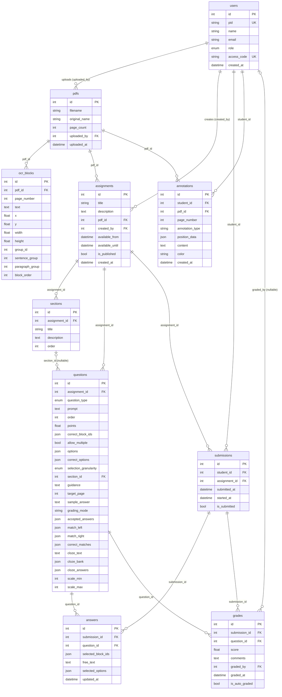

# Data Model

This document describes PaperLock's relational schema: every table, its columns
(name / type / nullability / default), enums, relationships, unique constraints,
and cascade behavior. It is the authoritative reference derived directly from the
SQLAlchemy models.

- **Models:** [`backend/app/models.py`](../backend/app/models.py)
- **Engine / session / PRAGMAs:** [`backend/app/database.py`](../backend/app/database.py)

Related docs:

- API surface that reads/writes these tables → [`./api-reference.md`](./api-reference.md)
- Grading semantics for `Grade` / `grading_mode` → [`./grading.md`](./grading.md)
- Assignment export/import JSON shape → [`./bundles.md`](./bundles.md)

---

## Engine, session, and SQLite specifics

The database layer lives in [`backend/app/database.py`](../backend/app/database.py).

- `DATABASE_URL = os.getenv("DATABASE_URL", "sqlite:///./paperlock.db")` — defaults
  to a local SQLite file `./paperlock.db`.
- `is_sqlite = DATABASE_URL.startswith("sqlite")` — a single boolean drives all
  engine/PRAGMA branching, so the same code runs on SQLite (dev + bundled prod) or
  Postgres (`DATABASE_URL=postgresql://…`).
- **connect_args:** `{"check_same_thread": False}` when SQLite, else `{}`.
  `check_same_thread` is SQLite-only (passing it to Postgres would raise); disabling
  it lets a SQLite connection be shared across FastAPI worker threads.
- **SQLite PRAGMAs** — an `@event.listens_for(engine, "connect")` handler
  (`_set_sqlite_pragma`) runs on every new DBAPI connection and executes:
  - `PRAGMA journal_mode=WAL` — Write-Ahead Logging (concurrent readers + one writer).
  - `PRAGMA busy_timeout=5000` — wait 5000 ms on lock contention instead of an
    immediate "database is locked" error (sized for ~40+ students submitting at once).
  - `PRAGMA foreign_keys=ON` — enables FK enforcement (off by default in SQLite).

  This whole block is skipped when not SQLite (Postgres uses its own defaults).
- `SessionLocal = sessionmaker(autocommit=False, autoflush=False, bind=engine)`.
- `Base(DeclarativeBase)` — the SQLAlchemy 2.x declarative base every model inherits.
- `get_db()` — generator dependency that yields a session and closes it in `finally`.
- `init_db()` — imports the model classes, then `Base.metadata.create_all(bind=engine)`.
  This is create-all only; **there are no migrations (no Alembic)**.
  > Quirk: `init_db()`'s explicit `from app.models import (…)` lists only **9** names —
  > it omits `Section` — yet all **10** tables are created. `create_all` builds every
  > table registered on `Base.metadata`, and `models.py` is imported in full by the
  > routers (`from app.models import …` executes the whole module, defining `Section`)
  > before startup, so `sections` is registered regardless of the short import list.

### A note on defaults and nullability

- Columns whose model definition omits an explicit `nullable=` are **nullable by
  default** in SQLAlchemy (marked "(implicitly nullable)" below): `allow_multiple`,
  `is_submitted`, `is_auto_graded`, `color`, and all `DateTime` timestamp columns
  fall into this group.
- Only `assignments.is_published` carries a **DB-level** default
  (`server_default="0"`). Every other default is Python-side — applied by the ORM at
  `INSERT`, not written into the DDL.
- The timestamp columns `users.created_at`, `pdfs.uploaded_at`,
  `submissions.started_at`, `answers.updated_at`, `annotations.created_at`, and
  `assignments.created_at` default to the Python lambda
  `datetime.now(timezone.utc)`. `answers.updated_at` additionally has `onupdate` set
  to the same lambda, so it is refreshed on every row update.

---

## Enums

Three real Python enums are used; `grading_mode` is deliberately **not** an enum.

| Enum | Python type | Column type | Values |
|---|---|---|---|
| `UserRole` | `str, enum.Enum` | `SAEnum(UserRole)` | `instructor`, `student`, `ta` |
| `QuestionType` | `str, enum.Enum` | `SAEnum(QuestionType)` | `region_select`, `free_text`, `multiple_choice`, `short_answer`, `matching`, `cloze`, `scale` |
| `SelectionGranularity` | `str, enum.Enum` | `SAEnum(SelectionGranularity)` | `word`, `sentence`, `paragraph` |

**`grading_mode`** is a plain `String(20)` (nullable) on `questions`, **not** an
enum. Only three values are meaningful — `auto`, `manual`, `completion` — and a
`NULL` value is backfilled to a per-type default when a question is created or
edited (see [`./grading.md`](./grading.md)):

- `free_text` → `manual`
- `scale` → `completion`
- everything else → `auto`

---

## Entity–relationship diagram

---

## Tables

There are **10 tables**. Column types are the SQLAlchemy types from
`models.py`; "Nullable" reflects the effective ORM behavior.

### `users` — `User`

| Column | Type | Nullable | Default | Notes |
|---|---|---|---|---|
| `id` | Integer | No (PK) | — | primary key, indexed |
| `pid` | String(20) | No | — | **unique**, indexed (campus PID login) |
| `name` | String(200) | No | — | display name |
| `email` | String(200) | Yes | — | optional |
| `role` | SAEnum(`UserRole`) | No | — | `instructor` \| `student` \| `ta` |
| `access_code` | String(64) | No | — | **unique**, indexed; plaintext login code by design |
| `created_at` | DateTime | Yes (implicit) | `datetime.now(timezone.utc)` (Python lambda) | |

**Relationships**

- `submissions` → `Submission` (`back_populates="student"`, `cascade="all, delete-orphan"`)
- `annotations` → `Annotation` (`back_populates="student"`, `cascade="all, delete-orphan"`)

Users are also referenced (without `back_populates`) by `PDF.uploader`
(`pdfs.uploaded_by`), `Assignment.creator` (`assignments.created_by`), and
`Grade.grader` (`grades.graded_by`).

### `pdfs` — `PDF`

| Column | Type | Nullable | Default | Notes |
|---|---|---|---|---|
| `id` | Integer | No (PK) | — | primary key, indexed |
| `filename` | String(500) | No | — | stored on-disk filename in the upload dir |
| `original_name` | String(500) | No | — | original uploaded filename |
| `page_count` | Integer | No | `0` | |
| `uploaded_by` | Integer | No | — | FK → `users.id` |
| `uploaded_at` | DateTime | Yes (implicit) | `datetime.now(timezone.utc)` lambda | |

**Relationships**

- `blocks` → `OCRBlock` (`back_populates="pdf"`, `cascade="all, delete-orphan"`)
- `assignments` → `Assignment` (`back_populates="pdf"`, **no cascade**)
- `uploader` → `User` (no `back_populates`)

> Deleting a PDF cascades to its `OCRBlock` rows but **not** to `Assignment`s. The
> API blocks a PDF delete with **409** if any assignment still references it.

### `ocr_blocks` — `OCRBlock`

Text/geometry blocks extracted from a PDF, the unit of region-select answers.

| Column | Type | Nullable | Default | Notes |
|---|---|---|---|---|
| `id` | Integer | No (PK) | — | primary key, indexed |
| `pdf_id` | Integer | No | — | FK → `pdfs.id` |
| `page_number` | Integer | No | — | |
| `text` | Text | No | — | |
| `x` | Float | No | — | left coordinate |
| `y` | Float | No | — | top coordinate |
| `width` | Float | No | — | |
| `height` | Float | No | — | |
| `group_id` | Integer | Yes | — | manual grouping override (references another block id) |
| `sentence_group` | Integer | Yes | — | auto sentence-grouping id (used for proximity credit) |
| `paragraph_group` | Integer | Yes | — | auto paragraph-grouping id |
| `block_order` | Integer | No | `0` | reading order within the PDF |

**Relationships**

- `pdf` → `PDF` (`back_populates="blocks"`)

### `assignments` — `Assignment`

| Column | Type | Nullable | Default | Notes |
|---|---|---|---|---|
| `id` | Integer | No (PK) | — | primary key, indexed |
| `title` | String(500) | No | — | |
| `description` | Text | Yes | — | |
| `pdf_id` | Integer | No | — | FK → `pdfs.id` |
| `created_by` | Integer | No | — | FK → `users.id` |
| `available_from` | DateTime | Yes | — | availability window start (null = open-ended) |
| `available_until` | DateTime | Yes | — | availability window end / deadline (null = open-ended) |
| `is_published` | Boolean | No | Python `False` **+ `server_default="0"`** | drafts default; only DB-level default in the schema |
| `created_at` | DateTime | Yes (implicit) | `datetime.now(timezone.utc)` lambda | |

**Relationships**

- `pdf` → `PDF` (`back_populates="assignments"`)
- `creator` → `User` (no `back_populates`)
- `questions` → `Question` (`back_populates="assignment"`, `cascade="all, delete-orphan"`, `order_by="Question.order"`)
- `sections` → `Section` (`back_populates="assignment"`, `cascade="all, delete-orphan"`, `order_by="Section.order"`)
- `submissions` → `Submission` (`back_populates="assignment"`, **no cascade**)

> An assignment is a draft (`is_published=False`) until explicitly published.
> Students never see drafts regardless of the availability window. Deleting an
> assignment cascades to its questions and sections but **not** to submissions — the
> delete endpoint removes submissions manually first.

### `sections` — `Section`

Optional grouping of questions within an assignment (e.g. a QALMRI pass).

| Column | Type | Nullable | Default | Notes |
|---|---|---|---|---|
| `id` | Integer | No (PK) | — | primary key, indexed |
| `assignment_id` | Integer | No | — | FK → `assignments.id`, indexed |
| `title` | String(300) | No | — | |
| `description` | Text | Yes | — | markdown intro / instructions |
| `order` | Integer | No | `0` | |

**Relationships**

- `assignment` → `Assignment` (`back_populates="sections"`)

> Deleting a section does **not** delete its questions; the API un-groups them
> (`Question.section_id → NULL`) first.

### `questions` — `Question`

The largest table: a single row holds all the type-specific fields for every
`QuestionType`. Only the fields relevant to a given `question_type` are populated;
the rest stay `NULL`.

**Core fields**

| Column | Type | Nullable | Default | Notes |
|---|---|---|---|---|
| `id` | Integer | No (PK) | — | primary key, indexed |
| `assignment_id` | Integer | No | — | FK → `assignments.id`, indexed |
| `question_type` | SAEnum(`QuestionType`) | No | — | |
| `prompt` | Text | No | — | |
| `order` | Integer | No | `0` | position within assignment/section |
| `points` | Float | No | `1.0` | max score |
| `allow_multiple` | Boolean | Yes (implicit) | `False` | region: multi-block; MC: multiple correct answers |
| `selection_granularity` | SAEnum(`SelectionGranularity`) | No | `SelectionGranularity.sentence` | region-select unit |
| `section_id` | Integer | Yes | — | FK → `sections.id`, indexed (null = ungrouped) |
| `guidance` | Text | Yes | — | "where to look" hint |
| `target_page` | Integer | Yes | — | 1-based PDF page for jump-to-page |
| `sample_answer` | Text | Yes | — | instructor-only reference (model answer / rubric); stripped from every student response — no post-submit reveal |
| `grading_mode` | String(20) | Yes | — | `auto` \| `manual` \| `completion` (not an enum) |

**Type-specific answer-key / config fields** (all `JSON`/`Text`/`Integer`, all nullable)

| Column | Type | Used by | Notes |
|---|---|---|---|
| `correct_block_ids` | JSON | `region_select` | list of `OCRBlock` ids (answer key) |
| `options` | JSON | `multiple_choice` | list of option strings |
| `correct_options` | JSON | `multiple_choice` | list of correct option **indices** |
| `accepted_answers` | JSON | `short_answer` | list of acceptable strings |
| `match_left` | JSON | `matching` | list of prompt strings |
| `match_right` | JSON | `matching` | list of option strings |
| `correct_matches` | JSON | `matching` | right-index for each left item |
| `cloze_text` | Text | `cloze` | text with `{{0}}`, `{{1}}` placeholders |
| `cloze_bank` | JSON | `cloze` | list of bank words |
| `cloze_answers` | JSON | `cloze` | correct bank-index per blank |
| `scale_min` | Integer | `scale` | Likert lower bound |
| `scale_max` | Integer | `scale` | Likert upper bound |

**Relationships**

- `assignment` → `Assignment` (`back_populates="questions"`)
- `answers` → `Answer` (`back_populates="question"`, `cascade="all, delete-orphan"`)
- `grades` → `Grade` (`back_populates="question"`, `cascade="all, delete-orphan"`)

> **Answer-key fields** (`correct_block_ids`, `correct_options`, `accepted_answers`,
> `correct_matches`, `cloze_answers`, `sample_answer`) are stripped to `NULL` in the
> student-facing API responses; the render fields (`options`, `match_left`,
> `match_right`, `cloze_text`, `cloze_bank`) are not. See [`./api-reference.md`](./api-reference.md).

### `submissions` — `Submission`

One student's attempt at one assignment.

**Unique constraint:** `uq_submission_student_assignment` on `(student_id, assignment_id)`.

| Column | Type | Nullable | Default | Notes |
|---|---|---|---|---|
| `id` | Integer | No (PK) | — | primary key, indexed |
| `student_id` | Integer | No | — | FK → `users.id`, indexed |
| `assignment_id` | Integer | No | — | FK → `assignments.id`, indexed |
| `submitted_at` | DateTime | Yes | — | set when locked/submitted |
| `started_at` | DateTime | Yes (implicit) | `datetime.now(timezone.utc)` lambda | |
| `is_submitted` | Boolean | Yes (implicit) | `False` | lock flag |

**Relationships**

- `student` → `User` (`back_populates="submissions"`)
- `assignment` → `Assignment` (`back_populates="submissions"`)
- `answers` → `Answer` (`back_populates="submission"`, `cascade="all, delete-orphan"`)
- `grades` → `Grade` (`back_populates="submission"`, `cascade="all, delete-orphan"`)

> The unique constraint enforces one submission per student per assignment; the
> `start` endpoint catches the resulting `IntegrityError` on concurrent starts and
> returns the existing row.

### `answers` — `Answer`

One student answer to one question (upserted as the student works).

**Unique constraint:** `uq_answer_submission_question` on `(submission_id, question_id)`.

| Column | Type | Nullable | Default | Notes |
|---|---|---|---|---|
| `id` | Integer | No (PK) | — | primary key, indexed |
| `submission_id` | Integer | No | — | FK → `submissions.id`, indexed |
| `question_id` | Integer | No | — | FK → `questions.id`, indexed |
| `selected_block_ids` | JSON | Yes | — | region-select: list of `OCRBlock` ids |
| `free_text` | Text | Yes | — | free-text / short-answer response (max 20000 chars enforced at API) |
| `selected_options` | JSON | Yes | — | positional selection: MC indices, or per-blank indices for matching/cloze/scale (nullable positions allowed) |
| `updated_at` | DateTime | Yes (implicit) | `datetime.now(timezone.utc)`, **`onupdate`** same lambda | refreshed on every update |

**Relationships**

- `submission` → `Submission` (`back_populates="answers"`)
- `question` → `Question` (`back_populates="answers"`)

### `annotations` — `Annotation`

A student's private highlights/notes on a PDF (independent of any submission).

| Column | Type | Nullable | Default | Notes |
|---|---|---|---|---|
| `id` | Integer | No (PK) | — | primary key, indexed |
| `student_id` | Integer | No | — | FK → `users.id` |
| `pdf_id` | Integer | No | — | FK → `pdfs.id` |
| `page_number` | Integer | No | — | |
| `annotation_type` | String(50) | No | — | `"highlight"` or `"note"` |
| `position_data` | JSON | No | — | `{x, y, width, height}` or similar |
| `content` | Text | Yes | — | note body |
| `color` | String(20) | Yes (implicit) | `"#FFFF00"` | |
| `created_at` | DateTime | Yes (implicit) | `datetime.now(timezone.utc)` lambda | |

**Relationships**

- `student` → `User` (`back_populates="annotations"`)
- `pdf` → `PDF` (no `back_populates`)

### `grades` — `Grade`

One score for one question of one submission (manual or auto-generated).

**Unique constraint:** `uq_grade_submission_question` on `(submission_id, question_id)`.

| Column | Type | Nullable | Default | Notes |
|---|---|---|---|---|
| `id` | Integer | No (PK) | — | primary key, indexed |
| `submission_id` | Integer | No | — | FK → `submissions.id`, indexed |
| `question_id` | Integer | No | — | FK → `questions.id`, indexed |
| `score` | Float | Yes | — | null = ungraded/skipped |
| `comments` | Text | Yes | — | grader feedback |
| `graded_by` | Integer | Yes | — | FK → `users.id` (nullable; detached on grader deletion) |
| `graded_at` | DateTime | Yes | — | |
| `is_auto_graded` | Boolean | Yes (implicit) | `False` | `True` for auto-grade; manual grades set it `False` and are never overwritten by auto-grade |

**Relationships**

- `submission` → `Submission` (`back_populates="grades"`)
- `question` → `Question` (`back_populates="grades"`)
- `grader` → `User` (no `back_populates`)

> `graded_by` is nullable so a grader (TA/instructor) can be deleted without an FK
> violation — the delete-user endpoint sets `Grade.graded_by → NULL` before removing
> the user. See [`./grading.md`](./grading.md) for scoring semantics.

---

## Unique constraints

| Constraint | Table | Columns |
|---|---|---|
| column-level `unique` | `users` | `pid` |
| column-level `unique` | `users` | `access_code` |
| `uq_submission_student_assignment` | `submissions` | `(student_id, assignment_id)` |
| `uq_answer_submission_question` | `answers` | `(submission_id, question_id)` |
| `uq_grade_submission_question` | `grades` | `(submission_id, question_id)` |

---

## Cascade behavior

All cascades are **ORM-level** (`cascade="all, delete-orphan"`), applied by
SQLAlchemy — they are **not** DB-level `ON DELETE` clauses. (SQLite FK enforcement
is still turned on via `PRAGMA foreign_keys=ON`, which prevents dangling FKs, but
does not itself cascade deletes.)

| Parent | Cascades delete to | Does **not** cascade to |
|---|---|---|
| `User` | `submissions`, `annotations` | — |
| `PDF` | `blocks` (`OCRBlock`) | `assignments` |
| `Assignment` | `questions`, `sections` | `submissions` |
| `Question` | `answers`, `grades` | — |
| `Submission` | `answers`, `grades` | — |

Consequences and how the API compensates:

- **Deleting a PDF** cascades to its `OCRBlock`s but not to `Assignment`s. The delete
  endpoint therefore returns **409** if any assignment references the PDF.
- **Deleting an Assignment** cascades to `Question`s and `Section`s but not to
  `Submission`s; the endpoint deletes submissions first (which cascade to their
  `answers`/`grades`).
- **Deleting a User** cascades to their submissions and annotations; because
  `Grade.graded_by` is a separate nullable FK, authored grades are detached
  (`graded_by → NULL`) rather than deleted.
