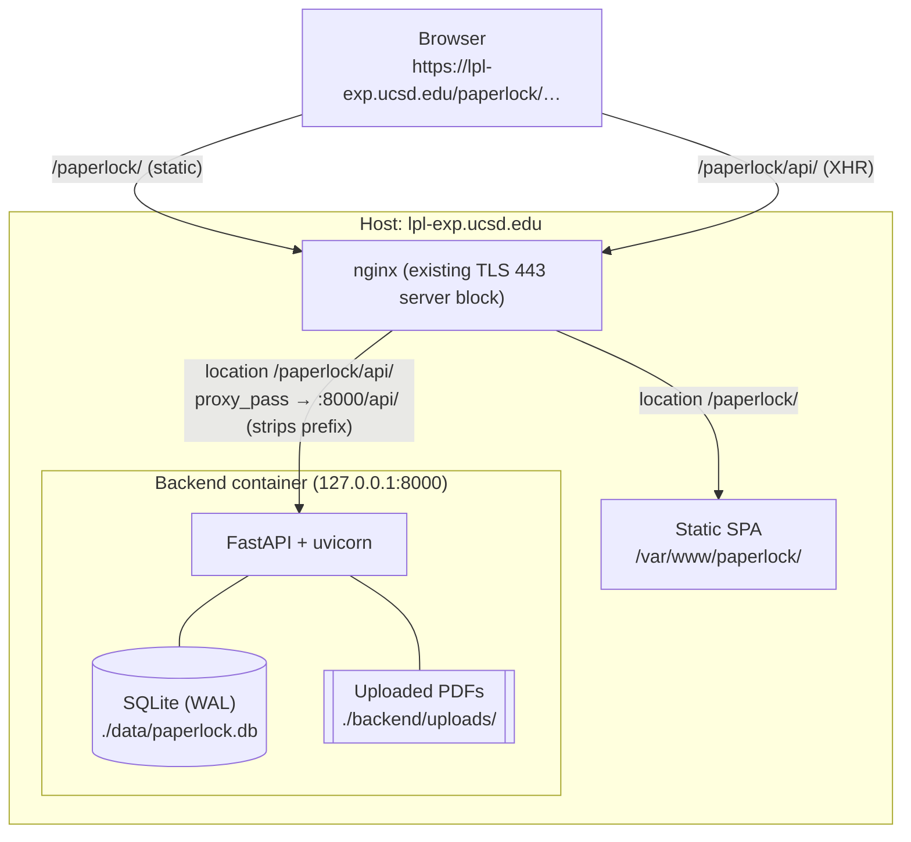
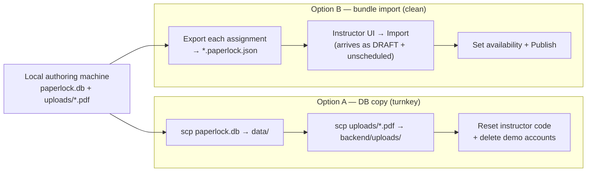

# Deployment

How PaperLock is deployed to a server: a **static frontend** built with
`VITE_BASE_PATH` and served by nginx under a sub-path, a **containerized backend**
(or bare `uvicorn`) bound to `127.0.0.1:8000`, the nginx **location blocks** that
wire the two together, the production **`SECRET_KEY`** guard, and how the
SQLite database + uploaded PDFs are persisted, backed up, and moved between
machines.

See also: [Overview](./overview.md) · [Architecture](./architecture.md) ·
[Data model](./data-model.md) · [Grading](./grading.md) ·
[API reference](./api-reference.md) · [Authoring guide](./authoring-guide.md).

> [!IMPORTANT]
> **This page is a summary, not the runbook.** The authoritative, step-by-step
> deploy procedure lives in **`DEPLOY.md`** (repo root) and the nginx snippet in
> **`deploy/nginx-paperlock.conf`**. Those two files — along with
> `docker-compose.prod.yml`, the uploaded PDFs, and `paperlock.db` — are
> **gitignored**: they are copied to the server, not obtained by `git clone`.
> If anything here disagrees with `DEPLOY.md`, `DEPLOY.md` wins.

---

## Authoritative sources (and why a clone isn't enough)

| File | Role | In git? |
|---|---|---|
| `DEPLOY.md` | The 12-section step-by-step runbook (targets `lpl-exp.ucsd.edu/paperlock`). | No — gitignored (`/DEPLOY.md`) |
| `deploy/nginx-paperlock.conf` | The two nginx `location` blocks to paste into the host's TLS server block. | No — gitignored (`/deploy/`) |
| `docker-compose.prod.yml` | Production backend-only compose file. | No — gitignored |
| `backend/uploads/*.pdf` | Uploaded article PDFs (copyrighted course content). | No — gitignored |
| `*.db` (e.g. `backend/paperlock.db`) | SQLite database (student data + authored assignments). | No — gitignored |
| `deploy/update-lpl-exp.sh` | Optional one-shot deploy helper (rsync checkout → rebuild → restart → verify). | No — gitignored (`/deploy/`) |

Because the infra files, PDFs, and DB are all intentionally kept out of the
public repo, a plain `git clone` produces a checkout that **cannot deploy or run
with real content**. The whole local `paperlock/` project is instead copied to
the server (the runbook uses `rsync -a`/`scp -r` into `/opt/paperlock`), and the
content is brought over separately (see [Moving content](#moving-content-between-machines)).

---

## Topology

PaperLock deploys **same-origin** behind the host's existing TLS nginx: the SPA
and the API are both served from `lpl-exp.ucsd.edu`, under the `/paperlock`
sub-path. Because there is only one origin, **CORS is not involved**.



The backend listens **only** on `127.0.0.1:8000` — it is never exposed to the
public directly; all external traffic reaches it through the nginx reverse
proxy. See [Architecture](./architecture.md) for the request lifecycle and
repository layout.

---

## Frontend — static SPA under a sub-path

The frontend is a Vite/React SPA built **once** into static files; no Node
process runs at request time.

- **`VITE_BASE_PATH` is the load-bearing build var.** `frontend/vite.config.js`
  sets `base: process.env.VITE_BASE_PATH || '/'`. Building with
  `VITE_BASE_PATH=/paperlock/` bakes `/paperlock/` into every asset URL and
  client-side route so the app resolves correctly under the sub-path. Omitting
  it (dev default `/`) yields a build whose `/assets/*.js` 404 under `/paperlock`.
- **The API base is relative by default.** `frontend/src/api/client.js` uses
  `` `${import.meta.env.BASE_URL.replace(/\/+$/, "")}/api` `` — i.e. `/paperlock/api`
  in production and `/api` in dev — so no runtime API URL config is needed.
  `VITE_API_URL` overrides this and is only for unusual split-origin deploys.

Build and publish (from the runbook; a throwaway Node container avoids needing
Node on the host):

```bash
docker run --rm -v "$PWD/frontend":/app -w /app -e VITE_BASE_PATH=/paperlock/ \
  node:20-alpine sh -c "npm ci && npm run build"

sudo mkdir -p /var/www/paperlock
sudo rsync -a --delete frontend/dist/ /var/www/paperlock/
```

The output `frontend/dist/` is rsynced to **`/var/www/paperlock/`**, which is
what the nginx `/paperlock/` location serves.

---

## Backend — container (or bare uvicorn) on `127.0.0.1:8000`

### With `docker-compose.prod.yml` (recommended)

The production compose file runs the **backend only** (the frontend is static on
the host):

```bash
cd /opt/paperlock
mkdir -p data backend/uploads
docker compose -f docker-compose.prod.yml up -d --build
```

Key facts from `docker-compose.prod.yml`:

| Setting | Value | Why |
|---|---|---|
| `build` | `./backend` | `python:3.11-slim` image; installs deps + `spacy download en_core_web_sm`. |
| `ports` | `127.0.0.1:8000:8000` | Published to localhost only — the host nginx proxies to it. |
| `restart` | `unless-stopped` | Survives reboots. |
| `volumes` | `./backend/uploads:/app/uploads`, `./data:/app/data` | PDFs + SQLite DB bind-mounted to the host (persist; easy to back up). |
| `environment` | `PAPERLOCK_ENV=production` | Activates the `SECRET_KEY` start-guard. |
| `environment` | `DATABASE_URL=sqlite:////app/data/paperlock.db` | DB file lives on the `./data` bind mount. |
| `environment` | `SECRET_KEY=${SECRET_KEY:?…}` | **Required**; compose errors out if `.env` lacks it. |
| `healthcheck` | `GET http://localhost:8000/api/health` | `start_period: 45s` to allow the spaCy model to load on first boot. |

The container starts `uvicorn app.main:app --host 0.0.0.0 --port 8000` inside the
container network; the `127.0.0.1:8000:8000` publish keeps it private to the host.

> The plain **`docker-compose.yml`** (checked in) is the *dev / all-in-one*
> variant: it runs the backend (`expose 8000`, no host publish) **plus** a
> `frontend` nginx container publishing `${FRONTEND_PORT:-3000}:80`, and stores
> the DB in a named `db-data` volume. The **prod** file is backend-only with
> host bind mounts. Don't use `docker-compose.yml` for the sub-path deploy.

### Bare `uvicorn` (no Docker)

If Docker isn't available, `DEPLOY.md`'s appendix runs the backend from a venv +
systemd instead:

```bash
cd /opt/paperlock/backend
python3 -m venv venv && ./venv/bin/pip install -r requirements.txt
./venv/bin/python -m spacy download en_core_web_sm
# ExecStart:
#   /opt/paperlock/backend/venv/bin/uvicorn app.main:app --host 127.0.0.1 --port 8000
# Env: PAPERLOCK_ENV=production
#      SECRET_KEY=<strong>
#      DATABASE_URL=sqlite:////opt/paperlock/data/paperlock.db
```

The nginx config is unchanged — it still proxies `/paperlock/api/ → 127.0.0.1:8000`.

---

## nginx location blocks

Paste the two blocks from `deploy/nginx-paperlock.conf` **inside the existing
`listen 443 ssl` server block** for the host, then `sudo nginx -t && sudo
systemctl reload nginx`.

| Location | Directive | Effect |
|---|---|---|
| `= /paperlock` | `return 301 /paperlock/;` | Redirect the bare path to the trailing-slash form. |
| `/paperlock/api/` | `proxy_pass http://127.0.0.1:8000/api/;` | Reverse-proxy to the backend, **stripping the `/paperlock` prefix** (the backend only knows `/api/*` routes). |
| `/paperlock/api/` | `client_max_body_size 60M;` | Allow large PDF uploads (nginx default is 1M → 413). |
| `/paperlock/api/` | `proxy_read_timeout 120s;` | PDF upload + OCR extraction can be slow. |
| `/paperlock/` | `root /var/www; try_files $uri $uri/ /paperlock/index.html;` | Serve hashed SPA assets; **fall back to `index.html`** for client-side routes (e.g. `/paperlock/read/2`). |

```nginx
location = /paperlock { return 301 /paperlock/; }

location /paperlock/api/ {
    proxy_pass         http://127.0.0.1:8000/api/;   # strips /paperlock
    proxy_set_header   Host $host;
    proxy_set_header   X-Real-IP $remote_addr;
    proxy_set_header   X-Forwarded-For $proxy_add_x_forwarded_for;
    proxy_set_header   X-Forwarded-Proto $scheme;
    proxy_read_timeout 120s;
    client_max_body_size 60M;
}

location /paperlock/ {
    root      /var/www;                              # /paperlock/<path> -> /var/www/paperlock/<path>
    try_files $uri $uri/ /paperlock/index.html;      # SPA fallback
}
```

The trailing slashes on `proxy_pass` (`…/api/`) are what strip the `/paperlock`
prefix; getting them wrong is the classic "page loads but every API call 404s"
failure (see `DEPLOY.md` §12).

---

## Environment variables and the `SECRET_KEY` production guard

| Var | Where | Required | Purpose |
|---|---|---|---|
| `SECRET_KEY` | backend | **Yes in production** | Signs JWT login tokens (HS256). Boot is refused if weak (see below). |
| `PAPERLOCK_ENV` | backend | No (default `development`) | Set to `production` to activate the `SECRET_KEY` guard. |
| `DATABASE_URL` | backend | No (default local SQLite) | Prod sets `sqlite:////app/data/paperlock.db`. See [Data model](./data-model.md). |
| `CORS_ORIGINS` | backend | No | Unused in the same-origin deploy; only for split origins. |
| `VITE_BASE_PATH` | frontend build | For sub-path deploy | `/paperlock/` — public base path. |
| `VITE_API_URL` | frontend build | No | Override API base; normally unset (relative `/api`). |
| `VITE_DEV_API_TARGET` | frontend dev | No | Vite dev-server `/api` proxy target (default `http://localhost:8000`). |

**The guard (`backend/app/main.py`, `on_startup`):** when
`PAPERLOCK_ENV=production`, the app raises `RuntimeError` and **refuses to boot**
if `SECRET_KEY` is empty, shorter than 16 characters, or one of the insecure
placeholders (`dev-secret-change-in-production`, `change-me-in-production`,
`change-me`, `secret`). This prevents an attacker who guesses the key from
forging instructor tokens. Generate a strong key with:

```bash
python -c "import secrets; print(secrets.token_urlsafe(48))"
```

Write it into a `.env` file next to `docker-compose.prod.yml` (compose reads it
automatically; `${SECRET_KEY:?…}` makes a missing key a hard error). A
first-run instructor account is created separately via `backend/seed.py`
(`INSTRUCTOR_PID` / `INSTRUCTOR_NAME` / `INSTRUCTOR_CODE`); see `DEPLOY.md` §8.

---

## Storage and backup

State lives in two host paths, both bind-mounted into the container so they are
trivial to back up and survive `docker compose down`:

- **`./data/paperlock.db`** — SQLite database in **WAL mode** (`journal_mode=WAL`,
  `busy_timeout=5000`, `foreign_keys=ON`; see [Data model](./data-model.md)).
- **`./backend/uploads/`** — the uploaded article PDFs.

Grades, submissions, users, questions, and OCR blocks all live in the DB; only
the raw PDF bytes live on disk. A WAL-safe snapshot + PDF archive (from the
runbook):

```bash
docker compose -f docker-compose.prod.yml exec backend \
  python -c "import sqlite3,shutil; shutil.copy('/app/data/paperlock.db','/app/data/backup.db')"
tar czf paperlock-backup-$(date +%F).tgz data/backup.db backend/uploads
```

---

## Upgrading an existing database

PaperLock has **no migration framework** (no Alembic). `backend/app/database.py`'s
`init_db()` calls `Base.metadata.create_all(bind=engine)`, which only **creates
tables that don't yet exist** — it never adds a column to a table that is already
present. The schema has grown over releases (`assignments.is_published`, the
`sections` table plus the `questions.section_id` FK, `questions.grading_mode`,
the matching/cloze/scale fields, and `questions.guidance` / `questions.target_page`
were all later additions), so deploying a newer build on top of an **existing**
`paperlock.db` boots fine but then fails at query time with
`sqlite3.OperationalError: no such column: …`.

> [!IMPORTANT]
> `create_all` auto-creates **missing tables** (a new build that only adds the
> `sections` table just needs a restart), but it will **not** backfill new
> **columns** on tables that already exist. A single feature often does both —
> e.g. the sections feature added the `sections` table *and* the
> `questions.section_id` column — so the auto-create alone is not enough.

Two ways to reconcile an old DB with a newer build:

- **Apply the change manually.** Add the missing column(s) with `ALTER TABLE`
  against the live file, matching the definition in `models.py` (a `NOT NULL`
  column needs a `DEFAULT` so existing rows get a value; use the same
  `server_default`). For the `is_published` addition:

  ```bash
  docker compose -f docker-compose.prod.yml exec backend python -c \
    "import sqlite3; c=sqlite3.connect('/app/data/paperlock.db'); \
     c.execute('ALTER TABLE assignments ADD COLUMN is_published BOOLEAN NOT NULL DEFAULT 0'); \
     c.commit()"
  ```

  Back up first (see [Storage and backup](#storage-and-backup)); stop the backend
  or expect WAL contention while patching.

- **Recreate the DB, then move content across.** Start from an empty
  `paperlock.db` so `create_all` builds the **full, current** schema in one shot,
  then bring authored content over via bundle **Export → Import** — see
  [Moving content](#moving-content-between-machines), Option B. This avoids
  hand-patching at the cost of re-importing and re-scheduling each assignment.

---

## Moving content between machines

The instructor authors assignments locally; production needs that content. Pick
**one** path (`DEPLOY.md` §7):



- **Option A — copy the whole database.** `scp` `paperlock.db` into `./data/` and
  the PDFs into `./backend/uploads/` (stop the backend first so the DB isn't
  mid-write). Fastest, but it also copies the **local demo accounts** — reset the
  instructor's access code and delete demo student/TA accounts before go-live.
- **Option B — fresh DB + bundle import.** Seed a fresh instructor, then in the
  instructor UI **Export** each assignment to a `*.paperlock.json` bundle and
  **Import** it on the server via `POST /api/assignments/import`. Import
  recreates the PDF, OCR blocks (with old→new id remapping), questions,
  sections, and answer keys. **Imported assignments arrive as drafts and
  unscheduled** (`is_published=False`, `available_from=None`,
  `available_until=None`) so they are never accidentally live or already
  closed — set the availability window and publish when ready. See the import
  endpoint in the [API reference](./api-reference.md) and the
  [Authoring guide](./authoring-guide.md).

---

## Verify

```bash
# API through nginx:
curl -sk https://lpl-exp.ucsd.edu/paperlock/api/health     # → {"status":"ok"}
# SPA loads:
curl -skI https://lpl-exp.ucsd.edu/paperlock/ | head -n1   # → 200
```

Then open `https://lpl-exp.ucsd.edu/paperlock/`, log in as the instructor,
confirm the assignment + PDF render, and try a student login. Full verification,
operations (logs, restart, update), and a troubleshooting matrix are in
`DEPLOY.md` §10–§12.

---

## Related documentation

- [Architecture](./architecture.md) — stack, topology, request lifecycle, where state lives.
- [Data model](./data-model.md) — the 10 tables, enums, and the SQLite/WAL engine setup.
- [API reference](./api-reference.md) — every `/api/*` endpoint, including bundle import.
- [Grading](./grading.md) — grading modes, `_auto_score`, and CSV export.
- [Authoring guide](./authoring-guide.md) — creating, seeding, and importing content.
- **`DEPLOY.md`** + **`deploy/nginx-paperlock.conf`** (repo root; gitignored) — the authoritative runbook.
