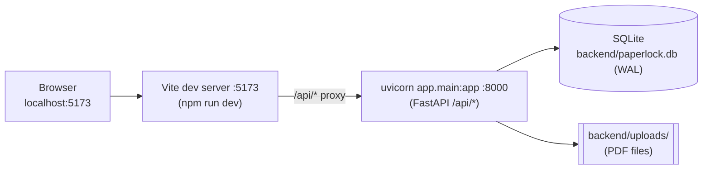
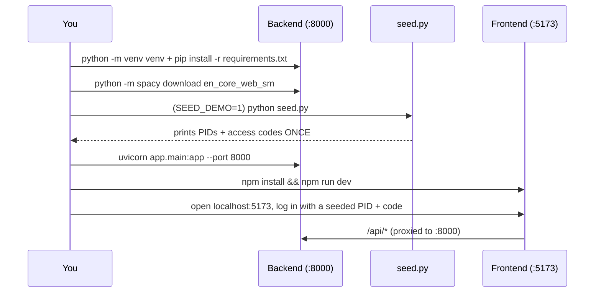

# Local Development

How to run PaperLock on your own machine: the FastAPI backend, the Vite
frontend, and the one-time account seeding in between. Everything here targets
the **development** configuration (SQLite on disk, the Vite dev server, no
Docker). For the production server runbook see the repo-root
[DEPLOY.md](../DEPLOY.md).

See also: [Architecture](./architecture.md) · [Data model](./data-model.md) ·
[API reference](./api-reference.md) · [Grading](./grading.md) ·
[Authoring guide](./authoring-guide.md).

---

## What you need

| Tool | Version / notes |
|---|---|
| **Python** | 3.11 (matches the backend `Dockerfile`, `python:3.11-slim`). |
| **Node.js + npm** | Node 18+ for Vite 8 (`frontend/package.json`). |
| **Internet (first run)** | The backend build downloads the spaCy `en_core_web_sm` model. |

The app splits cleanly in two — you run each half in its own terminal:

- **Backend** — FastAPI served by uvicorn on **`http://localhost:8000`**, all
  routes under `/api/*`.
- **Frontend** — the React SPA served by the Vite dev server on
  **`http://localhost:5173`**, which proxies `/api` to the backend.



Because the dev server proxies `/api` to `:8000`, the browser only ever talks to
one origin (`localhost:5173`) — the same same-origin shape as the production
nginx deploy, so **CORS is never exercised in normal dev**.

---

## Backend

All commands below run from the **`backend/`** directory (the ASGI app is
imported as the `app` package, so the working directory must contain `app/`).

### 1. Create a virtualenv and install dependencies

```bash
cd backend
python3.11 -m venv venv
source venv/bin/activate            # Windows: venv\Scripts\activate
pip install -r requirements.txt
```

`requirements.txt` pulls in FastAPI, `uvicorn[standard]`, SQLAlchemy, PyMuPDF
(`pymupdf`), spaCy, `python-jose[cryptography]`, and `python-multipart`. Note
the `numpy<2` pin (kept for spaCy/PyMuPDF binary compatibility). `psycopg2-binary`
and `alembic` are present for the optional Postgres path but are unused by the
SQLite dev/launch configuration.

### 2. Download the spaCy model

The OCR service loads the model **at import time** — `nlp =
spacy.load("en_core_web_sm")` in `app/services/ocr.py` — so the backend will
fail to start if the model is missing:

```bash
python -m spacy download en_core_web_sm
```

spaCy tags each extracted PDF word with a `sentence_group` and `paragraph_group`
so the reader can select at word / sentence / paragraph granularity.

### 3. Point at a local SQLite database

`DATABASE_URL` defaults to `sqlite:///./paperlock.db` (see `app/database.py`),
so this is optional, but setting it explicitly is harmless and self-documenting:

```bash
export DATABASE_URL=sqlite:///./paperlock.db
```

The path is relative to the current directory, so running from `backend/`
creates `backend/paperlock.db`. On first connect the engine turns on SQLite
**WAL mode**, a 5 s `busy_timeout`, and `foreign_keys=ON` (see
[Data model → SQLite/WAL setup](./data-model.md)); you will see companion
`paperlock.db-wal` and `paperlock.db-shm` files appear alongside the DB. The
schema is created on startup by `init_db()` via `Base.metadata.create_all` —
there are **no runtime migrations** in the SQLite path.

> **Schema-upgrade caveat.** `create_all` only creates tables that don't yet
> exist; it **never adds columns to a table that's already there**. So pulling a
> newer build onto an existing `paperlock.db` can fail at query time with
> `no such column` (e.g. when the `is_published` column was added to
> `assignments`). Either add the new column by hand —
> `ALTER TABLE assignments ADD COLUMN is_published BOOLEAN NOT NULL DEFAULT 0;`
> — or delete `paperlock.db` and re-seed. This matches the schema note in
> [DEPLOY.md](../DEPLOY.md) / [deployment.md](./deployment.md).

### 4. Seed the initial accounts

There is no signup flow — every login is a `pid` + `access_code` pair created
ahead of time. Run the seed script **once** to bootstrap an instructor account
(and, optionally, demo student/TA accounts):

```bash
# instructor only
python seed.py

# instructor + demo student/TA accounts (development convenience)
SEED_DEMO=1 python seed.py
```

`seed.py` calls `init_db()`, then upserts users and prints their credentials to
stdout **once**. It is **idempotent**: a PID that already exists is skipped and
its access code is left unchanged (you'll see `Already exists (code unchanged)`).
Access codes are stored in plaintext by design and are only printed at creation
time, so copy them somewhere safe.

To pin the instructor's login code (handy so you can log back in reliably),
set `INSTRUCTOR_CODE` before running; otherwise a random `secrets.token_urlsafe(12)`
code is generated and printed.

```bash
INSTRUCTOR_CODE=my-known-dev-code python seed.py
```

#### Demo logins

| PID | Name | Role | Created when | Access code |
|---|---|---|---|---|
| `INSTRUCTOR` | Thomas Morton | `instructor` | always | `INSTRUCTOR_CODE` env, else random (printed once) |
| `A00000001` | Test Student 1 | `student` | only with `SEED_DEMO=1` | random (printed once) |
| `A00000002` | Test Student 2 | `student` | only with `SEED_DEMO=1` | random (printed once) |
| `TA001` | Test TA | `ta` | only with `SEED_DEMO=1` | random (printed once) |

`POST /api/auth/login` with `{ "pid": "...", "access_code": "..." }` returns a
24-hour HS256 JWT. Log in through the SPA at `http://localhost:5173`, or hit the
API directly. The three roles (`instructor`, `student`, `ta`) drive route
protection on both the backend (`require_role`) and the UI.

> In production, students are added later via roster CSV import in the instructor
> UI — **do not** run `seed.py` with `SEED_DEMO=1` on the live server.

### 5. Run the server

```bash
uvicorn app.main:app --port 8000
# with autoreload while editing backend code:
uvicorn app.main:app --reload --port 8000
```

Verify it's up (no auth required):

```bash
curl http://localhost:8000/api/health
# {"status":"ok"}
```

### `PAPERLOCK_ENV` and the `SECRET_KEY` production guard

| Setting | Dev behavior |
|---|---|
| `PAPERLOCK_ENV` | Defaults to `development`. Leave it unset for local work. Set to `production` only to exercise the startup guard. |
| `SECRET_KEY` | Signs login JWTs. Defaults to `dev-secret-change-in-production` (fine for dev). |

The guard lives in `on_startup()` in `app/main.py`. **Only when
`PAPERLOCK_ENV=production`**, the app refuses to boot (raises `RuntimeError`) if
`SECRET_KEY` is empty, is one of the insecure placeholders
(`dev-secret-change-in-production`, `change-me-in-production`, `change-me`,
`secret`), or is shorter than 16 characters. In plain development the default
placeholder key is accepted and the server starts normally.

Generate a strong key when you do need one (e.g. to test production mode):

```bash
python -c "import secrets; print(secrets.token_urlsafe(48))"
```

---

## Frontend

Run these from the **`frontend/`** directory.

```bash
cd frontend
npm install
npm run dev
```

`npm run dev` starts the Vite dev server on **`http://localhost:5173`**. The dev
server proxies API calls so the SPA can use a relative `/api` base (see
`vite.config.js`):

```js
server: {
  proxy: {
    '/api': {
      target: process.env.VITE_DEV_API_TARGET || 'http://localhost:8000',
      changeOrigin: true,
    },
  },
}
```

The API client (`src/api/client.js`) defaults its base to `${BASE_URL}/api` (a
relative `/api` in dev), attaches the stored JWT as `Authorization: Bearer
<token>`, and — for inline PDF embedding — builds
`/api/pdf/{id}/serve?token=<token>` URLs that pass the token as a query param.
Start the **backend first** (or at least before you exercise any API-backed
screen), otherwise proxied requests fail with a connection error.

### Other npm scripts

| Script | Does |
|---|---|
| `npm run dev` | Vite dev server on `:5173` with the `/api` proxy. |
| `npm run build` | Production build into `frontend/dist/`. |
| `npm run preview` | Serves the built `dist/` locally (Vite's default `:4173`) to sanity-check a build. |
| `npm run lint` | ESLint over the project. |

---

## Environment variables

### Backend

| Var | Required? | Default | Purpose |
|---|---|---|---|
| `SECRET_KEY` | Required in production only | `dev-secret-change-in-production` | Signs login JWTs (HS256). Subject to the production start-guard above. |
| `PAPERLOCK_ENV` | Optional | `development` | Set to `production` to activate the `SECRET_KEY` guard. |
| `DATABASE_URL` | Optional | `sqlite:///./paperlock.db` | DB connection string; SQLite triggers WAL/PRAGMA setup in `database.py`. |
| `CORS_ORIGINS` | Optional | `http://localhost:5173,http://localhost:3000` | Comma-separated allowed origins. Not needed for the proxied same-origin dev flow; only for split-origin setups. |

### Frontend (Vite)

| Var | When | Default | Purpose |
|---|---|---|---|
| `VITE_DEV_API_TARGET` | dev only | `http://localhost:8000` | Backend target for the dev-server `/api` proxy. |
| `VITE_BASE_PATH` | build time | `/` | Public base path. Set to `/paperlock/` for the sub-path production build. |
| `VITE_API_URL` | build time | *(unset)* | Overrides the API base. Leave unset — the client's relative `/api` works in both dev and prod. Only for unusual split deployments. |

### Seed / bootstrap (read by `seed.py`, not by any compose file)

| Var | Default | Purpose |
|---|---|---|
| `INSTRUCTOR_PID` | `INSTRUCTOR` | PID for the seeded instructor. |
| `INSTRUCTOR_NAME` | `Thomas Morton` | Instructor display name. |
| `INSTRUCTOR_CODE` | random `token_urlsafe(12)` | Pins the instructor's access code instead of a random one. |
| `SEED_DEMO` | *(unset)* | Set to `1` to also create the demo student/TA accounts. |

---

## Ports at a glance

| Port | Service | Command |
|---|---|---|
| `8000` | FastAPI / uvicorn backend (`/api/*`, `/api/health`) | `uvicorn app.main:app --port 8000` |
| `5173` | Vite dev server (SPA + `/api` proxy) | `npm run dev` |
| `4173` | Vite preview of a production build (optional) | `npm run preview` |

---

## Full first-run sequence



---

## Production build note

The frontend ships as a static SPA. For the production server (served under the
`/paperlock` sub-path on `lpl-exp.ucsd.edu`), build with the base path set so all
assets and client routes resolve under `/paperlock`:

```bash
cd frontend
VITE_BASE_PATH=/paperlock/ npm ci && VITE_BASE_PATH=/paperlock/ npm run build
```

The output in `frontend/dist/` is rsynced to the host and served by nginx; no
Node runs at runtime. For a plain root-path build (or local `npm run build`),
omit `VITE_BASE_PATH` and it defaults to `/`.

The backend runs as a single Docker container in production
(`docker-compose.prod.yml`) with `PAPERLOCK_ENV=production`,
`DATABASE_URL=sqlite:////app/data/paperlock.db`, and a **required** `SECRET_KEY`.

> Full server setup — nginx sub-path config, Docker compose, TLS, seeding on the
> server, and content migration — lives in the repo-root
> [DEPLOY.md](../DEPLOY.md) runbook (the deployment companion to this page).

---

## Related documentation

- [Architecture](./architecture.md) — stack, topology, request lifecycle, on-disk state.
- [Data model](./data-model.md) — the 10 tables, enums, constraints, cascades, and the SQLite/WAL engine setup.
- [API reference](./api-reference.md) — every `/api/*` endpoint, roles, and gating.
- [Grading](./grading.md) — `grading_mode`, the `_auto_score` algorithm, and CSV export.
- [Authoring guide](./authoring-guide.md) — building assignments, sections, and question types.
- [DEPLOY.md](../DEPLOY.md) — the production server runbook.
