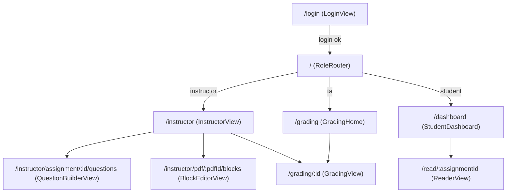
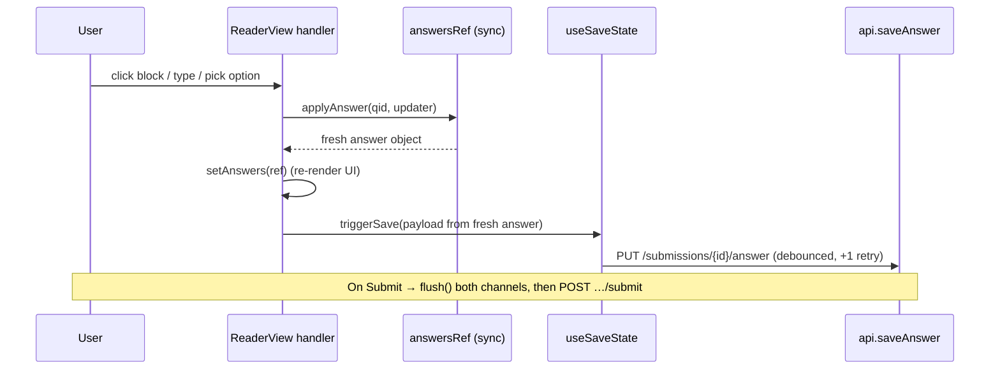

# Frontend

PaperLock's frontend is a **React 19 single-page app** built with **Vite**, styled with **Tailwind CSS v4** and a small set of shadcn-style components over [`@base-ui/react`](https://www.npmjs.com/package/@base-ui/react). PDFs are rendered client-side with [`pdfjs-dist`](https://www.npmjs.com/package/pdfjs-dist); routing is [`react-router-dom` v7](https://reactrouter.com/). There is no server-side rendering — the built `dist/` is a static bundle served same-origin behind nginx (see [Deployment](../DEPLOY.md)).

All source lives under `/Users/thomasmorton/SS1Psyc101/software/paperlock/frontend/`. Paths below are relative to `frontend/src/` unless noted.

- Data shapes returned by the API: see [./data-model.md](./data-model.md).
- Endpoint semantics, auth, and answer-key stripping: see [./api-reference.md](./api-reference.md).
- Auto/manual grading rules exercised by `GradingView`: see [./grading.md](./grading.md).

---

## Entry point & provider stack

`main.jsx` mounts `<App/>` inside React `StrictMode`. `App.jsx` composes the global providers around the router:

```
ErrorBoundary
└─ ToastProvider          (components/Toast.jsx — toast notifications)
   └─ AuthProvider        (hooks/useAuth.jsx — current user + login/logout)
      ├─ SessionExpiredModal   (listens for the "session-expired" window event)
      └─ BrowserRouter
         └─ Routes …
```

`SessionExpiredModal` sits **outside** `<Routes>` so it can pop over any view.

---

## Views, routes, and allowed roles

Routing is declared in `App.jsx`. Every non-public route is wrapped in `<ProtectedRoute allowedRoles={…}>`, which:

1. shows `Loading…` while `useAuth().loading` is true,
2. redirects to `/login` when there is no `user`,
3. redirects to `/` (the role router) when `user.role` is not in `allowedRoles`.

| Route | View (`views/…`) | Allowed roles | Notes |
|---|---|---|---|
| `/login` | `LoginView` | public | Redirects to `/` if already authenticated. |
| `/` | `RoleRouter` (in `App.jsx`) | any authenticated | Redirects by role: `instructor`→`/instructor`, `ta`→`/grading`, else→`/dashboard`; no user→`/login`. |
| `/dashboard` | `StudentDashboard` | `student` | Lists the student's available assignments. |
| `/read/:assignmentId` | `ReaderView` | `student` | The lockdown reader (PDF + questions). |
| `/instructor` | `InstructorView` | `instructor` | Tabbed authoring console (assignments / PDFs / users). |
| `/instructor/assignment/:assignmentId/questions` | `QuestionBuilderView` | `instructor` | Author questions/sections against the PDF. |
| `/instructor/pdf/:pdfId/blocks` | `BlockEditorView` | `instructor` | Merge/split OCR blocks. |
| `/grading` | `GradingHome` | `instructor`, `ta` | Pick an assignment to grade. |
| `/grading/:assignmentId` | `GradingView` | `instructor`, `ta` | Per-submission, per-question grading. |
| `*` | — | — | `<Navigate to="/" replace />` catch-all. |

> **Client-side role gating is UX only.** The backend independently enforces roles with `require_role(...)` and strips answer keys for students (see [./api-reference.md](./api-reference.md)). Never treat `ProtectedRoute` as a security boundary.



### View responsibilities (brief)

- **`LoginView`** — Collects two fields, `pid` and `code`, and calls `login(pid, code)`. (The inputs are labelled "Username" and "PID" in the UI, but map to the account **PID** and its **access code** respectively.) On success it routes to `/`.
- **`StudentDashboard`** — `api.listAssignments()` → assignment cards. A card's status badge is derived from the per-student flags on the response: `is_submitted` → *Submitted*, else `has_started` → *In Progress*, else *Not Started*. Clicking a card navigates to `/read/:id`.
- **`ReaderView`** — The core student experience; detailed in [State patterns](#state-patterns) below.
- **`InstructorView`** — A single large view with three tabs (`assignments`, `pdfs`, `users`). `AssignmentTab` handles create/edit/publish/delete plus **bundle export/import** (`exportAssignmentBundle` / `importAssignmentBundle`). `PdfUploadTab` handles drag-and-drop upload, delete, and deep-links to the block editor. `UsersTab` renders student/TA tables and a CSV roster import (`batchCreateUsers`), with per-user reset-code / delete / copy-code actions. Deep-links to `/instructor/assignment/:id/questions` and `/grading/:id`.
- **`QuestionBuilderView`** — Split layout: a `PdfViewer` + `BlockOverlay` for picking a region question's `correct_block_ids`, alongside a question list and per-type editor forms; also section CRUD and question reordering (persisted with `updateQuestion({ order })`).
- **`BlockEditorView`** — Select OCR blocks over the PDF and `mergeBlocks(...)` / `splitBlocks(groupId)` to fix the OCR grouping that drives sentence/paragraph selection.
- **`GradingHome`** — `api.listAssignments()` → list → navigate to `/grading/:id`.
- **`GradingView`** — Loads `listSubmissions`, per-submission `getSubmission` + `getSubmissionGrades`, writes scores via `gradeQuestion`, runs `autoGrade`, and downloads the CSV via `exportCsv`.

---

## The `BrowserRouter` `basename` (sub-path deploys)

The app can be served from the site root (`/`, local dev) **or** from a sub-path (`/paperlock/` in production). The router's `basename` is derived from Vite's public base URL:

```jsx
// App.jsx
<BrowserRouter basename={import.meta.env.BASE_URL.replace(/\/+$/, "") || "/"}>
```

`import.meta.env.BASE_URL` is whatever `vite.config.js` `base` was set to at build time (trailing slash included). Trailing slashes are stripped so react-router gets a clean prefix, and the empty string falls back to `"/"`:

| Build (`VITE_BASE_PATH`) | `import.meta.env.BASE_URL` | Router `basename` |
|---|---|---|
| unset (dev default) | `/` | `/` |
| `/paperlock/` | `/paperlock/` | `/paperlock` |

This is what lets the same source produce a build that lives under `https://lpl-exp.ucsd.edu/paperlock/` without hard-coding the prefix into any `<Link>`/`navigate()` call.

---

## API client (`api/client.js`)

A single thin `fetch` wrapper. The base URL is derived from the **same** Vite base as the router, so the API is always same-origin with the app unless explicitly overridden:

```js
// api/client.js
const API_BASE =
  import.meta.env.VITE_API_URL ||
  `${import.meta.env.BASE_URL.replace(/\/+$/, "")}/api`;
```

| Build (`import.meta.env.BASE_URL`) | `VITE_API_URL` | `API_BASE` |
|---|---|---|
| `/` (dev) | unset | `/api` (hits the Vite dev proxy) |
| `/paperlock/` (prod) | unset | `/paperlock/api` (nginx strips `/paperlock`) |
| any | set | the literal `VITE_API_URL` (split-origin escape hatch) |

**`request(path, options)` behavior:**

- Reads the JWT from `localStorage["paperlock_token"]`; if present, adds `Authorization: Bearer <token>`.
- JSON-encodes `options.body` and sets `Content-Type: application/json` **unless** the body is `FormData` (used by `uploadPdf`, which lets the browser set the multipart boundary).
- On a non-OK response:
  - a **`401` while a token exists** dispatches a `window` `"session-expired"` event (→ `SessionExpiredModal`). A `401` with **no** token is treated as bad login credentials, not an expired session, so the modal never covers the login screen.
  - throws `new Error(detail)` from the response body's `detail` field.
- Returns `res.text()` when the response is `text/csv` (grade export), otherwise `res.json()`.

**`getPdfUrl(pdfId)`** is special: it returns `${API_BASE}/pdf/${pdfId}/serve?token=${token}` — the token travels as a **query parameter** because the URL is consumed by `pdf.js` (`getDocument(url)`), which cannot attach an `Authorization` header. The backend's `get_current_user` accepts `?token=` for exactly this case.

The `api` object exposes one method per backend endpoint. Selected mappings:

| Client method | HTTP endpoint |
|---|---|
| `login(pid, access_code)` | `POST /auth/login` |
| `me()` | `GET /auth/me` |
| `listAssignments()` / `getAssignment(id)` | `GET /assignments/` · `GET /assignments/{id}` |
| `getBlocks(pdfId)` / `getPdfUrl(pdfId)` | `GET /pdf/{id}/blocks` · `GET /pdf/{id}/serve?token=` |
| `startSubmission(id)` / `saveAnswer(subId, data)` / `submit(subId)` | `POST /submissions/start/{id}` · `PUT /submissions/{id}/answer` · `POST /submissions/{id}/submit` |
| `createAnnotation / getAnnotations / updateAnnotation / deleteAnnotation` | `…/submissions/annotations…` |
| `listSubmissions / getSubmissionGrades / gradeQuestion / autoGrade / exportCsv` | `…/grading/…` |
| `exportAssignmentBundle(id)` / `importAssignmentBundle(bundle)` | `GET /assignments/{id}/bundle` · `POST /assignments/import` |

See [./api-reference.md](./api-reference.md) for the full endpoint contract.

---

## Key components (`components/…`)

### `PdfViewer.jsx`
Wraps `pdfjs-dist`. The worker is loaded via `pdfjs-dist/build/pdf.worker.min.mjs?url` and assigned to `GlobalWorkerOptions.workerSrc`.

- **Virtualized rendering**: an `IntersectionObserver` (root = scroll container, `rootMargin: "200px"`) tracks `visiblePages`; only pages within `RENDER_BUFFER = 2` of a visible page are drawn to their `<canvas>`. Off-screen pages show a lightweight placeholder sized to a cached or US-Letter-fallback dimension.
- Renders at `window.devicePixelRatio` for crisp HiDPI text; a `renderTracker` keyed by `pageIndex_scale_dpr` avoids redundant re-renders and cancels superseded `RenderTask`s.
- **Zoom** 0.5×–3× (default 1.5×), a click-to-jump page indicator, and imperative scroll-to on `searchHighlightPage` and on the `jumpToPage` `{ page, n }` nonce (the changing `n` forces a re-scroll to the same page).
- Exposes callbacks `onCurrentPageChange`, `onPageDimensions`, and a **render-prop** `renderOverlay(pageIndex, dims)` — this is how `ReaderView` layers `BlockOverlay` and `AnnotationOverlay` on top of each page. Right-click is suppressed via `onContextMenu`.

### `BlockOverlay.jsx`
Draws clickable, absolutely-positioned boxes over OCR blocks. **All geometry is expressed in percentages** of page width/height (blocks store `x/y/width/height` as page-relative percents), so overlays stay aligned across zoom levels.

- Blocks are bucketed into a **group key** by the active `selectionGranularity`: a manual `group_id` wins (`manual_{id}`), else `paragraph_group` (`para_{n}`) or `sentence_group` (`sent_{n}`), else the block id itself (`word_{id}`).
- For sentence/paragraph modes, `mergeBlocksIntoLines()` clusters a group's word boxes into line-level spans (by Y proximity) so a multi-line sentence renders as tidy line highlights.
- Clicking any box calls `onBlockClick(ids)` with **every** block id in that group (across pages), briefly flashes them, and paints hover/selected/search/hint states. The overlay only captures pointer events when an `activeQuestionId` is set (the sentinel `"__annotation__"` enables it for highlight mode).

### `QuestionPanel.jsx`
The right-hand question sidebar in `ReaderView`, with two layouts driven by `mode`:

- **`persistent`** — questions grouped by section (sorted by `order`); a section's markdown `description` renders via `<Markdown/>`. Questions whose `section_id` points at a missing section are still shown in an "ungrouped" bucket (never dropped).
- **`focus`** — a single floating card with prev/next navigation.

It renders a **type-specific editor** per `question_type`:

| `question_type` | Editor | Answer field written |
|---|---|---|
| `free_text` | `Textarea` | `free_text` |
| `short_answer` | `Input` | `free_text` |
| `multiple_choice` | radio/checkbox (checkbox when `allow_multiple`) | `selected_options` |
| `matching` | one `<select>` per `match_left` row | `selected_options[i]` = chosen right index |
| `cloze` | inline `<select>` per `{{n}}` placeholder parsed from `cloze_text` | `selected_options[blankIdx]` |
| `scale` | button row `scale_min…scale_max` | `selected_options[0]` |
| `region_select` | selection indicator + text preview (selection happens on the PDF via `BlockOverlay`) | `selected_block_ids` |

`isQuestionAnswered()` computes the per-type "answered" heuristic that feeds the progress counter, and the footer opens a confirm **Dialog** before `onSubmit()`.

### `AnnotationOverlay.jsx`
Renders a student's saved annotations (percentage-positioned) over each page: **highlights** (colored boxes with a hover-to-delete button) and **notes** (a sticky-note marker that expands into a card with a `Textarea`). Note edits are debounced ~500 ms and persisted with a PATCH (`updateAnnotation`) so the note keeps its id (no remount / lost focus). The whole overlay goes non-interactive (`disabled`) whenever a question is active, so annotating never fights with answering.

### `SearchBar.jsx`
The reader's in-PDF find bar, opened with **Ctrl/Cmd+F** (intercepted in `ReaderView`'s lockdown `keydown` handler; a toolbar Search button toggles it too). It searches the same OCR `blocks` array that drives selection: matching is a **case-insensitive substring** test (`block.text.toLowerCase().includes(query.toLowerCase())`), so it only finds text that has **OCR blocks** and **won't match scanned-image content** with no recognized text.

- Live-filters as you type. It shows an **`n / N` result counter** while there are matches, and a **"No results"** state once a non-empty query matches nothing.
- Navigate with **Enter / Shift+Enter** or the **up/down chevrons** (both disabled when there are no results); the index wraps around modulo the match count. **Escape** (or the ✕ button) closes the bar and clears the query.
- The active match is reported via `onSearchResult(block)` → `ReaderView.handleSearchResult`, which sets `searchHighlight` (the block id) and `searchHighlightPage` (`block.page_number + 1`). `PdfViewer` imperatively scrolls to that page and `BlockOverlay` paints the block's **search** state, so the hit is both scrolled into view and highlighted.

### `Markdown.jsx`
A tiny dependency-free renderer for **instructor-authored section intros** only. Supports `#`/`##`/`###` → `h3`/`h4`/`h5`, inline `**bold**` / `*italic*` / `` `code` ``, `-`/`*` bullet lists, `>` blockquotes, and paragraphs. It is intentionally minimal — not a general Markdown engine, no raw HTML.

### `Toast.jsx`
`ToastProvider` supplies a `toast({ type, message, title, duration })` function via context (`useToast()`). Toasts auto-dismiss after `duration` (default 4000 ms) and render into a fixed `toast-viewport`. `useToast()` returns no-op stubs if no provider is mounted, so a missing provider can't crash a flow.

### Dialogs (`components/ui/dialog.jsx`)
shadcn-style wrappers over `@base-ui/react`'s `Dialog` primitive: `Dialog`, `DialogContent`, `DialogHeader`, `DialogTitle`, `DialogDescription`, `DialogFooter`, etc. Used by the submit-confirmation dialog in `QuestionPanel`, the create/edit/confirm dialogs in `InstructorView`, and `SessionExpiredModal`.

### Supporting components
`SessionExpiredModal` (listens for the `"session-expired"` event, then clears the token and hard-navigates to `/login`), `SaveIndicator` (the saving/saved/error pill next to the reader title), plus `AnnotationTools`, `ErrorBoundary`, and the `components/ui/*` primitives (`button`, `input`, `textarea`, `badge`, `tooltip`, `scroll-area`, `separator`).

---

## State patterns

### Auth: `AuthProvider` / `useAuth` (`hooks/useAuth.jsx`)
A React context holds `{ user, loading, login, logout }`.

- On mount, if `localStorage["paperlock_token"]` exists it calls `api.me()` to hydrate `user`; a failure clears the token. `loading` gates the whole app until this resolves.
- `login(pid, accessCode)` posts to `/auth/login`, stores the returned `token`, and sets `user = { id, name, role, pid }`.
- `logout()` removes the token and clears `user`.

The token is the single source of session truth; there is no refresh flow — a `401` from any request surfaces the session-expired modal, whose "Sign In" button clears the token and reloads at `/login`.

### `answersRef` + `applyAnswer`: the synchronous source of truth (`ReaderView.jsx`)

`ReaderView` keeps answers in **two places on purpose**:

- `answers` — React **state**, used only for rendering (`QuestionPanel`, progress bar, block highlights).
- `answersRef` — a **`useRef`** that is the *synchronous* source of truth for reads and writes.

```jsx
// ReaderView.jsx
const answersRef = useRef({});
const applyAnswer = useCallback((questionId, updater) => {
  const prev = answersRef.current[questionId] || {
    selected_block_ids: [], free_text: "", selected_options: [],
  };
  const nextAnswer = updater(prev);
  answersRef.current = { ...answersRef.current, [questionId]: nextAnswer };
  setAnswers(answersRef.current);   // mirror into state for rendering
  return nextAnswer;                // return the fresh value for the save call
}, []);
```

**Why a ref and not just state?** React does **not** apply `setState` updaters synchronously — the new `answers` object isn't visible on the same tick, and multiple handlers can fire between renders (e.g. a burst of block clicks, or a keystroke landing while a previous save is mid-flight). If handlers read `answers` directly they'd compound off a **stale** value and a save could serialize an out-of-date (or `undefined`) answer. By funnelling every mutation through `applyAnswer`, each handler reads the latest committed answer from the ref, writes the merged next value back to the ref, mirrors it into state for the UI, and **returns the fresh object** so the very next line can hand it straight to the save call — no waiting for a re-render.

Every answer object has the shape `{ selected_block_ids, free_text, selected_options }`, matching the `Answer` fields the backend expects (see [./data-model.md](./data-model.md)). On load, `startSubmission` returns any prior answers, which are rehydrated into `answersRef.current` before first paint.

The three input handlers all follow the same pattern — mutate via `applyAnswer`, then persist the returned value:

- `handleBlockClick` → `region_select` toggling/replacing `selected_block_ids` (respects `allow_multiple`), then `triggerBlockSave`.
- `handleOptionChange` → multiple-choice `selected_options`, then `triggerBlockSave`.
- `handlePositionalSelect` → positional writes for matching / cloze / scale (`selected_options[position] = value`), then `triggerBlockSave`.
- `handleFreeTextChange` → `free_text`, then the **debounced** `triggerFreeTextSave`.

### Auto-save: `useSaveState` (`hooks/useSaveState.js`)

`ReaderView` creates two independent save channels off the same `api.saveAnswer(submission.id, data)` function:

- **`triggerBlockSave`** — `debounceMs = 0` (fires immediately; block/option/positional picks are discrete).
- **`triggerFreeTextSave`** — `debounceMs = 300` (coalesces typing).

Each channel is a `useSaveState(saveFn, { debounceMs })` returning `{ triggerSave, flush, status }`:

- `status` cycles `idle → saving → saved → idle` (auto-reverts after 2 s) or `error`. `SaveIndicator` shows the merged status of both channels (error > saving > saved > idle).
- `triggerSave` is fire-and-forget with a **single cancellable retry** (2 s later). A newer `triggerSave` cancels a pending retry, so a stale retry can never overwrite a newer answer. In-flight saves of the same payload are coalesced.
- `flush()` forces any debounced/in-flight save to settle and **rejects on failure**, so a caller can abort rather than lock in unsaved data.

**Submit is flush-then-lock**: `handleSubmit()` awaits `flushFreeTextSave()` and `flushBlockSave()` first; if a flush rejects it throws (and `QuestionPanel` surfaces the error in the confirm dialog) instead of calling `submit`. This guarantees the last keystrokes are persisted before the server locks the submission — a save after submit is rejected server-side.



### Reader "lockdown" behaviors (`ReaderView.jsx`)
A window `keydown` listener `preventDefault`s **Ctrl/Cmd+S** and **Ctrl/Cmd+P**, and intercepts **Ctrl/Cmd+F** to open the in-app [`SearchBar`](#searchbarjsx) instead of the browser find bar. Right-click is disabled on the reader root (`onContextMenu`). These are convenience/friction guards, not hard security.

---

## Build & configuration (`vite.config.js`)

```js
// vite.config.js (essentials)
export default defineConfig({
  base: process.env.VITE_BASE_PATH || '/',          // → import.meta.env.BASE_URL
  plugins: [react(), tailwindcss()],
  resolve: { alias: { '@': path.resolve(__dirname, './src') } },  // "@/..." imports
  server: {
    proxy: {
      '/api': {
        target: process.env.VITE_DEV_API_TARGET || 'http://localhost:8000',
        changeOrigin: true,
      },
    },
  },
});
```

**Build-time env vars:**

| Var | When | Purpose |
|---|---|---|
| `VITE_BASE_PATH` | build | Public base path → `import.meta.env.BASE_URL`. Set `/paperlock/` for the sub-path deploy; defaults to `/`. Drives both the router `basename` and `API_BASE`. |
| `VITE_API_URL` | build | Overrides `API_BASE`. Normally **unset** (relative `/api`); only for unusual split-origin deploys. |
| `VITE_DEV_API_TARGET` | dev only | Backend target for the dev `/api` proxy. Defaults to `http://localhost:8000`. |

**Dev proxy:** `npm run dev` starts Vite on `http://localhost:5173`. Because `API_BASE` is the relative `/api`, all API calls hit Vite's dev server, which proxies `/api/*` to the backend (`changeOrigin: true`). This **mirrors the production nginx same-origin setup**, so CORS is never exercised in dev.

**Scripts** (`package.json`): `dev` (Vite dev server), `build` (`vite build` → `dist/`), `preview`, `lint` (ESLint). Notable deps: `react@19`, `react-router-dom@7`, `pdfjs-dist@5`, `@base-ui/react`, `tailwindcss@4`, `lucide-react`.

**Production:** the app is built once with `VITE_BASE_PATH=/paperlock/`, and `dist/` is served statically by the host nginx under `/paperlock/`, which reverse-proxies `/paperlock/api/` to the backend container. Full runbook in [../DEPLOY.md](../DEPLOY.md).
