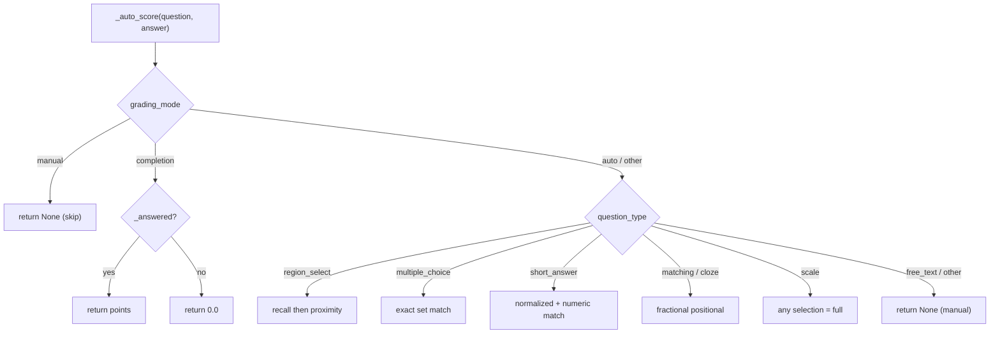
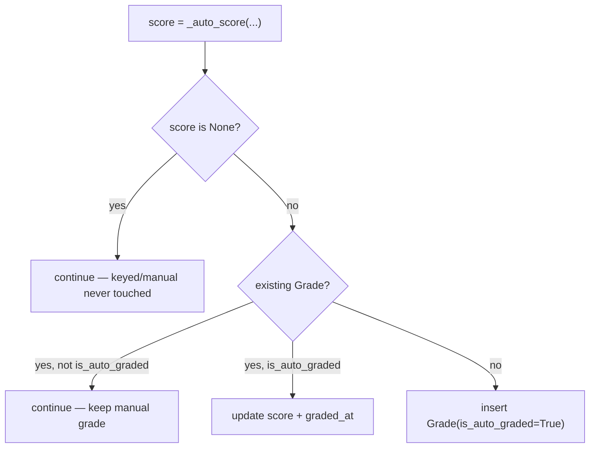

# Grading

How PaperLock scores student submissions: the three grading **modes**, the
per-question-type **auto-scoring** rules and their exact constants, the
**auto-grade** endpoint, **manual / TA** grading and override precedence, and
the Canvas-ready **CSV export**.

All grading logic lives in
[`backend/app/routers/grading.py`](../backend/app/routers/grading.py) and
[`backend/app/services/export.py`](../backend/app/services/export.py); the
per-type defaults are applied in
[`backend/app/routers/assignments.py`](../backend/app/routers/assignments.py).
For the shape of each question type (its answer-key fields and how it renders),
see [./question-types.md](./question-types.md); for the `Question` / `Grade`
column definitions see [./data-model.md](./data-model.md); for the full endpoint
surface see [./api-reference.md](./api-reference.md).

---

## Grading modes

Every `Question` carries a `grading_mode` column. It is **not** an enum — it is a
plain nullable `String(20)` — and only three values are meaningful:

| Mode | Meaning |
|---|---|
| `auto` | Score by the type-specific algorithm in `_auto_score` (needs an answer key). |
| `manual` | Never auto-scored — a human (instructor/TA) must enter the score. |
| `completion` | Full credit for any genuine answer, `0` otherwise. No answer key needed. |

### Per-type defaults

When an author does not set `grading_mode`, `_default_grading_mode(qtype)`
([assignments.py](../backend/app/routers/assignments.py)) fills it in at
create/add time inside `_question_kwargs`
(`grading_mode=q.grading_mode or _default_grading_mode(q.question_type)`):

| Question type | Default `grading_mode` |
|---|---|
| `free_text` | `manual` |
| `scale` | `completion` |
| `region_select` | `auto` |
| `multiple_choice` | `auto` |
| `short_answer` | `auto` |
| `matching` | `auto` |
| `cloze` | `auto` |

The rule is simply: `free_text` → `manual`, `scale` → `completion`, **everything
else** → `auto`.

> **Type-change safety:** in `update_question`, if `question_type` changes but
> `grading_mode` was **not** explicitly provided in the request, the mode is
> reset to the new type's default:
> ```python
> if "question_type" in fields_set and "grading_mode" not in fields_set:
>     question.grading_mode = _default_grading_mode(question.question_type)
> ```
> This prevents a stale mode (e.g. a `scale`'s `completion`) from surviving a
> switch to `multiple_choice` and mis-grading it.

---

## Auto-scoring: `_auto_score(question, answer, block_sg=None)`

`_auto_score` computes a single question's score, or returns **`None`** to mean
"do not touch this — grade manually / no answer key." A `None` result is
**never** written as a zero.

It reads `mode = question.grading_mode or "auto"` and `qt = question.question_type`,
then applies the **mode short-circuits first**, before any type dispatch:



`_answered(answer)` is the shared "genuine answer" test used by `completion`
mode: truthy iff the answer exists **and** has a non-blank `free_text`, or any
`selected_options`, or any `selected_block_ids`.

```python
def _answered(answer) -> bool:
    return bool(
        answer
        and (
            (answer.free_text and answer.free_text.strip())
            or answer.selected_options
            or answer.selected_block_ids
        )
    )
```

### `region_select` — recall, then sentence-group proximity

Requires `question.correct_block_ids`; returns `None` if the key is absent or
empty. Let `correct = set(correct_block_ids)` and
`sel = set(answer.selected_block_ids)` (empty set if unanswered).

1. **Recall (coverage) credit:** `recall = len(sel & correct) / len(correct)`.
   If `recall > 0`, score is `round(points * recall, 4)`.
2. **Proximity fallback** (only when there is *zero* overlap, `sel` is non-empty,
   and a `block_sg` map was supplied): map both the correct and selected blocks
   to their `sentence_group` values (dropping `None`s). If both mapped sets are
   non-empty, take the minimum pairwise sentence distance
   `dist = min |sel_sg − correct_sg|` and compute
   `frac = max(0.0, 1.0 − dist / REGION_PROXIMITY_TOLERANCE)`, scoring
   `round(points * frac, 4)`.
3. Otherwise the score is `0.0`.

The tolerance constant is defined at the top of `grading.py`:

```python
REGION_PROXIMITY_TOLERANCE = 3  # grading.py:14
```

So a highlight that lands on a **neighboring sentence** still earns partial
credit that decays to zero three sentences out:

| Sentence distance `dist` | `frac = 1 − dist/3` | Credit |
|---|---|---|
| 0 (same sentence, but this path only runs on *zero block overlap*) | 1.0 | — |
| 1 (adjacent) | 0.667 | ⅔ of `points` |
| 2 | 0.333 | ⅓ of `points` |
| ≥ 3 | 0.0 | none |

This "find the line" forgiveness exists because students select whole
sentences, so a wrong answer is usually the right sentence's neighbor. The
`block_sg` map (`block_id → sentence_group`) is built by the caller only when a
region question is present.

### `multiple_choice` — exact set match (all-or-nothing)

Returns `None` if there are no `correct_options`. Otherwise
`sel = set(answer.selected_options)` (or `None` if unanswered) and the score is:

```python
return question.points if sel == set(question.correct_options) else 0.0
```

Order-independent and multi-select-aware: the selected set must equal the
correct set exactly — full points or nothing.

### `short_answer` — normalized string + numeric tolerance

Returns `None` if there are no `accepted_answers`. A blank/whitespace-only
response scores `0.0`. Otherwise the response is normalized with `_norm` and
compared against each accepted answer (also normalized):

```python
def _norm(s: str) -> str:          # grading.py:168-170
    return (s or "").strip().lower().rstrip(".%").strip()
```

For each accepted answer: an exact normalized string match → `points`; failing
that, a **numeric** comparison with tolerance `abs(float(rn) - float(an)) < 1e-6`
→ `points` (so `"17.3"` matches `"17.30"`). Non-numeric strings simply skip the
numeric branch. No match → `0.0`.

### `matching` / `cloze` — fractional positional credit

The key is `correct_matches` (matching) or `cloze_answers` (cloze); `None` if
absent. Compares the positional `answer.selected_options` (defaulting to `[]`)
against the key index-by-index:

```python
total = len(key)
if total == 0:
    return 0.0
correct = sum(1 for i in range(total) if i < len(sel) and sel[i] == key[i])
return round(question.points * correct / total, 4)
```

Each correct blank/pair earns its proportional share of `points`.

### `scale` — any genuine answer is full credit

```python
return question.points if (answer and answer.selected_options) else 0.0
```

Because `scale` defaults to `completion` mode, this `auto` branch is only reached
if an author overrides the mode to `auto`; either way any selection earns full
points.

### `free_text` / anything else

Returns `None` — left for manual grading.

### Summary table

| Type | Key field | Result | `None` (skip) when |
|---|---|---|---|
| `region_select` | `correct_block_ids` | `points × recall`, else proximity, else `0` | no/empty key |
| `multiple_choice` | `correct_options` | `points` on exact set match, else `0` | no key |
| `short_answer` | `accepted_answers` | `points` on normalized/numeric match, else `0` | no key |
| `matching` | `correct_matches` | `points × correct/total` | no key |
| `cloze` | `cloze_answers` | `points × correct/total` | no key |
| `scale` | — | `points` if answered, else `0` | (never, in `auto`) |
| `free_text` / other | — | — | always |
| mode `completion` | — | `points` if `_answered`, else `0` | (never) |
| mode `manual` | — | — | always |

---

## Auto-grade endpoint

```
POST /api/grading/auto-grade/{assignment_id}
```

Instructor **or** TA only (`require_role(UserRole.instructor, UserRole.ta)`).
`404` if the assignment does not exist. Returns `{"graded": <count>}` where the
count is the number of grade rows written or updated.

Behavior:

- Processes **only `is_submitted == True`** submissions — in-progress work is
  ignored.
- Builds the `block_sg = {block.id: block.sentence_group}` map (over the
  assignment's PDF blocks) **only if** at least one question is
  `region_select`; otherwise `block_sg` stays `None`.
- For each `(submission, question)` pair it finds the matching `Answer`, then
  `score = _auto_score(question, answer, block_sg)`:



Key guarantees:

- **Only keyed / auto / completion questions are ever written.** A `None` score
  (`manual` mode, `free_text`, or any type missing its answer key) is skipped —
  it is **never auto-zeroed**.
- **Manual grades are never overwritten.** If a `Grade` already exists and
  `not existing.is_auto_graded`, it is left alone.
- Prior **auto** grades are updated in place (`score` + `graded_at`); new auto
  grades are inserted with `is_auto_graded=True`, `graded_at=now`.
- All writes are committed once at the end.

Re-running auto-grade is therefore idempotent and safe: it refreshes machine
scores while preserving every human decision.

---

## Manual / TA grading

```
POST /api/grading/grade
```

Instructor or TA. Body (`GradeRequest`): `submission_id`, `question_id`,
`score`, optional `comments`.

- `404` if the submission or question is not found.
- `400 "Score must be between 0 and {points}"` if `score < 0` or
  `score > question.points`.
- Upserts the `Grade` for `(submission_id, question_id)` (unique constraint
  `uq_grade_submission_question`), setting `score`, `comments`,
  `graded_by = current_user.id`, `graded_at = now`, and crucially
  **`is_auto_graded = False`**.

Setting `is_auto_graded = False` is what **protects the grade from future
auto-grade overwrites** — this is the override precedence that lets a TA hand-fix
a machine score and have it survive later auto-grade runs.

### The `Grade` model

Relevant fields (see [./data-model.md](./data-model.md)):

| Field | Type | Notes |
|---|---|---|
| `submission_id` | int FK | part of unique key |
| `question_id` | int FK | part of unique key |
| `score` | float, nullable | the awarded score |
| `comments` | text, nullable | grader feedback |
| `graded_by` | int FK → users, nullable | who graded (set on manual grade) |
| `graded_at` | datetime, nullable | when |
| `is_auto_graded` | bool (default `False`) | **override flag** — `True` = machine, `False` = human |

### Precedence summary

| Existing grade | Auto-grade action | Manual `POST /grade` action |
|---|---|---|
| none | insert `is_auto_graded=True` | insert `is_auto_graded=False` |
| `is_auto_graded=True` | update score in place | overwrite, flip to `is_auto_graded=False` |
| `is_auto_graded=False` (manual) | **skip** (protected) | overwrite (re-graded manually) |

### Reading grades back

```
GET /api/grading/submissions/{submission_id}/grades
```

Returns the per-question `GradeResponse` list (`id`, `submission_id`,
`question_id`, `score`, `comments`, `is_auto_graded`, `graded_at`) so the
grading UI can show what has already been scored when a submission is reopened.

```
GET /api/grading/assignments/{assignment_id}/submissions
```

Returns a `SubmissionSummary` per submission (`student_name`, `student_pid`,
`is_submitted`, `submitted_at`, `total_score`, `max_score`, `graded_count`,
`question_count`). `graded_count` counts grades with a non-null `score`;
`max_score = sum(q.points)`. Notably `total_score` is populated **only** when
`graded_count >= question_count and question_count > 0` — otherwise it is `None`,
to avoid showing a misleading partial total (e.g. "3/10" when only 3 of 10
questions are graded).

---

## Grades CSV export (Canvas)

```
GET /api/grading/export/{assignment_id}
```

Instructor or TA. Returns a `PlainTextResponse` with media type `text/csv` and
header `Content-Disposition: attachment; filename=grades_assignment_{id}.csv`.
The body is produced by `export_grades_csv(assignment_id, db)`.

- **Rows:** only `is_submitted == True` submissions.
- **Sort order:** rows are sorted by `_last_name_key(student.name)`, which
  returns `(last.lower(), full_name.lower())`. The last name is the token
  **before the first comma** for `"Last, First"`, otherwise the **last
  whitespace token** for `"First Last"`; an empty name sorts as `("", "")`. This
  makes the export line up against a Canvas roster.
- **Columns:** `Student`, `ID` (= `student.pid`), then one column per question
  labeled `Q{q.order + 1} ({q.points})` (questions ordered by `Question.order`),
  then a final `Total ({sum of points})` column.

| Student | ID | Q1 (2.0) | Q2 (1.0) | … | Total (10.0) |
|---|---|---|---|---|---|
| Doe, Jane | A00000001 | 2.0 | 1.0 | … | 9.0 |

- **Per cell:** the `Grade.score` if a grade exists with a non-null score, else
  an empty string `""` (blank, not `0`).
- **Total cell:** sums only the numeric cells. It is left **blank (`""`) when
  `graded_count == 0`** for that student, so importing the CSV into Canvas never
  overwrites a real grade with a `0`. Partially graded students show a running
  partial total (the instructor is expected to export once grading is complete).

---

## See also

- [./question-types.md](./question-types.md) — the seven question types, their
  answer-key fields, and how each is authored and rendered.
- [./data-model.md](./data-model.md) — `Question`, `Answer`, and `Grade` schema
  and constraints.
- [./api-reference.md](./api-reference.md) — the complete `/api/grading` and
  `/api/submissions` endpoint reference.
