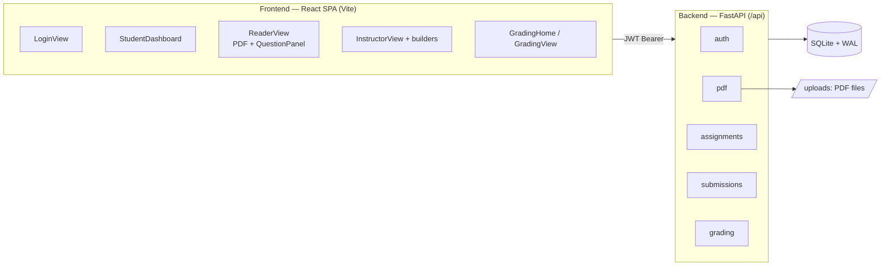
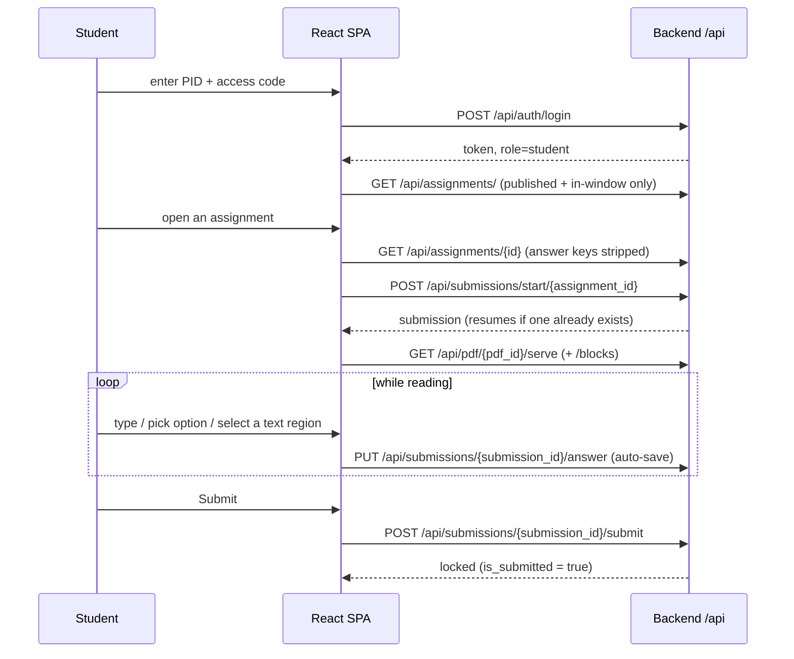
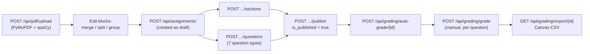

# Overview

PaperLock is a guided PDF-reading and question-based assessment web app built for
an introductory psychology course (**PSYC 1 / Intro Psych** at UCSD Summer
Session 1). Students read a primary research article inside a distraction-reduced
in-browser reader while answering scaffolded questions anchored to that article;
instructors and TAs author those assignments, grade them, and export results to
the course gradebook.

This is the index document. For deeper detail, see the
[Related documentation](#related-documentation) section at the bottom.

---

## What problem it solves

First-year students are asked to read primary research papers before they have the
skills to do so. Reading happens in one tab, the assignment lives in another, and
the two are never connected — so students skim, lose the thread, and can't tell
which sentence in the paper actually answers a question.

PaperLock closes that gap by putting the paper and the questions **side by side in
one screen** and by tying individual questions to specific places in the text:

- The article is rendered on the left; guided questions sit on the right.
- Questions can point students at a target page and can ask them to **select the
  exact region of text** ("find the line") that supports an answer.
- Work **auto-saves** continuously, so a dropped connection or closed tab never
  loses answers.
- Instructors author reusable assessments, auto-grade the objective questions,
  hand-grade the open-ended ones, and export a Canvas-ready CSV.

The pedagogical model behind the questions is the **QALMRI** framework (Question,
Alternatives, Logic, Methods, Results, Inference) delivered as a scaffold-fade
ladder of assignments; PaperLock is the delivery and assessment tool for that
curriculum.

---

## The three roles

Roles come from the `UserRole` enum (`backend/app/models.py`) and drive
route protection on both the backend (`require_role(...)`) and the frontend
(`ProtectedRoute` in `frontend/src/App.jsx`).

| Role | Enum value | What they do | Lands on |
|---|---|---|---|
| **Student** | `student` | Logs in, opens published assignments, reads the PDF, answers guided questions, submits. Sees only published, in-window assignments; answer keys are stripped from everything they receive. | `/dashboard` |
| **Instructor** | `instructor` | Full authoring and admin: manages the user roster and access codes, uploads PDFs and edits OCR blocks, builds assignments/sections/questions, publishes/unpublishes, exports/imports assignment bundles, grades, and exports the gradebook CSV. | `/instructor` |
| **TA** | `ta` | Grading only: runs auto-grade, hand-grades submissions, and exports the CSV. TAs use the grading endpoints but do **not** get the instructor authoring/roster tools. | `/grading` |

Instructors and TAs bypass student visibility gating and see unstripped data
(including answer keys). See [Backend API](./api-reference.md) for the exact
role guard on every endpoint.

---

## System at a glance

- **Frontend**: a React single-page app (`frontend/`) served as static files.
  It talks to the backend over a relative `/api` base, so it works same-origin in
  both dev (Vite proxy) and production (nginx reverse proxy).
- **Backend**: FastAPI, all routes mounted under `/api`, split into five routers —
  `auth`, `pdf`, `assignments`, `submissions`, `grading` (`backend/app/main.py`).
- **Auth**: JWT (HS256), 24h expiry, accepted via `Authorization: Bearer <token>`
  **or** a `?token=` query param (the latter is used for inline PDF embedding).
- **Storage**: SQLite in WAL mode plus PDF files on disk. See
  [Data model](./data-model.md).
- **PDF processing**: on upload, `extract_text_blocks` (`backend/app/services/ocr.py`)
  uses PyMuPDF for word-level bounding boxes and spaCy (`en_core_web_sm`) for
  sentence segmentation, so every word carries a `sentence_group` and
  `paragraph_group`. This is what makes granular region selection possible.
  Despite the `ocr.py` filename and the "OCR blocks" label used elsewhere in these
  docs, this is text-layer extraction (PyMuPDF `get_text`), not image OCR — an
  image-only/scanned PDF has no text layer and produces zero blocks.

---

## High-level flow: student

Log in with **PID + access code** → open a published assignment → read the PDF on
the left and answer guided questions on the right (auto-saving) → submit.

Details worth knowing:

- **Login** posts `pid` + `access_code` to `POST /api/auth/login`; the response
  carries the JWT plus `role`, and the app routes the user to the role-appropriate
  home. (In the login UI the two fields are labelled "Username" and "PID", but the
  underlying values are the account PID and its access code.)
- **Dashboard visibility** — students only see assignments where
  `is_published == true` **and** the current time falls inside the availability
  window (`available_from` / `available_until`, either of which may be open-ended).
  A draft looks nonexistent (404); a not-yet-open assignment returns 403 "not open
  yet"; a past-deadline assignment returns 403 "deadline has passed".
- **Starting** is idempotent: if the student already has a submission, it is
  returned (resuming is always allowed, even after the deadline). A brand-new start
  requires the window to be open.
- **Auto-save** — the reader keeps a synchronous `answersRef` source of truth and
  the `useSaveState` hook (`frontend/src/hooks/useSaveState.js`) debounces, coalesces
  in-flight saves, and retries once on failure, driving a live save indicator. Each
  save is an upsert of one `Answer` row.
- **Server-side deadline enforcement** — answer edits and (re)starts are re-checked
  against the availability window on the server, and a submitted assignment is locked
  (further edits return 400 "Already submitted").

The reader view (`frontend/src/views/ReaderView.jsx` +
`frontend/src/components/QuestionPanel.jsx`) shows the PDF with selectable text
blocks and search on the left, and the questions grouped into collapsible sections
on the right, with a progress count and a submit confirmation dialog.

---

## High-level flow: instructor

Upload a PDF → author sections and questions → publish → auto-grade and/or
hand-grade → export CSV.

Details worth knowing:

- **Upload** — `POST /api/pdf/upload` rejects non-`.pdf` files, runs text
  extraction in a threadpool, and returns page/block counts. Instructors can then
  merge, split, and group OCR blocks (`/api/pdf/blocks/...`) to tune where a
  region-select answer should land.
- **Authoring** — `POST /api/assignments/` creates a **draft** (`is_published=false`
  by default). Questions can be created inline with the assignment or added later
  via `POST /api/assignments/{id}/questions`; sections are created via
  `POST /api/assignments/{id}/sections`.
- **Publishing** — `POST /api/assignments/{id}/publish` with `{ published: bool }`
  flips visibility; the availability window controls the open/close dates.
- **Grading** — `POST /api/grading/auto-grade/{id}` scores the objective questions
  for **submitted** submissions only, and never overwrites a manual grade or
  auto-zeroes a keyless/manual question. Hand-grading goes through
  `POST /api/grading/grade`, which validates `0 <= score <= question.points`.
- **Export** — `GET /api/grading/export/{id}` returns a CSV
  (`grades_assignment_{id}.csv`) laid out for a Canvas import: `Student`, `ID`, one
  column per question labelled `Q{order+1} ({points})`, and a `Total ({sum})`
  column. A student with zero graded questions gets a blank total, so an import can
  never clobber a real grade with a 0. See [Grading](./grading.md).

---

## Feature list

- **Seven question types** — the `QuestionType` enum:

  | Type | `question_type` | What the student does |
  |---|---|---|
  | Region select ("find the line") | `region_select` | Selects the exact text region on the PDF that supports the answer |
  | Free text | `free_text` | Writes a long-form response (hand-graded by default) |
  | Multiple choice | `multiple_choice` | Picks one or (if `allow_multiple`) several options |
  | Short answer | `short_answer` | Types a short response matched against accepted answers |
  | Matching | `matching` | Pairs each left item with a right item |
  | Cloze | `cloze` | Fills `{{0}}`, `{{1}}`, … blanks from a word bank |
  | Scale | `scale` | Picks a value on a Likert-style `scale_min`–`scale_max` range |

- **Guided collapsible sections** — questions group into ordered `Section`s, each
  with an optional Markdown intro; sections render as collapsible panels with a
  per-section progress count in the reader.
- **Region-select "find the line"** — word-level OCR blocks (text-layer extraction
  via PyMuPDF, not image OCR) carry sentence and
  paragraph groupings so selections snap to a chosen granularity
  (`word` / `sentence` / `paragraph`), and grading can award partial/proximity
  credit for near-misses.
- **Auto / manual / completion grading** — the `grading_mode` on each question
  (defaults: `free_text`→`manual`, `scale`→`completion`, everything else→`auto`)
  decides how it is scored. Auto-grade never overwrites a manual grade.
- **Portable assignment bundles** — export a whole assignment (PDF bytes, OCR
  blocks, sections, questions, and answer keys) as a single `*.paperlock.json` file
  via `GET /api/assignments/{id}/bundle` and re-import it elsewhere with
  `POST /api/assignments/import` (imported as an unscheduled draft). See
  [Bundles](./bundles.md).
- **Publish / draft visibility + availability windows** — assignments start as
  drafts and become visible to students only when published and inside their
  `available_from` / `available_until` window.
- **Canvas CSV export** — a gradebook CSV sorted by student last name and shaped for
  a Canvas import.
- **PDF annotations** — students can add highlights and notes to a PDF
  (`/api/submissions/annotations`), scoped to their own account.
- **Roster management** — instructors create users individually or in batches,
  reset access codes, and filter the roster by role
  (`/api/auth/users` endpoints).

---

## Question types and grading modes

Each question stores a `question_type` (what the student answers) and a
`grading_mode` (how it is scored). The two are independent, and the mode defaults
sensibly from the type:

| `grading_mode` | Meaning | Default for |
|---|---|---|
| `auto` | Scored by the auto-grader against an answer key | region_select, multiple_choice, short_answer, matching, cloze |
| `manual` | Never auto-scored; a human enters the score | free_text |
| `completion` | Full points if answered, else 0 | scale |

The auto-grader supports exact-set matching (MC), normalized/numeric-tolerant
comparison (short answer), fractional per-blank credit (matching, cloze), and
recall-plus-proximity credit for region selections. Full rules live in
[Grading](./grading.md).

---

## Related documentation

| Doc | Covers |
|---|---|
| [Backend API](./api-reference.md) | Every `/api` endpoint, request/response shapes, roles, and gating |
| [Data model](./data-model.md) | The 10 tables, enums, relationships, constraints, and the SQLite/WAL setup |
| [Grading](./grading.md) | `grading_mode`, the `_auto_score` algorithm, manual overrides, and CSV export |
| [Bundles](./bundles.md) | The `*.paperlock.json` export/import format and remapping behavior |
| [Deployment](./deployment.md) | Environment variables, the `SECRET_KEY` production guard, seeding, and the nginx/Docker deploy |
