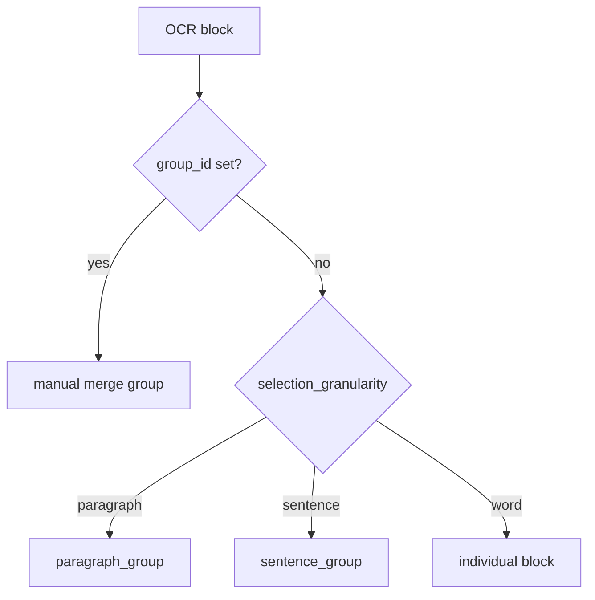

# Question Types

PaperLock assignments are built from **questions**. Each question has a
`question_type` drawn from a fixed enum, and that type drives three things:

1. **How the student answers it** in the lockdown reader UI.
2. **Which `Question` columns configure it** (options, answer keys, ranges…).
3. **How the answer is stored** on the `Answer` row and **how it is graded**
   (auto vs. manual vs. completion).

There are **7 question types**, defined by the `QuestionType` enum in
[`backend/app/models.py`](../backend/app/models.py):

```python
class QuestionType(str, enum.Enum):
    region_select   = "region_select"
    free_text       = "free_text"
    multiple_choice = "multiple_choice"
    short_answer    = "short_answer"
    matching        = "matching"
    cloze           = "cloze"
    scale           = "scale"
```

See also: [Data model](./data-model.md) · [Backend API](./api-reference.md) ·
[Grading](./grading.md) · [Assignment bundles](./bundles.md).

---

## Where each piece lives

| Concern | File |
|---|---|
| `QuestionType` / `Question` / `Answer` columns | [`backend/app/models.py`](../backend/app/models.py) |
| Create/edit questions, answer-key stripping | [`backend/app/routers/assignments.py`](../backend/app/routers/assignments.py) |
| Save/submit answers | [`backend/app/routers/submissions.py`](../backend/app/routers/submissions.py) |
| Auto-grading (`_auto_score`) | [`backend/app/routers/grading.py`](../backend/app/routers/grading.py) |
| Student answer editors (per type) | [`frontend/src/components/QuestionPanel.jsx`](../frontend/src/components/QuestionPanel.jsx) |
| PDF region click/highlight overlay | [`frontend/src/components/BlockOverlay.jsx`](../frontend/src/components/BlockOverlay.jsx) |
| Reader wiring (answer handlers, autosave) | [`frontend/src/views/ReaderView.jsx`](../frontend/src/views/ReaderView.jsx) |
| Instructor authoring UI | [`frontend/src/views/QuestionBuilderView.jsx`](../frontend/src/views/QuestionBuilderView.jsx) |

---

## Lifecycle at a glance

```mermaid
flowchart LR
    A[Instructor authors question<br/>POST /api/assignments/ or<br/>POST /api/assignments/:id/questions] --> B[Question row<br/>type + config + answer key]
    B -->|answer keys stripped for students| C[Student opens reader<br/>GET /api/assignments/:id]
    C --> D[Student answers in QuestionPanel]
    D -->|PUT /api/submissions/:sid/answer<br/>AnswerUpdate| E[Answer row<br/>selected_block_ids / free_text / selected_options]
    E --> F[POST /api/submissions/:sid/submit<br/>locks answers]
    F --> G[Grading]
    G -->|POST /api/grading/auto-grade/:aid<br/>_auto_score| H[Grade rows]
    G -->|POST /api/grading/grade<br/>manual| H
```



**Answer storage** always uses one of three columns on the `Answer` model
(the other two stay null for a given type):

- `selected_block_ids` — JSON list of `OCRBlock` ids (region questions).
- `free_text` — Text (free_text and short_answer).
- `selected_options` — JSON list of ints (may contain nulls). Used for
  multiple_choice **and** for the positional types matching/cloze/scale.

**Answer keys are hidden from students.** In `list_assignments` and
`get_assignment`, `_strip_answer_keys` nulls the `_ANSWER_KEY_FIELDS`
(`correct_block_ids`, `correct_options`, `accepted_answers`,
`correct_matches`, `cloze_answers`, `sample_answer`) for student requests.
Presentation fields needed to *render* the question — `options`, `match_left`,
`match_right`, `cloze_text`, `cloze_bank` — are **not** stripped. Instructors
and TAs receive everything.

---

## Overview table

| Type | Student UI mechanic | Answer column | Key config fields | Default `grading_mode` | Auto-gradable |
|---|---|---|---|---|---|
| `region_select` | Click a highlighted span in the PDF; it turns purple | `selected_block_ids` | `correct_block_ids`, `allow_multiple`, `selection_granularity` | `auto` | Yes (recall + proximity) |
| `free_text` | Type into a multi-line textarea | `free_text` | `sample_answer` (model answer) | `manual` | No (manual only) |
| `multiple_choice` | Radio buttons (single) or checkboxes (multi) | `selected_options` | `options`, `correct_options`, `allow_multiple` | `auto` | Yes (exact set match) |
| `short_answer` | Type into a single-line input | `free_text` | `accepted_answers` | `auto` | Yes (normalized/numeric match) |
| `matching` | One dropdown per left item, choosing a right item | `selected_options` (positional) | `match_left`, `match_right`, `correct_matches` | `auto` | Yes (per-item fractional) |
| `cloze` | Inline dropdowns per `{{n}}` blank, pick from a word bank | `selected_options` (positional) | `cloze_text`, `cloze_bank`, `cloze_answers` | `auto` | Yes (per-blank fractional) |
| `scale` | Row of numbered buttons (Likert) | `selected_options` (value at index 0) | `scale_min`, `scale_max` | `completion` | Yes (any answer = full) |

**Common fields available on every type** (`Question` model): `prompt`,
`order`, `points`, `section_id` (groups the question under a `Section`),
`guidance` ("where to look" hint), `target_page` (1-based PDF page for a
jump-to-page button), `sample_answer` (model answer), and `grading_mode`.

**`grading_mode`** is a free-form `String(20)` (not an enum) with three
meaningful values — `"auto"`, `"manual"`, `"completion"`. If the author leaves
it null, `_default_grading_mode(qtype)` fills it in at create/add time
(`free_text` → `manual`, `scale` → `completion`, everything else → `auto`). The
mode is checked **first** in `_auto_score`, before type dispatch:

- `manual` → returns `None` (skipped; never auto-zeroed).
- `completion` → full `points` if the answer is non-empty (`_answered`), else `0.0`.
- otherwise → falls through to the per-type logic below.

---

## `region_select`

**What it is.** The signature PaperLock question: "find the line." The student
locates the relevant text *in the PDF itself* and selects it, rather than
retyping it.

**How the student answers it.** The PDF is overlaid with invisible, clickable
spans built from OCR blocks ([`BlockOverlay.jsx`](../frontend/src/components/BlockOverlay.jsx)).
When the question is active, hovering tints a span and clicking it selects the
whole group — the span flashes green, then renders purple
(`rgba(108, 92, 231, …)`) to show it's selected. Which blocks are grouped into
one clickable span is governed by `selection_granularity`:



A manual `group_id` (set by the instructor via `POST /api/pdf/blocks/merge`)
always wins over the granularity default. With `allow_multiple = false`, a click
*replaces* the selection; with `allow_multiple = true`, clicks toggle blocks in
and out of a set (see `handleBlockClick` in
[`ReaderView.jsx`](../frontend/src/views/ReaderView.jsx)).

**Configuring fields.**

- `correct_block_ids` — JSON list of `OCRBlock` ids that count as correct (the
  answer key; stripped from student responses).
- `allow_multiple` — allow selecting several spans (a set) vs. a single span.
- `selection_granularity` — `SelectionGranularity` enum: `word` | `sentence` |
  `paragraph` (default `sentence`).
- Common: `guidance`, `target_page` help the student find the passage.

**Storage.** `Answer.selected_block_ids` — the list of selected `OCRBlock` ids.

**Grading** (auto, `_auto_score` in [`grading.py`](../backend/app/routers/grading.py)).
If there is no `correct_block_ids` key → `None` (manual). Otherwise it is
forgiving, in two stages:

1. **Recall / coverage.** `recall = |selected ∩ correct| / |correct|`. If
   `recall > 0`, score = `round(points * recall, 4)` — partial credit for
   covering part of the correct set.
2. **Proximity fallback.** If there is *no* overlap but the student selected
   something, correct and selected blocks are mapped to their `sentence_group`
   values; `dist` = the minimum sentence distance between them and
   `frac = max(0, 1 − dist / REGION_PROXIMITY_TOLERANCE)`. With
   `REGION_PROXIMITY_TOLERANCE = 3`: an adjacent sentence (dist 1) earns 2/3,
   dist 2 earns 1/3, dist ≥ 3 earns 0. Score = `round(points * frac, 4)`.

Otherwise → `0.0`. (The `block_id → sentence_group` map is built once per
auto-grade run, only if the assignment actually contains a region question.)

---

## `free_text`

**What it is.** An open-ended written response — paragraphs, explanations,
QALMRI syntheses.

**How the student answers it.** A multi-line `<Textarea>` in the question panel
(`renderEditor` in [`QuestionPanel.jsx`](../frontend/src/components/QuestionPanel.jsx)).
Keystrokes autosave on a short debounce.

**Configuring fields.** No answer key. `sample_answer` holds an optional model
answer (Text). Common `guidance` / `target_page` apply.

**Storage.** `Answer.free_text` — the raw string. The API caps it at
`MAX_FREE_TEXT_LEN = 20000` characters (`AnswerUpdate.free_text` has
`max_length=20000`).

**Grading.** Default `grading_mode = "manual"`, so `_auto_score` returns `None`
and the question is **never auto-graded or auto-zeroed** — a grader scores it
via `POST /api/grading/grade`. (If a mode is overridden to `completion`, it
earns full points for any non-empty response.)

---

## `multiple_choice`

**What it is.** A classic pick-from-a-list question. Supports single-answer and
multi-answer variants.

**How the student answers it.** `renderOptions` renders one control per entry in
`options`: a **radio button** when `allow_multiple = false` (exactly one choice)
or a **checkbox** when `allow_multiple = true` (any number). Selecting toggles
that option's index in the answer.

**Configuring fields.**

- `options` — JSON list of option **strings** (rendered to students; not stripped).
- `correct_options` — JSON list of correct option **indices** (the answer key;
  stripped from students).
- `allow_multiple` — single-select vs. multi-select.

> **Option-count lock:** `PUT /api/assignments/{id}/questions/{qid}` returns
> **409** if you change the *number* of `options` on an MC question that already
> has submissions, because `selected_options` stores positional indices that
> would otherwise misalign. Same-count edits (renaming an option) are allowed.

**Storage.** `Answer.selected_options` — the list of chosen option indices
(e.g. `[0, 2]`).

**Grading** (auto). No `correct_options` key → `None`. Otherwise **all-or-nothing,
order-independent**: full `points` iff
`set(selected_options) == set(correct_options)`, else `0.0`. This handles
multi-select correctly (both sets must match exactly).

---

## `short_answer`

**What it is.** A brief factual response — a number, a term, a name — that can be
checked against a small list of acceptable strings.

**How the student answers it.** A single-line `<Input>` (`renderEditor`). Note it
is text-based like `free_text`, **not** an option picker.

**Configuring fields.** `accepted_answers` — JSON list of acceptable answer
strings (the answer key; stripped from students). Common `guidance` /
`target_page` apply.

**Storage.** `Answer.free_text` — the typed string (short_answer shares the
`free_text` column with `free_text`, **not** `selected_options`).

**Grading** (auto). No `accepted_answers` → `None`. A blank/whitespace response →
`0.0`. Otherwise the response is normalized with `_norm`
(`strip().lower()` then strip trailing `.`/`%` then strip again) and compared to
each accepted answer (also normalized):

- exact normalized string match → full `points`; else
- **numeric tolerance:** if both parse as floats and
  `abs(resp − acc) < 1e-6` → full `points` (so `"17.3"` matches `"17.30"`).

No match → `0.0`.

---

## `matching`

**What it is.** Match each item in a left column to an item in a right column
(term ↔ definition, section ↔ QALMRI element, etc.).

**How the student answers it.** `renderMatching` renders one row per `match_left`
item, each with a `<select>` dropdown listing every `match_right` option
(labeled "— choose —" when empty). Picking a right option stores its index at
the left item's position via the shared positional handler.

**Configuring fields.**

- `match_left` — JSON list of left prompt strings (rendered; not stripped).
- `match_right` — JSON list of right option strings (rendered; not stripped).
- `correct_matches` — JSON list where entry *i* is the correct **right-index**
  for left item *i* (the answer key; stripped from students).

**Storage.** `Answer.selected_options` used **positionally**: index = left-item
position, value = chosen right-index (or `null` if not yet chosen — e.g.
`[2, null, 0]`). `AnswerUpdate.selected_options` is typed `list[int | None]` to
allow those gaps.

**Grading** (auto, shared with cloze). Key = `correct_matches`; no key → `None`.
`total = len(key)`; if 0 → `0.0`. **Per-item fractional credit:**
`correct = count of i where i < len(sel) and sel[i] == key[i]`, then score =
`round(points * correct / total, 4)`.

---

## `cloze`

**What it is.** A word-bank fill-in-the-blank: a passage with numbered blanks the
student fills from a shared bank of words.

**How the student answers it.** `cloze_text` contains `{{0}}`, `{{1}}`, …
placeholders. `renderCloze` splices the text around each placeholder and drops in
an inline `<select>` (shown as `____` when empty) populated from `cloze_bank`.
Choosing a bank word stores its **bank index** at that blank's number.

**Configuring fields.**

- `cloze_text` — Text with `{{n}}` placeholders (rendered; not stripped).
- `cloze_bank` — JSON list of bank word strings (rendered; not stripped).
- `cloze_answers` — JSON list where entry *n* is the correct **bank-index** for
  blank `{{n}}` (the answer key; stripped from students).

**Storage.** `Answer.selected_options` used **positionally**: index = blank
number, value = chosen bank-index (or `null` for an unfilled blank — e.g.
filling `{{1}}` before `{{0}}` yields `[null, 3]`).

**Grading** (auto, same code path as matching). Key = `cloze_answers`; no key →
`None`. Per-blank fractional credit:
`round(points * correct / total, 4)` where `correct` counts positions where
`sel[i] == key[i]`.

---

## `scale`

**What it is.** A Likert / rating item — pick a number on a scale (e.g. 1–5 for a
confidence or relevance rating).

**How the student answers it.** `renderScale` renders a row of buttons for every
integer from `scale_min` to `scale_max` inclusive (defaults 1 and 5 in the UI if
unset). Clicking a button stores that **value** at position 0 of the answer.

**Configuring fields.** `scale_min` and `scale_max` (integers) define the range.
No answer key.

**Storage.** `Answer.selected_options` — the chosen value at index `0`
(e.g. `[4]`).

**Grading.** Default `grading_mode = "completion"`, so `_auto_score` returns full
`points` if the answer is non-empty, else `0.0` — a rating has no "wrong" value,
so answering it at all earns credit. (If the mode is overridden to `auto`, the
`scale` branch behaves the same way: full points for any `selected_options`,
else `0.0`.)

---

## Authoring, editing, and answering endpoints

| Action | Endpoint | Role |
|---|---|---|
| Create assignment with inline questions | `POST /api/assignments/` | instructor |
| Add a question | `POST /api/assignments/{assignment_id}/questions` | instructor |
| Edit a question | `PUT /api/assignments/{assignment_id}/questions/{question_id}` | instructor |
| Delete a question | `DELETE /api/assignments/{assignment_id}/questions/{question_id}` | instructor |
| Start / resume a submission | `POST /api/submissions/start/{assignment_id}` | student |
| Save one answer | `PUT /api/submissions/{submission_id}/answer` | owner |
| Submit (lock answers) | `POST /api/submissions/{submission_id}/submit` | owner |
| Auto-grade an assignment | `POST /api/grading/auto-grade/{assignment_id}` | instructor / ta |
| Manually grade one question | `POST /api/grading/grade` | instructor / ta |

**Editing quirk worth knowing:** on `PUT .../questions/{id}`, if you change
`question_type` but do **not** explicitly send a new `grading_mode`, the mode is
reset to the new type's default. This prevents, for example, a `scale`
question's `completion` mode from silently mis-grading a question you switched to
`multiple_choice`.

See [Backend API](./api-reference.md) for full request/response schemas,
[Grading](./grading.md) for the complete `_auto_score` reference and CSV export,
and [Data model](./data-model.md) for every column and constraint.
