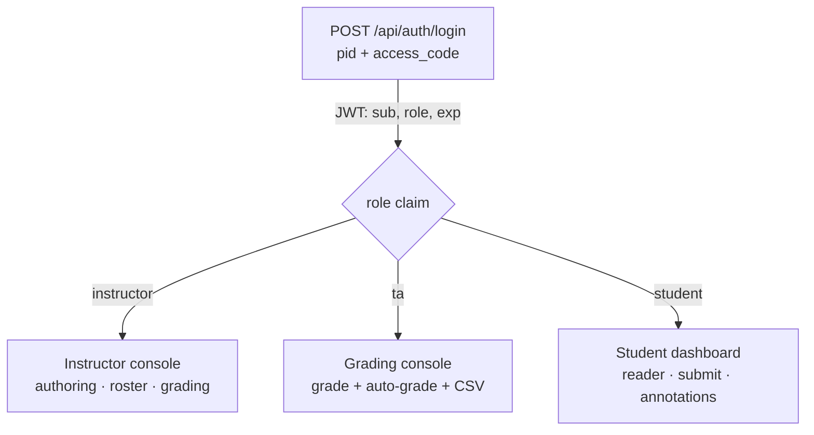
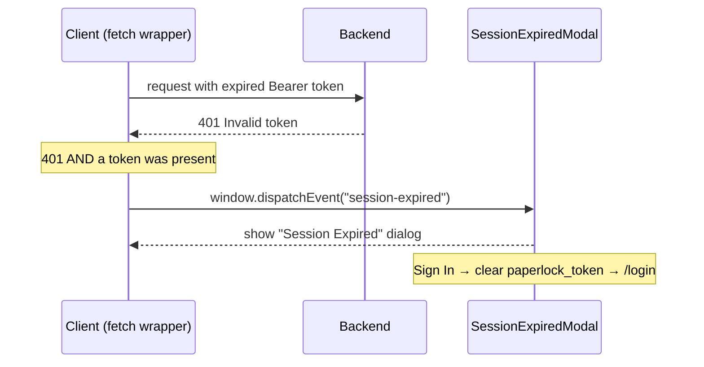
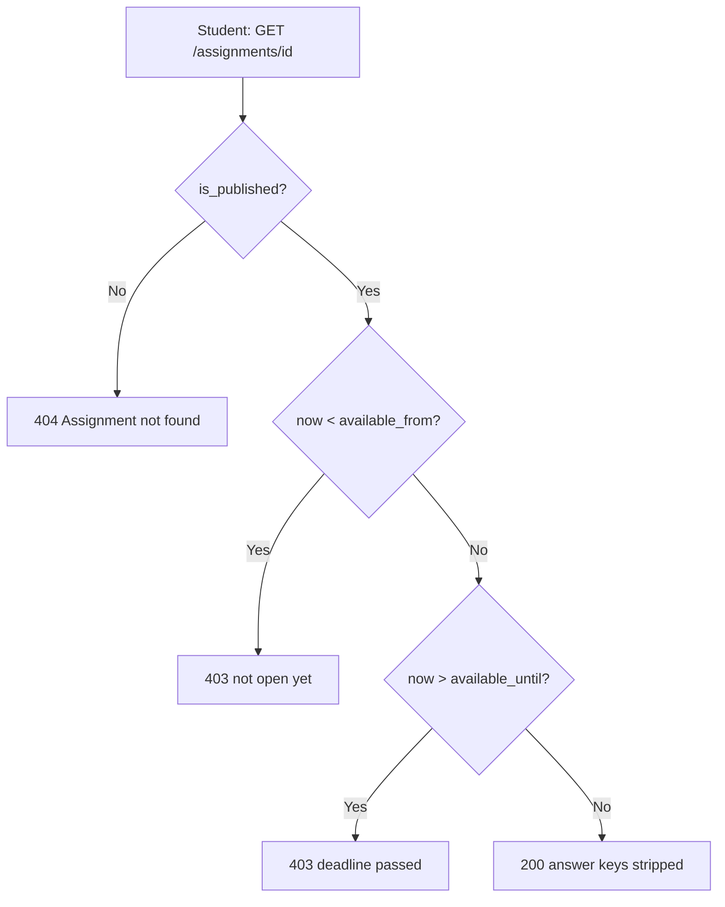
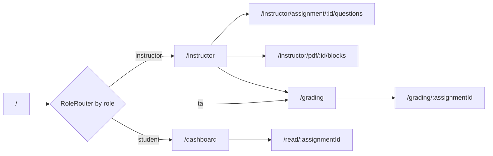

# Roles & Access

How PaperLock decides **who** can do **what**: the three roles
(`instructor`, `student`, `ta`), the exact routes and API endpoints each may
reach, the authentication model (plaintext access codes, JWT bearer tokens,
session-expiry handling), and the **visibility rules** that keep students from
seeing draft or out-of-window assignments.

- **Role enum + user table:** [`backend/app/models.py`](../backend/app/models.py) (`UserRole`)
- **Auth dependencies + auth endpoints:** [`backend/app/auth`](../backend/app/routers/auth.py) — `get_current_user`, `require_role`, `/api/auth/*`
- **Startup / SECRET_KEY guard:** [`backend/app/main.py`](../backend/app/main.py)
- **Student visibility gating:** [`backend/app/routers/assignments.py`](../backend/app/routers/assignments.py)
- **Frontend route guards:** [`frontend/src/App.jsx`](../frontend/src/App.jsx), [`frontend/src/hooks/useAuth.jsx`](../frontend/src/hooks/useAuth.jsx)

Related docs:

- Column definitions for `User`, `Assignment`, `Submission`, etc. → [`./data-model.md`](./data-model.md)
- Grading endpoints and scoring semantics → [`./grading.md`](./grading.md)
- Full endpoint surface → [`./api-reference.md`](./api-reference.md)
- Assignment export/import → [`./bundles.md`](./bundles.md)

---

## The three roles at a glance

Roles are the string enum `UserRole` (`backend/app/models.py`): `instructor`,
`student`, `ta`. A user's role is fixed on their `users` row and is baked into
their JWT at login (`role` claim). There is no self-signup — every account is
created by an instructor (or the one-time `seed.py` bootstrap).

| Role | Purpose | Backend guard | Lands on (frontend) |
|---|---|---|---|
| `instructor` | Full authoring + roster + grading | `require_role(UserRole.instructor)` on management routes | `/instructor` |
| `ta` | Grading only | `require_role(UserRole.instructor, UserRole.ta)` on grading routes | `/grading` |
| `student` | Lockdown reader + submit | `get_current_user` + per-request student gating | `/dashboard` |



---

## Authentication model

### Access codes are plaintext by design

A user logs in with their **PID** and a per-user **access code** (`users.pid`
+ `users.access_code`, both unique-indexed). The access code is stored
**in plaintext** — this is a deliberate design decision, not an oversight (see
the launch-hardening memo). Because there is no password-reset email flow, the
**instructor is responsible for distributing codes** to students and TAs
out-of-band and can regenerate any code on demand.

Codes are generated with `secrets.token_urlsafe(16)` on the API paths:

- New user: `POST /api/auth/users` returns the fresh `access_code` in the response.
- Roster import: `POST /api/auth/users/batch`.
- Regenerate: `POST /api/auth/users/{user_id}/reset-code` → `{"access_code": <new>}`.
- The seeded instructor's code is printed once to stdout by `seed.py` (or pinned via `INSTRUCTOR_CODE`); note `seed.py` mints it with `secrets.token_urlsafe(12)`, not 16.

**Handing out codes.** "Out-of-band" doesn't mean by hand — the instructor's
**Users** tab (Students + TAs) has an **Export Codes CSV** button that downloads
`paperlock_access_codes.csv`, one row per student with `Name`, `PID`,
`Access Code`, and the login URL. Each roster row also has a per-student
copy-code button. This is the intended way to distribute the plaintext codes
(`frontend/src/views/InstructorView.jsx`, `ExportCodesButton` ~L1319–1344).

Because codes are the only credential and are reversible, they are treated as
secrets: distribute privately, and reset a code (rather than emailing the same
one twice) if it may have leaked.

### Login → JWT

```
POST /api/auth/login
{ "pid": "A00000001", "access_code": "xxxxxxxx" }
```

On a match, the server issues a signed **JWT** and echoes identity:

```jsonc
// LoginResponse
{ "token": "<jwt>", "user_id": 12, "name": "Test Student 1", "role": "student" }
```

No match → **401** `"Invalid PID or access code"`.

Token facts (`backend/app/routers/auth.py`):

| Property | Value |
|---|---|
| Algorithm | `HS256` |
| Signing key | `SECRET_KEY` env var |
| Lifetime | 24 hours (`TOKEN_EXPIRE_HOURS = 24`) |
| Payload claims | `sub` = `str(user_id)`, `role`, `exp` |

> **Production start-guard.** `main.py:on_startup` refuses to boot
> (`RuntimeError`) when `PAPERLOCK_ENV=production` and `SECRET_KEY` is empty, in
> the insecure-placeholder set (`dev-secret-change-in-production`,
> `change-me-in-production`, `change-me`, `secret`), or shorter than 16
> characters — otherwise anyone who guessed the key could forge an instructor
> token. Generate one with
> `python -c "import secrets; print(secrets.token_urlsafe(48))"`.

### Sending the token

`get_current_user` accepts the token **two** ways:

1. **Header (default):** `Authorization: Bearer <token>` — used by all JSON API calls.
2. **Query param:** `?token=<token>` — used for inline `<embed>`/`<iframe>` PDF
   loads where a header can't be attached (see `GET /api/pdf/{id}/serve`).

The frontend stores the token in `localStorage` under `paperlock_token` and
attaches it as a bearer header on every request (`frontend/src/api/client.js`);
`api.getPdfUrl()` appends it as `?token=` for PDF embeds.

Failure modes from `get_current_user`:

| Condition | Status | Detail |
|---|---|---|
| No header and no `?token=` | 401 | `No token provided` |
| Malformed / bad signature / expired | 401 | `Invalid token` |
| Valid token but user row gone | 401 | `User not found` |

`require_role(*roles)` runs after `get_current_user` and returns **403**
`"Insufficient permissions"` when `current_user.role` is not in the allowed set.

### Session-expiry handling

Tokens are not refreshed; after 24 h the JWT's `exp` passes and the next call
returns 401. The client turns that into a graceful re-login prompt
(`frontend/src/api/client.js` + `SessionExpiredModal.jsx`):



Key detail: the modal only fires on a 401 **when a token was actually present**.
A failed login (no stored token) surfaces as an inline
`"Invalid PID or access code"` error instead of popping the expiry modal over
the login screen. On app load, `AuthProvider` validates the stored token via
`GET /api/auth/me` and silently discards it if rejected.

---

## Permission matrix

Endpoints are grouped by their guard. **Any authenticated** = only
`get_current_user` (any role passes). ✓ = allowed, ✗ = blocked, ◐ = allowed but
scoped to the caller's own rows.

| Endpoint (method + path under `/api`) | Guard | student | instructor | ta |
|---|---|:--:|:--:|:--:|
| `POST /auth/login` | none | ✓ | ✓ | ✓ |
| `GET /auth/me` | any auth | ✓ | ✓ | ✓ |
| `POST /auth/users`, `/users/batch` | instructor | ✗ | ✓ | ✗ |
| `GET /auth/users`, `PATCH/DELETE /auth/users/{id}`, `POST /auth/users/{id}/reset-code` | instructor | ✗ | ✓ | ✗ |
| `GET /pdf/` (list) | instructor | ✗ | ✓ | ✗ |
| `POST /pdf/upload`, `DELETE /pdf/{id}` | instructor | ✗ | ✓ | ✗ |
| `PATCH /pdf/blocks/{id}/group`, `POST /pdf/blocks/merge`, `/blocks/split` | instructor | ✗ | ✓ | ✗ |
| `GET /pdf/{id}/serve`, `GET /pdf/{id}/blocks` | any auth | ✓ | ✓ | ✓ |
| `GET /assignments/` (list) | any auth | ◐ filtered | ✓ all | ✓ all |
| `GET /assignments/{id}` | any auth | ◐ gated | ✓ | ✓ |
| `POST /assignments/`, `PUT/DELETE /assignments/{id}`, `POST /{id}/publish` | instructor | ✗ | ✓ | ✗ |
| question/section CRUD under `/assignments/{id}/…` | instructor | ✗ | ✓ | ✗ |
| `GET /assignments/{id}/bundle`, `POST /assignments/import` | instructor | ✗ | ✓ | ✗ |
| `POST /submissions/start/{id}` | student only | ✓ | ✗ | ✗ |
| `PUT /submissions/{id}/answer`, `POST /{id}/submit`, `GET /submissions/{id}` | any auth (owned) | ◐ own | ✓ any\* | ✓ any\* |
| annotations CRUD under `/submissions/annotations…` | any auth (owner) | ◐ own | ◐ own | ◐ own |
| `GET /grading/assignments/{id}/submissions` | instructor **or** ta | ✗ | ✓ | ✓ |
| `GET /grading/submissions/{id}/grades` | instructor **or** ta | ✗ | ✓ | ✓ |
| `POST /grading/grade`, `POST /grading/auto-grade/{id}` | instructor **or** ta | ✗ | ✓ | ✓ |
| `GET /grading/export/{id}` (CSV) | instructor **or** ta | ✗ | ✓ | ✓ |

\* For `answer`/`submit`, ownership is enforced by a `student_id == current_user.id`
filter, so instructors/TAs (who own no submissions) get 404 there; but
`GET /submissions/{id}` explicitly lets instructors/TAs read **any** submission
while students may read only their own.

> **Not role-gated:** `GET /pdf/{id}/serve` and `GET /pdf/{id}/blocks` require
> only a valid token, so any logged-in user can fetch any PDF or its OCR block
> text by id. Answer-key protection is applied to *question* fields only, not to
> block text. See [`./api-reference.md`](./api-reference.md) for the caveat.

---

## Student

Students use the lockdown reader. The frontend exposes exactly two student
routes (`App.jsx`, `allowedRoles={["student"]}`):

| Route | View | Purpose |
|---|---|---|
| `/dashboard` | `StudentDashboard` | List of visible assignments + Submitted / In Progress / Not Started status |
| `/read/:assignmentId` | `ReaderView` | PDF reader, question panel, annotations, submit |

`RoleRouter` sends a student who hits `/` to `/dashboard`; `ProtectedRoute`
bounces them off any instructor/grading route back to `/`.

### What a student may call

- **Dashboard:** `GET /api/assignments/` — returns only assignments visible to
  this student (see [Visibility rules](#visibility-rules-publish--availability)),
  each annotated with `is_submitted` / `has_started`, with all answer-key fields
  stripped.
- **Reader:** `GET /api/assignments/{id}` (gated), `GET /api/pdf/{id}/serve`
  (inline PDF), `GET /api/pdf/{id}/blocks` (selectable text regions).
- **Submit:** `POST /api/submissions/start/{id}` (student-only — a non-student
  gets **403** `"Only students can submit"`), then
  `PUT /api/submissions/{id}/answer`, `POST /api/submissions/{id}/submit`, and
  `GET /api/submissions/{id}` — all scoped to the caller's own submission
  (`student_id == current_user.id`; otherwise 404, or 403
  `"Not your submission"` on read).
- **Annotations:** `POST /api/submissions/annotations`,
  `GET /api/submissions/annotations/{pdf_id}`,
  `PATCH` / `DELETE /api/submissions/annotations/{annotation_id}` — always the
  current user's own highlights/notes.

### What a student never sees

- **Answer keys** are set to `None` before serialization in both
  `list_assignments` and `get_assignment` for students. The stripped fields
  (`_ANSWER_KEY_FIELDS`) are: `correct_block_ids`, `correct_options`,
  `accepted_answers`, `correct_matches`, `cloze_answers`, `sample_answer`.
  Render-only fields (`options`, `match_left`, `match_right`, `cloze_text`,
  `cloze_bank`) are **not** stripped — they are needed to draw the question.
- **Draft or out-of-window assignments** — enforced server-side (next section),
  so a bookmarked or guessed URL can't bypass the dashboard filter.

---

## Instructor

The instructor is the superuser: everything a TA can do, plus all authoring,
roster, and content management. Frontend routes (`allowedRoles={["instructor"]}`):

| Route | View |
|---|---|
| `/instructor` | `InstructorView` (dashboard: PDFs, assignments, roster) |
| `/instructor/assignment/:assignmentId/questions` | `QuestionBuilderView` |
| `/instructor/pdf/:pdfId/blocks` | `BlockEditorView` (OCR block grouping) |
| `/grading`, `/grading/:assignmentId` | shared grading console (see TA) |

Instructor-only API surface (`require_role(UserRole.instructor)`):

- **Roster / users:** create (`POST /auth/users`), batch import
  (`POST /auth/users/batch`, silently skips existing PIDs), list
  (`GET /auth/users`), update (`PATCH /auth/users/{id}`), delete
  (`DELETE /auth/users/{id}`), reset code (`POST /auth/users/{id}/reset-code`).
- **PDFs:** list (`GET /pdf/`), upload (`POST /pdf/upload`), delete
  (`DELETE /pdf/{id}` — 409 if an assignment references it).
- **OCR blocks:** regroup (`PATCH /pdf/blocks/{id}/group`), merge
  (`POST /pdf/blocks/merge`), split (`POST /pdf/blocks/split`).
- **Assignments:** create (`POST /assignments/`, born as a **draft**), edit
  (`PUT /assignments/{id}`), delete (`DELETE /assignments/{id}`).
- **Publish / unpublish:** `POST /assignments/{id}/publish` with
  `{ "published": true|false }` — flips `is_published`. This is the master
  switch for student visibility.
- **Questions & sections:** full CRUD under `/assignments/{id}/questions…` and
  `/assignments/{id}/sections…`.
- **Bundles (portable export/import):** `GET /assignments/{id}/bundle` and
  `POST /assignments/import` — an imported assignment always lands as a **draft**
  and **unscheduled** (`available_from`/`available_until` = `None`) so it can't
  go live accidentally. Details in [`./bundles.md`](./bundles.md).
- **Grading:** all TA endpoints below (instructors satisfy
  `require_role(instructor, ta)`).

Instructors bypass **all** student gating: `GET /assignments/` and
`GET /assignments/{id}` return every assignment, drafts included, with answer
keys intact.

---

## TA

TAs exist to grade, and nothing else. Their console is shared with the
instructor (`allowedRoles={["instructor", "ta"]}`):

| Route | View |
|---|---|
| `/grading` | `GradingHome` (pick an assignment) |
| `/grading/:assignmentId` | `GradingView` (submissions, per-question scoring) |

Every grading endpoint is guarded by `require_role(UserRole.instructor, UserRole.ta)`:

| Method + path (under `/api/grading`) | Purpose |
|---|---|
| `GET /assignments/{id}/submissions` | Roster of submissions with `total_score` / `max_score` / `graded_count` |
| `GET /submissions/{id}/grades` | Existing per-question grades (reopen grading UI) |
| `POST /grade` | Manual grade a question (validates `0 ≤ score ≤ points`; sets `is_auto_graded=False`) |
| `POST /auto-grade/{id}` | Auto-score submitted work; never overwrites a manual grade |
| `GET /export/{id}` | Canvas-ready grades CSV |

See [`./grading.md`](./grading.md) for scoring rules, `grading_mode`, and the
manual-over-auto override precedence.

A TA is otherwise a plain authenticated user: they can call the "any auth"
endpoints (`GET /auth/me`, `GET /assignments/…` unfiltered, `GET /pdf/{id}/serve`,
`GET /submissions/{id}` for any student). A TA **cannot** author or manage
content (those routes are instructor-only) and **cannot** start or write a
submission (`POST /submissions/start/{id}` is student-only; `answer`/`submit`
are ownership-scoped and a TA owns none).

---

## Visibility rules (publish + availability)

Two independent conditions decide whether a **student** may see an assignment.
Both must hold; instructors and TAs are exempt from both.

1. **Published** — `assignment.is_published` must be `True`. New and imported
   assignments default to `False` (draft). Flip it with
   `POST /api/assignments/{id}/publish`.
2. **Within the availability window** — `now` must be between
   `available_from` and `available_until`. Either bound may be `null`, meaning
   open-ended on that side. Naive datetimes (SQLite stores them naive) are
   coerced to UTC before comparison.

### Where each rule is enforced

`GET /api/assignments/` (list) filters the query for students:

```python
Assignment.is_published == True,
(Assignment.available_from == None) | (Assignment.available_from <= now),
(Assignment.available_until == None) | (Assignment.available_until >= now),
```

`GET /api/assignments/{id}` (single) gates by role, returning distinct statuses
so a **draft is indistinguishable from a nonexistent assignment**:

| Student requests… | Response |
|---|---|
| An unpublished (draft) assignment | **404** `Assignment not found` (looks like it doesn't exist) |
| A published assignment before `available_from` | **403** `This assignment is not open yet` |
| A published assignment after `available_until` | **403** `The deadline for this assignment has passed` |
| A published assignment inside its window | **200** (answer keys stripped) |

Because the single-item endpoint applies the same rules, a student who types the
reader URL directly (`/read/:assignmentId` → `GET /api/assignments/{id}`) gets
the same 404/403 — the dashboard filter cannot be bypassed by direct URL.



### Availability at submit time

Publication/window is also re-checked when a student acts on a submission
(`backend/app/routers/submissions.py`, helper `_availability`):

- `POST /submissions/start/{id}` — **starting a new** submission requires an
  open window (else 403 with the same "not open yet" / "deadline passed"
  reason). **Resuming an existing** submission is always allowed, even after the
  deadline, so a student who already started can return to view or finish.
- `PUT /submissions/{id}/answer` — writing an answer re-checks the window
  server-side and returns 403 with the reason if it has closed (a locked,
  already-submitted answer returns 400 `"Already submitted"`).

This means the deadline is enforced on the server for every mutating call, not
just hidden in the UI.

---

## Route-guard summary (frontend)

`ProtectedRoute` gates each React route by role; `RoleRouter` sends `/` to the
right home per role. Guards are UX only — the backend re-checks every request,
so a tampered client still can't exceed its role.



| Route | `allowedRoles` |
|---|---|
| `/dashboard`, `/read/:assignmentId` | `["student"]` |
| `/instructor`, `/instructor/assignment/:id/questions`, `/instructor/pdf/:id/blocks` | `["instructor"]` |
| `/grading`, `/grading/:assignmentId` | `["instructor", "ta"]` |
| `/login` | public |
| `*` | redirect to `/` |
